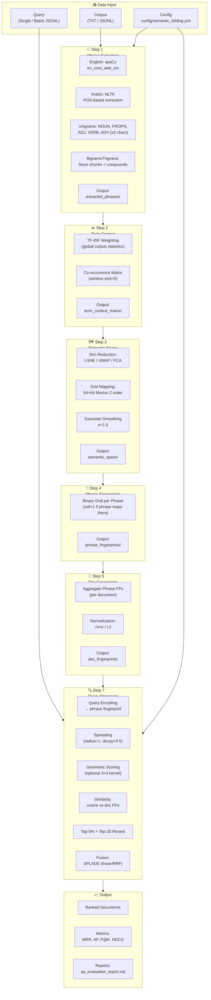
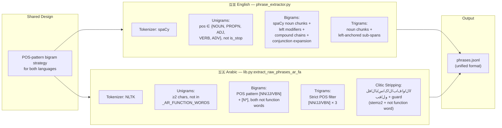
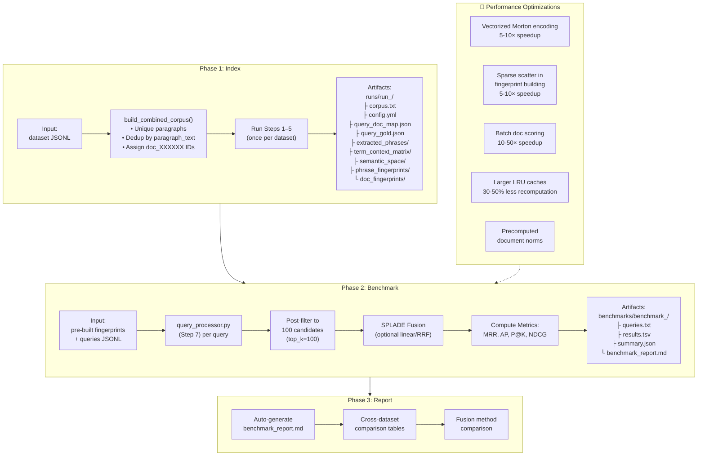
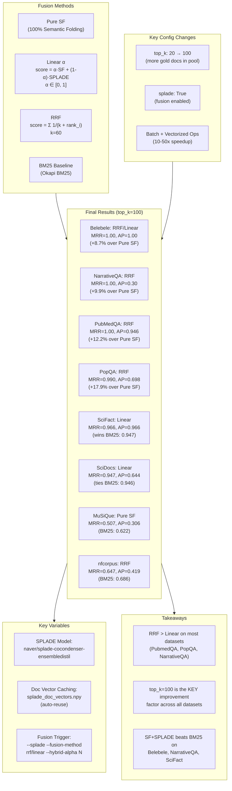
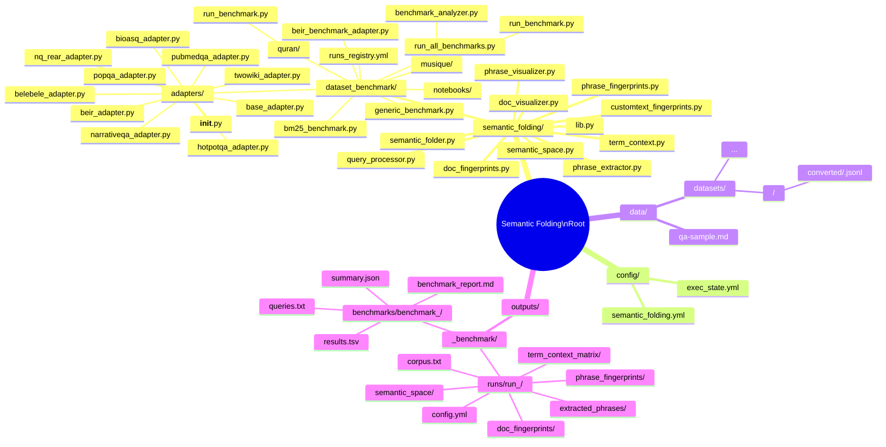
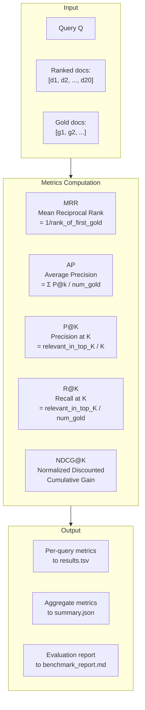

# Semantic Folding Pipeline — Block Diagram

## 1. Overall Pipeline Architecture



---

## 2. Extraction Symmetry (English vs Arabic)



---

## 3. Benchmarking Framework (3-Phase)



---

## 4. Dataset Adapters

```mermaid
flowchart LR
    subgraph ADAPTERS["Available Dataset Adapters"]
        A1["belebele_adapter.py\n(100 queries, 476 docs)"]
        A2["narrativeqa_adapter.py\n(50 queries, 19,585 docs)"]
        A3["pubmedqa_adapter.py\n(311 queries, 1,475 docs)"]
        A4["popqa_adapter.py\n(1,000 queries, 1,475 docs)"]
        A5["beir_adapter.py\nSciDocs, NFCorpus,\nSciFact, Quora,\nTREC-COVID, DBPedia"]
        A6["bioasq_adapter.py"]
        A7["hotpotqa_adapter.py"]
        A8["nq_rear_adapter.py"]
        A9["twowiki_adapter.py"]
    end

    subgraph COMMON_STRUCT["Common Structure"]
        C1["BaseAdapter\n(abstract)"]
        C2["download()"]
        C3["convert_to_musique_format()"]
        C4["Output:\nconverted/<name>.jsonl"]
    end

    ADAPTERS --> COMMON_STRUCT
```



---

## 5. Fusion Methods (SF + SPLADE)



---

## 6. Project Directory Structure



---

## 7. Pipeline Configuration Parameters

```mermaid
flowchart LR
    subgraph GRID["Grid & Space"]
        G1["grid_size: 64×64"]
        G2["morton: True\n(Z-order encoding)"]
        G3["method: t-SNE\n(alt: UMAP, PCA)"]
        G4["smoothing_sigma: 1.5"]
    end

    subgraph QUERY["Query Processing"]
        Q1["spreading_steps: 1"]
        Q2["spreading_radius: 1"]
        Q3["spreading_decay: 0.5"]
        Q4["top_percent: 0.10"]
        Q5["top_k: 100\n(was 20 — KEY improvement)"]
        Q6["weighting: idf\n(alt: uniform)"]
        Q7["doc_norm: sqrt(nnz)"]
        Q8["query_norm: l2"]
    end

    subgraph SPLADE["SPLADE Fusion"]
        S1["splade: True\n(enables fusion)"]
        S2["model: naver/\nsplade-cocondenser-\nensembledistil"]
        S3["fusion_method:\nrrf (best) / linear"]
        S4["hybrid_alpha: 0.3\n(for linear)"]
        S5["rrf_k: 60"]
    end

    subgraph BENCH["Benchmark"]
        B1["seed: 42"]
        B2["sim_metric: cosine"]
        B3["score_norm: none"]
        B4["rerank: False"]
    end

    GRID --> QUERY --> SPLADE --> BENCH
```



---

## 8. Evaluation Metrics Pipeline



---

## 9. Version History

```
v3.2 ─── Current (Final)
  ├── top_k=100: KEY improvement (20→100)
  ├── SF+SPLADE fusion (RRF > Linear)
  ├── RRF MRR=1.00 on Belebele, NarrativeQA, PubMedQA
  ├── PopQA RRF MRR=0.990 (+17.9% over Pure SF)
  ├── SciDocs, SciFact, nfcorpus, MuSiQue benchmarks
  ├── Vectorized ops (5-50× speedup)
  ├── Belebele α sweep: best α=0.25–0.30
  ├── PopQA failure analysis
  ├── SPLADE doc vector caching
  └── Registry auto-backup on corruption

v3.1
  ├── Generic multi-dataset benchmark
  ├── 3-phase framework (index→benchmark→report)
  ├── BM25 baseline
  └── Quran benchmark (MRR=0.334)

v3.0
  ├── Arabic phrase extraction (lib.py)
  ├── Clitic stripping + function word filtering
  ├── English-Arabic extraction symmetry
  └── Bilingual groups removed
```
