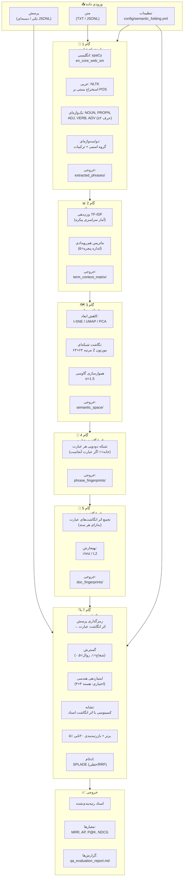
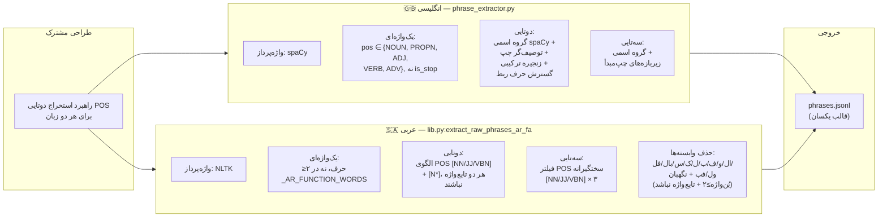
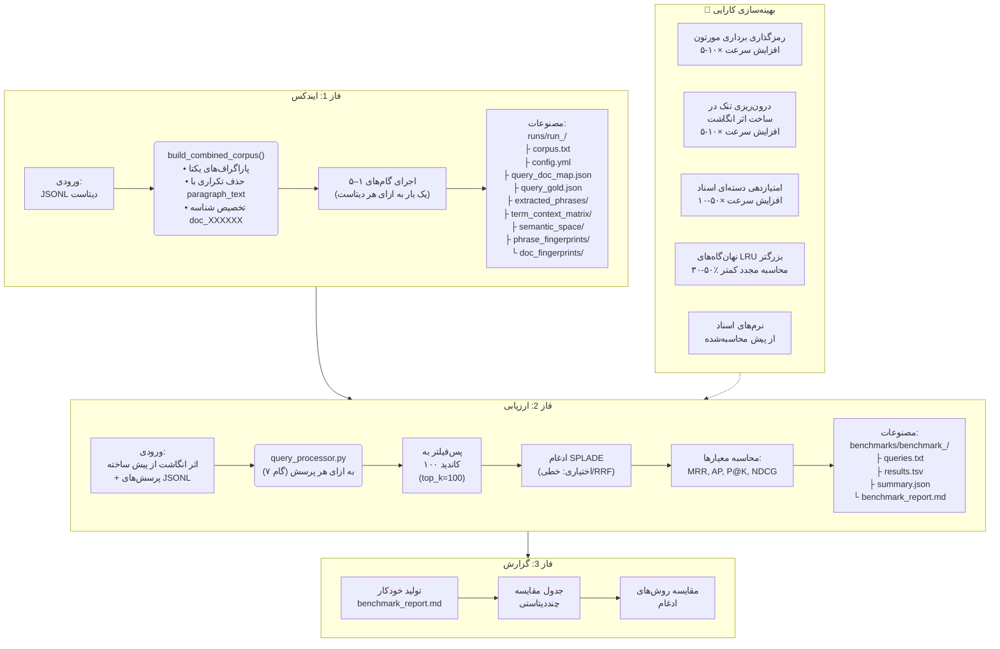
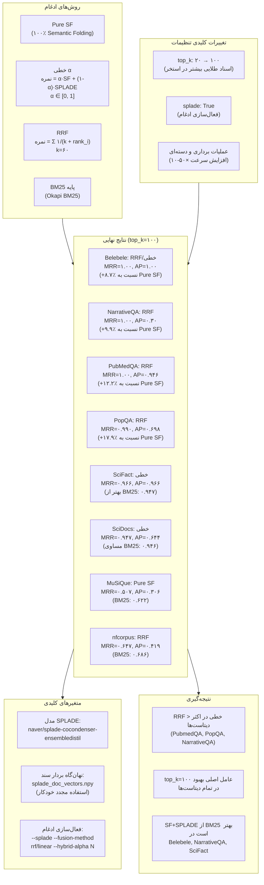
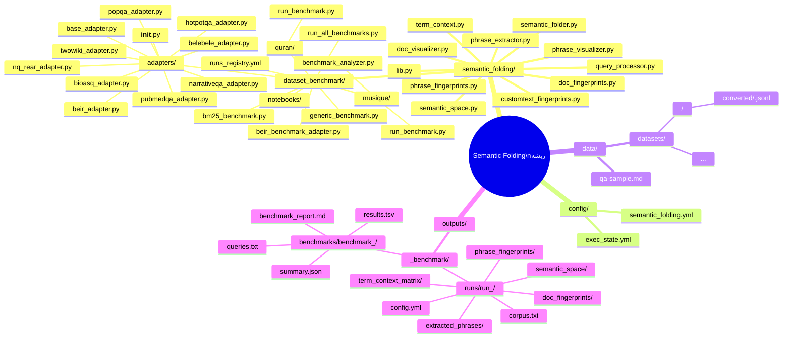
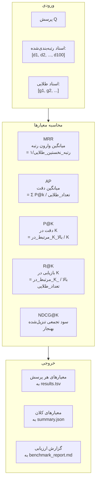

# خط‌لوله Semantic Folding — دیاگرام بلوکی

## 1. معماری کلی خط‌لوله



---

## 2. تقارن استخراج (انگلیسی در مقابل عربی)



---

## 3. چارچوب ارزیابی (۳ فاز)



---

## 4. تطبیق‌دهنده‌های دیتاست

```mermaid
flowchart LR
    subgraph ADAPTERS["تطبیق‌دهنده‌های موجود"]
        A1["belebele_adapter.py\n(۱۰۰ پرسش، ۴۷۶ سند)"]
        A2["narrativeqa_adapter.py\n(۵۰ پرسش، ۱۹۵۸۵ سند)"]
        A3["pubmedqa_adapter.py\n(۳۱۱ پرسش، ۱۴۷۵ سند)"]
        A4["popqa_adapter.py\n(۱۰۰۰ پرسش، ۱۴۷۵ سند)"]
        A5["beir_adapter.py\nSciDocs, NFCorpus,\nSciFact, Quora,\nTREC-COVID, DBPedia"]
        A6["bioasq_adapter.py"]
        A7["hotpotqa_adapter.py"]
        A8["nq_rear_adapter.py"]
        A9["twowiki_adapter.py"]
    end

    subgraph COMMON_STRUCT["ساختار مشترک"]
        C1["BaseAdapter\n(چکیده)"]
        C2("download()\n(دریافت)")
        C3("convert_to_musique_format()\n(تبدیل به قالب)")
        C4["خروجی:\nconverted/<name>.jsonl"]
    end

    ADAPTERS --> COMMON_STRUCT
```



---

## 5. روش‌های ادغام (SF + SPLADE)



---

## 6. ساختار دایرکتوری پروژه



---

## 7. پارامترهای پیکربندی خط‌لوله

```mermaid
flowchart LR
    subgraph GRID["شبکه و فضا"]
        G1["grid_size: ۶۴×۶۴"]
        G2["morton: True\n(رمزگذاری مرتبه Z)"]
        G3["method: t-SNE\n(جایگزین: UMAP, PCA)"]
        G4["smoothing_sigma: ۱.۵"]
    end

    subgraph QUERY["پردازش پرسش"]
        Q1["spreading_steps: ۱"]
        Q2["spreading_radius: ۱"]
        Q3["spreading_decay: ۰.۵"]
        Q4["top_percent: ۰.۱۰"]
        Q5["top_k: ۱۰۰\n(بود ۲۰ — بهبود کلیدی)"]
        Q6["weighting: idf\n(جایگزین: uniform)"]
        Q7["doc_norm: sqrt(nnz)"]
        Q8["query_norm: l2"]
    end

    subgraph SPLADE["ادغام SPLADE"]
        S1["splade: True\n(فعال‌سازی ادغام)"]
        S2["مدل: naver/\nsplade-cocondenser-\nensembledistil"]
        S3["روش ادغام:\nrrf (بهترین) / خطی"]
        S4["hybrid_alpha: ۰.۳\n(برای خطی)"]
        S5["rrf_k: ۶۰"]
    end

    subgraph BENCH["ارزیابی"]
        B1["seed: ۴۲"]
        B2["sim_metric: کسینوسی"]
        B3["score_norm: none"]
        B4["rerank: False"]
    end

    GRID --> QUERY --> SPLADE --> BENCH
```



---

## 8. خط‌لوله معیارهای ارزیابی



---

## 9. تاریخچه نسخه‌ها

```
v3.2 ─── جاری (نهایی)
  ├── top_k=۱۰۰: بهبود کلیدی (۲۰→۱۰۰)
  ├── ادغام SF+SPLADE (RRF > خطی)
  ├── RRF MRR=۱.۰۰ روی Belebele, NarrativeQA, PubMedQA
  ├── PopQA RRF MRR=۰.۹۹۰ (+۱۷.۹٪ نسبت به Pure SF)
  ├── ارزیابی SciDocs, SciFact, nfcorpus, MuSiQue
  ├── عملیات برداری (۵-۵۰× افزایش سرعت)
  ├── جستجوی α در Belebele: بهترین α=۰.۲۵–۰.۳۰
  ├── تحلیل شکست PopQA
  ├── نهان‌گاه بردار سند SPLADE
  └── پشتیبان‌گیری خودکار ثبات در خرابی

v3.1
  ├── چارچوب ارزیابی چنددیتاستی عمومی
  ├── چارچوب ۳ فاز (ایندکس→ارزیابی→گزارش)
  ├── پایه BM25
  └── ارزیابی قرآن (MRR=۰.۳۳۴)

v3.0
  ├── استخراج عبارت عربی (lib.py)
  ├── حذف وابسته‌ها + فیلتر تابع‌واژه
  ├── تقارن استخراج انگلیسی-عربی
  └── حذف گروه‌های دوزبانه
```
