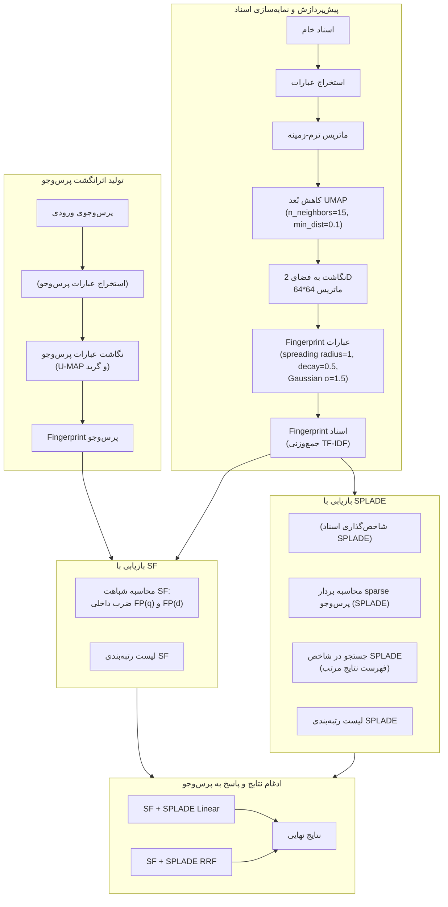

```mermaid
flowchart TD
    subgraph A["پیش‌پردازش و نمایه‌سازی اسناد"]
        A1["اسناد خام"]
        A2["استخراج عبارات"]
        A3["ماتریس ترم-زمینه"]
        A4["کاهش بُعد UMAP\n(n_neighbors=15, min_dist=0.1)"]
        A5["نگاشت به فضای 2D\nماتریس 64*64"]
        A6["Fingerprint عبارات\n(spreading radius=1, decay=0.5,\nGaussian σ=1.5)"]
        A7["Fingerprint اسناد\n(جمع‌وزنی TF-IDF)"]
    end
    subgraph B["تولید اثرانگشت پرس‌وجو"]
        B1["پرس‌وجوی ورودی"]
        B2["(استخراج عبارات پرس‌وجو)"]
        B3["نگاشت عبارات پرس‌وجو\n(U-MAP و گرید)"]
        B4["Fingerprint پرس‌وجو"]
    end
    subgraph C["بازیابی با SF"]
        C1["محاسبه شباهت SF:\nضرب داخلی FP(q) و FP(d)"]
        C2["لیست رتبه‌بندی SF"]
    end
    subgraph D["بازیابی با SPLADE"]
        D0["(شاخص‌گذاری اسناد SPLADE)"]
        D1["محاسبه بردار sparse پرس‌وجو (SPLADE)"]
        D2["جستجو در شاخص SPLADE\n(فهرست نتایج مرتب)"]
        D3["لیست رتبه‌بندی SPLADE"]
    end
    subgraph E["ادغام نتایج و پاسخ به پرس‌وجو"]
        E1["SF + SPLADE Linear"]
        E2["SF + SPLADE RRF"]
        E3["نتایج نهایی"]
    end
    
    A1 --> A2 --> A3 --> A4 --> A5 --> A6 --> A7
    B1 --> B2 --> B3 --> B4
    B4 --> C
    A7 --> C
    A7 --> D   
    C --> E
    D --> E
    E1 --> E3
    E2 --> E3
```