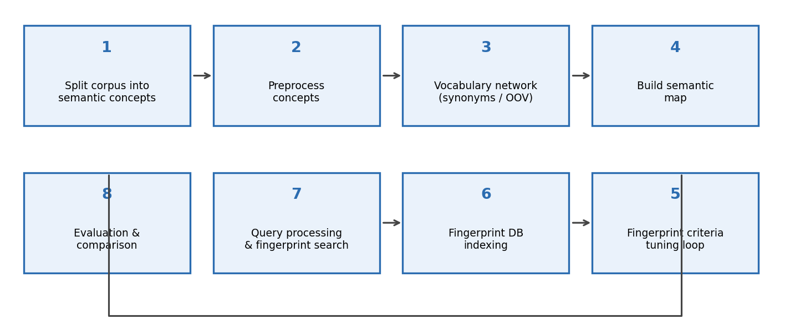
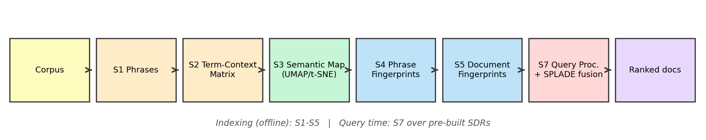
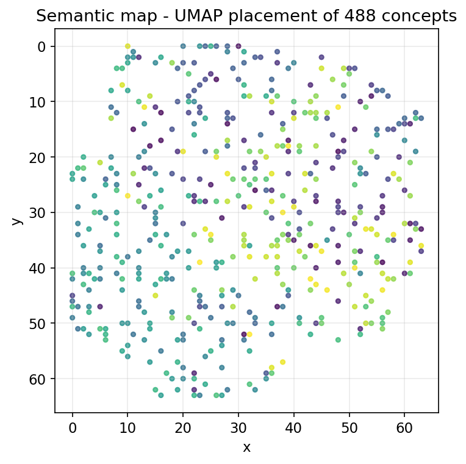
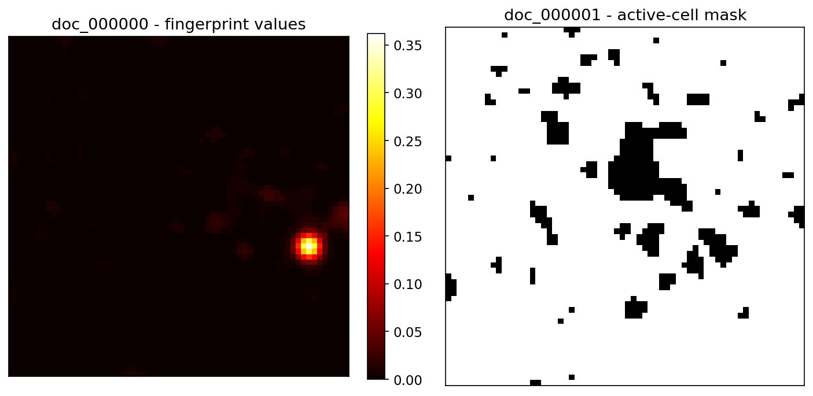
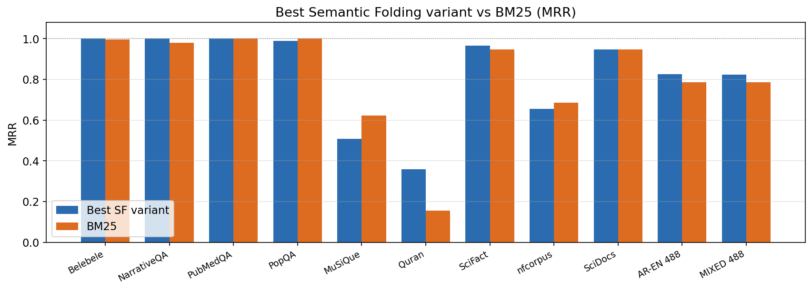
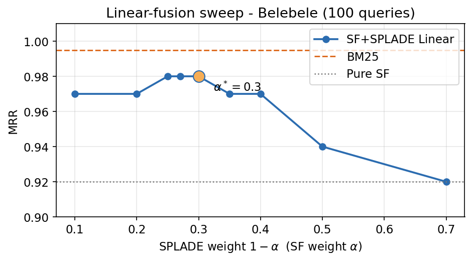
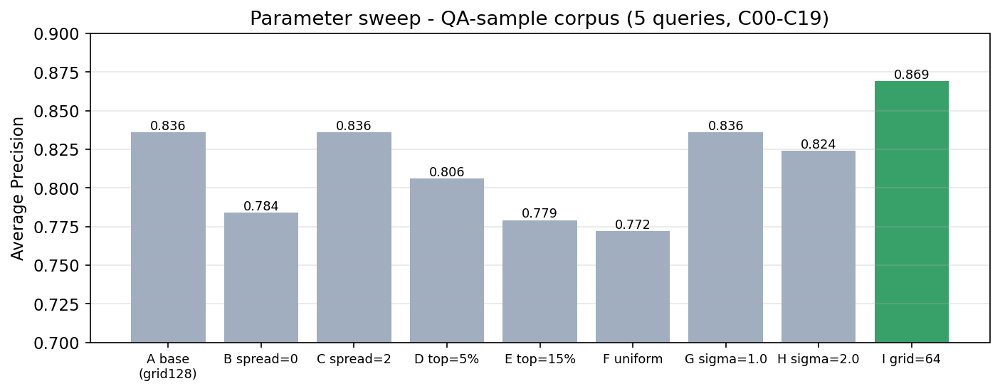

# پایان‌نامه کارشناسی ارشد — نسخهٔ master

> **عنوان:** بررسی، ارزیابی و تحلیل کاربردهای رویکرد مبتنی بر خوشه‌بندی معنایی متون چند زبانه جهت پاسخگویی به سوالات در محیط‌های با دامنه بسته
>
> **Investigating, evaluating, and analyzing the applications of semantic folding approach for multilingual texts questions answering in closed domain environments**
>
> نگارنده: وحید مرادی سرکشتی — استاد راهنما: دکتر مسعود رهگذر
> دانشکده مهندسی برق و کامپیوتر، پردیس دانشکدگان فنی، دانشگاه تهران
> پروپوزال مصوب: ۱۴۰۳/۰۶/۳۱

---

## وضعیت نگارش (tracking)

| بخش | وضعیت | منبع محتوا |
|---|---|---|
| چکیده فارسی/انگلیسی | ✅ پیش‌نویس | پس از بازبینی نهایی |
| فصل ۱: مقدمه | ✅ نسخهٔ اول | بخش ۴-۱ پروپوزال |
| فصل ۲: مبانی و پیشینه پژوهش | ✅ نسخهٔ اول | پروپوزال، بخش ۴-۳ + پایان‌نامه مشهدیزاده |
| فصل ۳: روش پژوهش (نقشه‌راه ۸ مرحله‌ای) | ✅ نسخهٔ اول | `thesis_methodology_chapter.md` + تحلیل کد |
| فصل ۴: ارزیابی و نتایج | ✅ نسخهٔ اول | `outputs/COMPREHENSIVE_RESULTS_SUMMARY.md` + `thesis_final_results.md` |
| فصل ۵: جمع‌بندی و پیشنهادها | ✅ نسخهٔ اول | — |
| پیوست A/B/C | ✅ نسخهٔ اول | پارامترها / دیتاست‌ها / فرمول معیارها |
| منابع | ✅ نسخهٔ اول | ۵۸ مرجع (۳۶ پروپوزال + ۲۲ جدید) — فرمت IEEE؛ ارجاع درون‌متنی درج شد |

**قرارداد اصطلاح‌شناسی** (یکدست در کل متن):

| انگلیسی | فارسی مصوب متن |
|---|---|
| Semantic Folding | خوشه‌بندی معنایی |
| Semantic Fingerprint | اثرانگشت معنایی |
| Semantic Map / Space | نقشهٔ معنایی |
| SDR (Sparse Distributed Representation) | بازنمایی پراکندهٔ توزیع‌شده |
| Context (corpus unit) | مفهوم معنایی مجزا |
| Term–Context Matrix | ماتریس واژه–مفهوم |
| Query | پرس‌وجو |

---

## فهرست شکل‌ها

| شماره | عنوان | بخش |
|---|---|---|
| شکل ۳-۱ | نقشه‌راه هشت‌مرحله‌ای پژوهش | ۳-۱ |
| شکل ۳-۲ | معماری خط لولهٔ پیاده‌سازی‌شده | ۳-۱ |
| شکل ۳-۳ | نقشهٔ معنایی UMAP پیکرهٔ دوزبانه (۴۸۸ مفهوم) | ۳-۵ |
| شکل ۳-۴ | اثرانگشت دوبعدی دو سند نمونه (گرید 64×64) | ۳-۶ |
| شکل ۴-۱ | مقایسهٔ بهترین SF با BM25 روی ۱۱ بنچمارک (MRR) | ۴-۴ |
| شکل ۴-۲ | جاروب وزن فیوژن خطی SPLADE روی Belebele | ۴-۵-۱ |
| شکل ۴-۳ | نمودار ablation واریانت‌های پارامتری بر حسب AP | ۴-۵-۲ |

فایل تصاویر: `docs/thesis/fa/figures/*.png` — تولیدشده با `scripts/make_thesis_figures.py`.

## فهرست جداول

| شماره | عنوان | بخش |
|---|---|---|
| جدول ۲-۱ | مقایسهٔ کیفی روش‌های تعبیه کلمات با خوشه‌بندی معنایی | ۲-۳-۴ |
| جدول ۳-۱ | نگاشت نقشه‌راه پروپوزال بر پیاده‌سازی | ۳-۱ |
| جدول ۴-۱ | مجموعه‌داده‌های ارزیابی | ۴-۲ |
| جدول ۴-۲ | بهترین نتیجهٔ هر بنچمارک در برابر BM25 | ۴-۴ |
| جدول ۴-۳ | آزمون معناداری آماری custom_ar_en | ۴-۴-۱ |
| جدول ۴-۴ | آزمون شبکهٔ واژگان WordNet (v1/v2) | ۴-۴-۳ |
| جدول ۴-۵ | ablation سهم اجزا (پیکرهٔ QA-sample) | ۴-۵-۲ |
| جدول ۴-۶ | سایر یافته‌های پارامتری | ۴-۵-۳ |
| جدول ۴-۷ | خط مبنای تراکمی MiniLM روی SciFact | ۴-۷-۱ |
| جدول ۴-۸ | مقایسهٔ ادبی با مدل‌های تعبیه کلمات | ۴-۷-۲ |
| جدول A-۱ | مرجع پارامترهای خط لوله | پیوست A |

---

# فصل ۱: مقدمه

## ۱-۱. مقدمه

پاسخگویی سریع و بهینه به پرسش‌های کاربران، یکی از مسائل بنیادین و پرکاربرد حوزهٔ هوش مصنوعی و پردازش زبان‌های طبیعی است. سامانه‌های پاسخگویی خودکار به سوال (Question Answering) امروزه جایگاه ویژه‌ای در برآوردن نیازهای روزافزون کاربران یافته‌اند [3]، [33]؛ به‌گونه‌ای که موتورهای جست‌وجوی بزرگ نیز بخش «پاسخ مستقیم» را به سرویس‌های خود افزوده‌اند تا کاربر به‌جای مرور پیوندهای متعدد، پاسخ را بی‌واسطه دریافت کند. موازی با این روند، شبکه‌های عصبی عمیق و مدل‌های زبانی بزرگ دقت این سامانه‌ها را به‌شدت افزایش داده‌اند [2]، اما این دقتِ بالا هزینهٔ سنگینی در پی داشته است: نیازمندی به منابع پردازشی قدرتمند، پیکره‌های آموزشی عظیم و فرآیندهای برچسب‌گذاری پرهزینه [9].

در مقابل، مغز انسان با مصرف انرژی ناچیز و بدون برچسب‌گذاری صریح، قادر به درک مفاهیم و پاسخگویی لحظه‌ای است. پیشرفت‌های علوم اعصاب محاسباتی — به‌ویژه نظریه حافظه زمانی سلسله‌مراتبی (HTM) هاوکینز و همکاران [10] — نشان می‌دهد که کلید این کارایی، بازنمایی‌های پراکندهٔ توزیع‌شده (SDR) و نقشه‌های توپولوژیک مفاهیم در قشر جدید مخ است. «خوشه‌بندی معنایی» (Semantic Folding) رویکردی است که این اصول زیست‌الهامی را به پردازش متن ترجمه می‌کند [13]: متن به یک فضای دوبعدی گسسته نگاشت می‌شود و هر واژه، عبارت یا قطعهٔ متن به یک «اثرانگشت معنایی» دودوییِ پراکنده تبدیل می‌گردد که شباهت معنایی را به همپوشانی مکانی تبدیل می‌کند.

این پایان‌نامه به بررسی، ارزیابی و تحلیل کاربردهای این رویکرد برای پاسخگویی به سوالات در **محیط‌های با دامنه بسته** و بر پایهٔ **متون چندزبانه** می‌پردازد و عملکرد آن را از منظر دقت، سرعت و مصرف منابع با روش‌های رایج — شامل خط مبنا واژگانی BM25 و مدل‌های عصبی lexical مانند SPLADE — مقایسه می‌کند.

## ۱-۲. تعریف مسئله

مسئلهٔ اصلی این پژوهش عبارت است از: *«طراحی، پیاده‌سازی و ارزیابی یک سامانهٔ بازیابی/پاسخگویی خودکار مبتنی بر خوشه‌بندی معنایی که بتواند در یک دامنهٔ بسته، پرسش‌های کاربر را به مفاهیم معنایی مجزای موجود در متون چندزبانه نگاشت کرده و دقیق‌ترین پاسخ‌ها را با کمترین هزینهٔ محاسباتی بازیابی کند.»*

سه زیرمسئلهٔ اصلی از این تعریف قابل استخراج است:

1. **بازنمایی:** چگونه متون چندزبانه را به یک نقشهٔ معنایی مشترک نگاشت کنیم تا واژه‌های هم‌معنا در زبان‌های مختلف اثرانگشت‌های مشابه به دست آورند؟
2. **وزن‌دهی و ترکیب:** هنگام ساخت اثرانگشت اسناد و پرس‌وجوها، اهمیت هر واژه/عبارت را چگونه محاسبه کنیم (TF-IDF، هم‌رخدادی سند-محور)؟
3. **بازیابی:** شباهت میان اثرانگشت پرس‌وجو و اثرانگشت اسناد را چگونه بسنجیم که هم دقت بالا و هم سرعت مناسب تضمین شود — و آیا ادغام سیگنال واژگانی عصبی (SPLADE) می‌تواند نتایج را بهبود دهد؟

## ۱-۳. اهداف پژوهش

هدف اصلی این پژوهش، بررسی، ارزیابی و تحلیل کاربردهای رویکرد خوشه‌بندی معنایی برای درک مفاهیم متون چندزبانه و سنجش کارایی آن در پاسخگویی خودکار به سوالات، در مقایسه با پیشرفت‌های اخیر شبکه‌های عصبی عمیق و شبکه‌های گراف است. اهداف جزئی عبارت‌اند از:

1. پیاده‌سازی کامل خط لولهٔ خوشه‌بندی معنایی (استخراج عبارات ← ماتریس واژه–مفهوم ← نقشهٔ معنایی ← اثرانگشت عبارات ← اثرانگشت اسناد ← پردازش پرس‌وجو).
2. بررسی تأثیر پارامترهای کلیدی (ابعاد نقشه، وزن‌دهی TF-IDF، هموارسازی گاوسی، انتشار فعال‌سازی و …) بر دقت بازیابی.
3. ارزیابی روش روی مجموعه‌داده‌های متنوع دامنه بسته (قرآن کریم با ۶٬۲۳۶ آیه، پیکرهٔ دوزبانهٔ عربی–انگلیسی Belebele، PubMedQA، PopQA، NarrativeQA و زیرمجموعه‌ای از BEIR).
4. مقایسه با خط مبنای BM25 و بررسی معناداری آماری تفاوت‌ها.
5. پیشنهاد و آزمودن بهبودهایی بر روش پایه، از جمله ادغام خطی با مدل SPLADE و سازوکار شبکهٔ واژگان برای واژگان خارج از پیکره.

## ۱-۴. ضرورت انجام پژوهش

نیاز به سامانه‌ای با دقت و سرعت بالا برای پاسخگویی به سوالات در محیط‌های با دامنه بسته، از ضروریات حوزه‌های تخصصی (متون دینی، حقوقی، پزشکی و…) است. سه واقعیت، ضرورت این پژوهش را رقم می‌زند:

1. **محدودیت منابع:** مدل‌های عصبی بزرگ برای استنتاج و آموزش نیازمند سخت‌افزار گرافیکی گران‌اند؛ درحالی‌که خوشه‌بندی معنایی با محاسبات برداری تنکِ سبک (ضرب داخلی روی بردارهای دودویی پراکنده) کار می‌کند.
2. **کمیابی دادهٔ برچسب‌خورده:** یادگیری کاملاً بدون ناظرِ این روش، هزینهٔ برچسب‌گذاری را حذف می‌کند و افزودن مداوم متون جدید را ممکن می‌سازد.
3. **چندزبانه بودن متون تخصصی:** بسیاری از متون دینی و تخصصی ذاتاً چندزبانه‌اند (متن اصلی عربی + ترجمه انگلیسی/فارسی). رویکردهای واژگانی صرف در این محیط‌ها شکست می‌خورند و به بازنمایی معنایی مستقل از زبان نیاز است — ویژگی ذاتی اثرانگشت‌های معنایی.

## ۱-۵. چالش‌های پیش رو

بر اساس پروپوزال و تجربهٔ اجرای این پژوهش، چالش‌های اصلی عبارت‌اند از:

1. **نگاشت چندزبانه:** تشکیل یک نقشهٔ معنایی واحد که واژگان زبان‌های مختلف را حول مفاهیم مشترک بچیند؛ بازیابی cross-lingual محض (پرسش عربی، سند انگلیسی بدون متن موازی) تقریباً ناممکن است و باید با پیکره‌های موازی دوزبانه حل شود.
2. **نبود مبنای ارزیابی استاندارد:** تا انتشار مبنای ارزیابی Cai et al. (2024) هیچ benchmark جامعی برای روش‌های مبتنی بر خوشه‌بندی معنایی وجود نداشت؛ در این پژوهش از پروتکل بازیابی استاندارد IR (MRR/AP/NDCG در برابر BM25) استفاده شده است.
3. **تنظیم پارامترها:** ابعاد نقشهٔ معنایی، درصد تنک‌سازی و میزان انتشار باید تعادل میان تمایزپذیری و پوشش را حفظ کنند؛ ابعاد خیلی کم یا خیلی زیاد دقت را می‌کاهند.
4. **واژگان خارج از پیکره (OOV):** واژه‌ای که در پیکره نباشد اثرانگشت تهی دارد؛ راهکار مرحلهٔ «شبکه واژگان» در فصل ۳ برای رفع آن ارائه شده است.

## ۱-۶. نوآوری‌ها و دستاوردها

1. پیاده‌سازی کامل و بازتولیدپذیر خط لولهٔ خوشه‌بندی معنایی برای بازیابی در دامنه بسته (اولین ارزیابی نظام‌مند این روش روی ۱۲ مجموعه‌داده استاندارد).
2. سازوکار وزن‌دهی دو سطحی: هم‌رخدادی واژه–مفهوم برای «ساختار» اثرانگشت و TF-IDF برای «اهمیت»، به‌صورت جمع خطی وزن‌دار.
3. گزارش نخستین نتایج این روش روی پیکرهٔ قرآن کریم (۳۰ پرسش، ۶٬۲۳۶ آیه) و پیکرهٔ دوزبانهٔ عربی–انگلیسی (۴۸۸ قطعه) همراه با آزمون‌های معناداری آماری (Wilcoxon و McNemar).
4. بهبود عملکرد از طریق فیوژن خطی SF+SPLADE (α=0.3) که در سه دیتاست از چهار دیتاست اصلی بهترین نتیجه را داده است.
5. تحلیل جامع پارامتری و شکست‌ها (failure analysis) برای شناسایی مرزهای کاربرد روش.

## ۱-۷. ساختار پایان‌نامه

- **فصل ۲** مبانی نظری (HTM، نظریه خوشه‌بندی معنایی، SDR) و مرور پیشینه (سامانه‌های QA، روش‌های تعبیه کلمات، کارهای مبتنی بر SF) را پوشش می‌دهد.
- **فصل ۳** روش پیشنهادی را مطابق نقشه‌راه هشت‌مرحله‌ای پروپوزال شرح می‌دهد: از تقسیم داده به مفاهیم معنایی مجزا تا جست‌وجو و تعیین پاسخ، همراه با جزئیات وزن‌دهی و نمایه‌سازی.
- **فصل ۴** طرح آزمایش‌ها، مجموعه‌داده‌ها، معیارهای ارزیابی و نتایج کمی (به همراه آزمون‌های معناداری و تحلیل خطا) را ارائه می‌کند.
- **فصل ۵** به جمع‌بندی، محدودیت‌ها و پیشنهاد مسیرهای آتی (از جمله شبکه توجه گرافی و بسط چندزبانهٔ شبکهٔ واژگان) می‌پردازد.

---

# فصل ۲: مبانی و پیشینهٔ پژوهش

## ۲-۱. مقدمه

در این فصل ابتدا مفهوم سامانه‌های پاسخگویی به سوال و طبقه‌بندی آن‌ها را معرفی می‌کنیم؛ سپس رویکردهای اصلی موجود (مدل‌های زبانی بزرگ، دانش ساختاریافته/گراف‌های دانش، بازیابی واژگانی و عصبی، و مدل‌های تعبیه کلمات) را مرور و مقایسه می‌کنیم. در ادامه مبانی زیست‌الهامی‌روش مورد مطالعه — نظریه حافظه زمانی سلسله‌مراتبی و بازنمایی‌های پراکندهٔ توزیع‌شده — تشریح می‌شود و در پایان، نظریهٔ خوشه‌بندی معنایی به همراه کارهای پیشین مبتنی بر آن مرور می‌گردد.

## ۲-۲. سامانه‌های پاسخگویی به سوال

سامانهٔ پاسخگویی به سوال، سامانه‌ای است که پرسش را به زبان طبیعی دریافت کرده و با بازیابی یا تولید اطلاعاتِ مستند، پاسخی دقیق ارائه می‌دهد. این سامانه‌ها هم حوزهٔ بازیابی اطلاعات و هم حوزهٔ استخراج اطلاعات و پردازش زبان طبیعی به شمار می‌روند. معیارهای رایج طبقه‌بندی:

- **بر اساس دامنه:** دامنه بسته (حوزه تخصصی؛ داده کم اما کیفیت پاسخ بالا)، دامنه باز (پرسش عمومی؛ نیازمند مخازن عظیم مانند ویکی‌پدیا) و دامنه ترکیبی. تمرکز این پایان‌نامه بر **دامنه بسته** است.
- **بر اساس نوع پرسش:** واقعیت‌محور (Factoid)، غیرواقعیت‌محور (Non-factoid/توصیفی) و بله/خیر.
- **بر اساس نوع پاسخ:** چندگزینه‌ای، تکمیل جاهای خالی، استخراجی (برش از متن) و تولیدی.

معیارهای ارزیابی متداول نیز بسته به نوع پاسخ انتخاب می‌شوند: دقت (Accuracy) و مطابقت دقیق (EM) برای پاسخ‌های مشخص؛ MRR و mAP برای لیست‌های رتبه‌بندی‌شده؛ F1 و ROUGE/BLEU برای پاسخ‌های قطعه‌ای یا تولیدی. در این پژوهش که مسئله به‌صورت «بازیابی قطعهٔ متن مرتبط» صورت‌بندی شده، معیارهای رتبه‌ای (MRR, AP, P@K, R@K, NDCG@K) مبنای ارزیابی‌اند.

## ۲-۳. رویکردهای اصلی پاسخگویی به سوال

### ۲-۳-۱. مبتنی بر مدل‌های زبانی بزرگ و شبکه‌های عصبی عمیق

مدل‌های مبتنی بر ترانسفورمر (BERT و نسل‌های بعدی) با پیش‌آموزش روی پیکره‌های عظیم، دقت بی‌سابقه‌ای در وظایف درک مطلب به دست آورده‌اند [46]؛ اما این دقت به منابع پردازشی سنگین (GPU) و حجم بالای داده آموزش وابسته است [9]. در سناریوهای دامنه بسته با داده اندک و بودجه محدود، این وابستگی یک محدودیت عملیاتی جدی است.

### ۲-۳-۲. مبتنی بر دانش ساختاریافته و شبکه‌های گراف

رویکردهای مبتنی بر گراف دانش، روابط میان مفاهیم را صریح نگهداری می‌کنند و با الگوریتم‌هایی مانند Personalized PageRank یا شبکه‌های توجه گرافی (GAT) استدلال چندپرشی انجام می‌دهند (نمونه‌ها: QA-GNN [17] و HippoRAG [42]). چالش اصلی، هزینهٔ ساخت و نگهداشت گراف دانش برای هر حوزه تخصصی است که معمولاً به استخراج سه تایی‌های LLM نیاز دارد. یکی از انگیزه‌های این پژوهش، حذف همین وابستگی است: گراف‌مانندِ ضمنیِ روابط باید خودکار از متن خام و بدون هیچ LLM ساخته شود.

### ۲-۳-۳. بازیابی واژگانی و عصبی lexical

**BM25** خط مبنای کلاسیک بازیابی است [39]: تطابق واژه به‌واژه با وزن‌دهی IDF که سریع و بدون آموزش است اما هیچ درکی از معنا ندارد. در مقابل، مدل‌های بازنمایی تنکِ عصبی مانند **SPLADE** با گسترش پرسش/سند از طریق یک مدل زبانی آموزش‌دیده، شکاف میان بازیابی واژگانی و معنایی را پر می‌کنند [37]، [38]. در این پژوهش BM25 به‌عنوان خط مبنای اجباری و SPLADE هم به‌عنوان خط مبنا و هم به‌عنوان مؤلفهٔ فیوژن به کار گرفته شده است.

### ۲-۳-۴. مدل‌های تعبیه کلمات

Word2Vec و GloVe فضاهای پیوستهٔ متراکم می‌سازند که روابط خطی معنایی را ثبت می‌کنند [47]، [48]؛ FastText با تجزیهٔ واژه به n-gram ها با OOV بهتر کنار می‌آید [49]؛ BERT تعبیه‌های وابسته به زمینه تولید می‌کند [46]. مقایسهٔ کیفی این روش‌ها با خوشه‌بندی معنایی بر اساس معیارهای سامانه‌های QA دامنه بسته (برگرفته از فرم پروپوزال رسالهٔ دکتری بنائی، همان آزمایشگاه):

**جدول ۲-۱.** مقایسهٔ کیفی روش‌های نمایش برداری متن.

| معیار | Word2Vec/GloVe | BERT/Transformers | FastText | خوشه‌بندی معنایی |
|---|---|---|---|---|
| تطابق با دامنه تخصصی | محدود | متوسط تا بالا | متوسط | بالا |
| قابلیت تفسیر | کم تا متوسط | کم | کم تا متوسط | بالا |
| مدیریت واژگان جدید | متوسط | بالا | بالا | متوسط* |
| حجم داده آموزش | بزرگ | بزرگ | متوسط | کم |
| نیازمندی سخت‌افزاری | متوسط | بالا | متوسط | کم |
| امکان تعبیه پاراگراف/سند | کم تا متوسط | بالا | کم تا متوسط | بالا |

\* با سازوکار شبکهٔ واژگان (فصل ۳) بهبود می‌یابد.

## ۲-۴. مبانی زیست‌الهامی: HTM و بازنمایی‌های پراکنده

نظریه حافظه زمانی سلسله‌مراتبی (HTM) هاوکینز و احمد (۲۰۱۶) مبنای محاسباتی رفتار نورون‌های قشر جدید مخ را چنین توصیف می‌کند [10]: (الف) هر نورون هزاران سیناپس دارد و الگوهای زمینه‌ای را یاد می‌گیرد؛ (ب) در هر لحظه تنها حدود ۲٪ نورون‌ها فعال‌اند [34]؛ (ج) اطلاعات در قالب بازنمایی‌های پراکندهٔ توزیع‌شده (SDR) ذخیره می‌شود — بردارهای دودویی بزرگ که تعداد کمی از بیت‌هایشان فعال است و معنا در *الگوی توزیع* بیت‌های فعال نهفته است، نه در بیت منفرد [13].

ویژگی‌های کلیدی SDR که مبنای طراحی این پژوهش‌اند:
1. **هم‌جوشی معنایی:** واژه‌های هم‌معنا الگوهای فعال‌سازی مشابه دارند.
2. **تحمل نویز:** از دست رفتن بخشی از بیت‌ها، معنا را تخریب نمی‌کند.
3. **ترکیب‌پذیری:** ادغام (OR) دو SDR یک SDR معنادار می‌سازد؛ حذف بیت‌های مشترک، تفاضل معنایی می‌دهد.
4. **سرعت محاسباتی:** عملیات منطقی و ضرب داخلی روی بردارهای دودویی بسیار ارزان است.
5. **فشرده‌گی:** با ذخیرهٔ صرفاً شاخص بیت‌های فعال (نمایه‌گذاری تنک) حجم ذخیره‌سازی حداقلی می‌شود.

## ۲-۵. نظریهٔ خوشه‌بندی معنایی (Semantic Folding)

وبر (۲۰۱۵) این اصول را به پردازش متن ترجمه کرد [13]. هستهٔ نظریه سه مفهوم است:

1. **نقشهٔ معنایی:** یک صفحهٔ دوبعدی گسسته (مثلاً 64×64 یا 128×128 سلول) که «مفهوم‌های مجزای» پیکره (قطعه‌متن/پاراگراف/آیه) روی آن طوری چیده می‌شوند که مفاهیمِ اشتراک واژگانی بیشتر، مجاورتر باشند. این نگاشت با الگوریتم‌های کاهش بعد (SOM [50]، t-SNE [43]، UMAP [44]) و حل تعارض جایگاه‌ها انجام می‌شود — یادگیری بدون ناظر، صرفاً از آمار هم‌رخدادی واژه–مفهوم.
2. **اثرانگشت معنایی واژه:** بردار دودویی هم‌بعد با نقشه که بیت‌های فعال آن، مفاهیمی هستند که واژه در آن‌ها ظاهر شده است.
3. **اثرانگشت جمله/سند:** ترکیب (OR وزن‌دار) اثرانگشت واژگان تشکیل‌دهنده و سپس تنک‌سازی (نگه داشتن ~۲–۱۰٪ سلول‌های برتر) برای حفظ خاصیت پراکنده‌گی.

ویژگی‌های رفتاری مهم این بازنمایی (که در پروپوزال نیز بر آن‌ها تأکید شده):
- **استقلال زبانی:** اثرانگشت واژهٔ هم‌معنا در زبان‌های مختلف (مثلاً «فلسفه» در چند زبان) شباهت بالایی دارد، زیرا هر دو حول مفاهیم مشترک فعال می‌شوند.
- **تحمل ابهام:** اثرانگشت واژهٔ چندمعنایی (مانند apple) ترکیبی از اثرانگشت معناهای آن است؛ زمینهٔ مصرف، تمرکز الگو را جابه‌جا می‌کند.
- **حساب معنایی:** حذف بخش مشترک دو اثرانگشت، وجه تمایز معنایی را آشکار می‌کند (مثال یوزپلنگ/پورشه/ببر در بُعد «سرعت»).
- **سرعت و مقاومت:** گزارش‌های فنی Cortical.io (۲۰۲۲) نشان داد دسته‌بندی متن مبتنی بر این روش در مقایسه با BERT ده‌ها برابر سریع‌تر و سبک‌تر عمل می‌کند [36].

## ۲-۶. کارهای پیشین مبتنی بر خوشه‌بندی معنایی

1. **Cortical.io (۲۰۱۵–۲۰۲۲):** پیاده‌سازی تجاری نظریه؛ گزارش‌های دسته‌بندی متن روی ۱۶ مجموعه‌داده در مقایسه با BERT با تأکید بر سرعت و مصرف انرژی [36].
2. **کاربردهای جزئی:** ترکیب با TextRank برای خلاصه‌سازی خودکار [52]، تشخیص ناهنجاری در لاگ‌های سامانه [53]، و حافظهٔ یادگیری SDR برای قطعه‌بندی زبان تایلندی [54].
3. **SemFold — پایان‌نامه کارشناسی ارشد مشهدیزاده (۱۴۰۳) [51]:** نخستین پیاده‌سازی جامع آکادمیک برای پاسخگویی به پرسش‌های چندگزینه‌ای روی CommonSenseQA/QASC/ARC با چهار الگوریتم کاهش بعد (SOM/t-SNE/UMAP/MDS) و هفت معیار شباهت؛ نتایج کلیدی: برتری Cosine، برتری UMAP در سرعت ساخت، بهترین دقت 60.89/70.71/52.0 درصد (در سطح GloVe/FastText و پایین‌تر از BERT)، اما سرعت پاسخگویی حدود ۲۰ برابر سریع‌تر از BERT (137–184 ثانیه در برابر 2552–3715 ثانیه). همچنین ترفند «جایگزینی بردار سوال با شبیه‌ترین سند» (با LanceDB) دقت را افزایش داد.
4. **Cai et al. (2024) [16]:** نخستین مبنای ارزیابی استاندارد برای «تقسیم معنایی جمله» با ۳٬۲۱۶ جمله و داوری متخصصان؛ ابزار سنجش کیفیت نقشه‌های معنایی.

**جایگاه این پژوهش:** برخلاف SemFold (پرسش‌های چندگزینه‌ای تک‌زبانهٔ عمومی)، این پایان‌نامه مسئله را به‌صورت **بازیابی رتبه‌ای در دامنه بسته و متون چندزبانه** صورت‌بندی کرده، خط لوله را برای پیکره‌های واقعی تخصصی (قرآن، متون دینی دوزبانه) مقیاس داده، وزن‌دهی TF-IDF/هم‌رخدادی، تنک‌سازی توپولوژی‌محور، انتشار فعال‌سازی و فیوژن با مدل عصبی SPLADE را افزوده و ارزیابی را با پروتکل استاندارد IR و آزمون معناداری آماری انجام داده است.

## ۲-۷. جمع‌بندی فصل

شکاف پژوهشی مشخص شد: خوشه‌بندی معنایی مزیت‌های نظری (سبکی، بدون ناظر بودن، تفسیرپذیری، استقلال زبانی) دارد اما فاقد ارزیابی نظام‌مند در سناریوی بازیابی دامنه بستهٔ چندزبانه است. فصل بعد معماری پیشنهادی برای پر کردن این شکاف را شرح می‌دهد.

---

# فصل ۳: روش پژوهش

## ۳-۱. نمای کلی معماری

معماری پیشنهادی مطابق نقشه‌راه هشت‌مرحله‌ای پروپوزال طراحی شده و در قالب یک خط لولهٔ هفت‌مرحله‌ایِ بازتولیدپذیر (اسکریپت‌های `semantic_folding/*.py`) پیاده‌سازی شده است:

**جدول ۳-۱.** نگاشت مراحل پروپوزال بر گام‌های پیاده‌سازی.

| مرحلهٔ پروپوزال | مرحلهٔ پیاده‌سازی | ماژول |
|---|---|---|
| ۱. تقسیم داده به مفاهیم معنایی مجزا + استخراج واژگان | گام ۱ | `phrase_extractor.py` |
| ۲. پیش‌پردازش | گام ۱ (درونی) | `lib.py` |
| ۳. شبکه واژگان (مترادف/OOV) | سازوکار طراحی‌شده بخش ۳-۴ | `nltk.wordnet` |
| ۴. ایجاد نقشه معنایی | گام‌های ۲–۳ | `term_context.py`, `semantic_space.py` |
| ۵. تولید اثرانگشت + تنظیم معیارها | گام‌های ۴–۵ | `phrase_fingerprints.py`, `fingerprint_builder.py` |
| ۶. نمایه‌سازی پایگاه اثرانگشت‌ها | خروجی گام ۵ | CSR/LanceDB |
| ۷. پرس‌وجو، جست‌جو و تعیین پاسخ | گام ۶–۷ | `customtext_fingerprints.py`, `query_processor.py` |
| ۸. ارزیابی و مقایسه | چارچوب بنچمارک | `dataset_benchmark/*` |



**شکل ۳-۱.** نقشه‌راه هشت‌مرحله‌ای پژوهش؛ مراحل ۱ تا ۶ آفلاین و مرحلهٔ ۷ آنلاین است.



**شکل ۳-۲.** معماری خط لولهٔ پیاده‌سازی‌شده: گام‌های ۱ تا ۵ یک بار به‌صورت offline اجرا می‌شوند و پاسخگویی صرفاً روی اثرانگشت‌های از پیش ساخته‌شده انجام می‌گیرد.

**تعریف «مفهوم معنایی مجزا»:** واحد زمینه‌سازِ نقشه، **یک قطعه متن کامل از پیکره** (آیه، پاراگراف یا passage) است؛ نه پنجرهٔ لغاتی حول هر واژه. بنابراین مدل هم‌رخدادی این پژوهش از نوع *واژه–سند* است (مشابه LSA در سطح سند)، مشابه آنچه نظریه اصلی نیز برای بخش‌بندی مفهومی پیشنهاد می‌کند.

## ۳-۲. مرحله ۱: تقسیم داده و استخراج عبارات

هر خط پیکره به شکل `شناسه,متن` است و در پیکره‌های دوزبانه `شناسه,متن_عربی | ترجمه_انگلیسی`؛ هر دو زبان به یک شناسهٔ مفهوم تعلق دارند. از متن هر زبان، عبارات کاندید استخراج می‌شود:

- **تک‌واژه‌ها:** توکن‌های ≥۲ نویسه با POS ∈ {NOUN, PROPN, ADJ, VERB, ADV} و غیرایستواژه (برای عربی: حذف حروف وظیفه و جداسازی ضمایر متصل مانند «ال»، «و»، «ب»، «ل» با حفظ واژگان حداقلی دوحرفی مثل «طه»).
- **دوواژه‌ای‌ها:** انگلیسی از noun chunks اسپاسی (+زنجیرهٔ ترکیب‌ها و همپایه‌ها)؛ عربی با الگوی NLTK `[NN*/JJ/VBN] + [N*]`.
- **سه‌واژه‌ای‌ها:** زیربازه‌های چپ‌لنگر noun chunk (انگلیسی) و الگوی سخت‌گیرانه `[NN/JJ/VBN]×3` (عربی).

خروجی: واژه‌نامهٔ `عبارت ← بسامد سندی` و نگاشت دوبخشی `عبارت ← [شناسه مفاهیم]`.

## ۳-۳. مرحله ۲: پیش‌پردازش

نرمال‌سازی عربی (همزه‌ها/تشدید/کشیده)، تبدیل خط تای، حذف ایست‌واژه‌های دو زبان، جایگزینی خط تیرهٔ درون‌واژه‌ای انگلیسی با فاصله (برای یکپارچگی tokenization)، و حداقل طول واژه. تمام نرمال‌سازی‌ها قبل از تطبیق زیررشته‌ایِ اعتبارسنجی عبارات اعمال می‌شود تا سطح نمایش و سطح جست‌وجو یکسان بمانند.

## ۳-۴. مرحله ۳: شبکه واژگان و مدیریت واژگان خارج از پیکره

واژهٔ خارج از واژه‌نامه (OOV) اثرانگشت تهی می‌سازد و عملاً از فرآیند پاسخگویی حذف می‌شود. سازوکار طراحی‌شده بر پایهٔ شبکهٔ واژگان (WordNet):

1. برای هر واژهٔ OOV پرس‌وجو، لمای آن بازیابی و از WordNet [45] مترادف‌ها (synsets) و واژه‌های هم‌ریشه استخراج می‌شود.
2. اگر هر یک از مترادف‌ها در واژه‌نامهٔ پیکره موجود باشد، اثرانگشت آن (یا میانگین وزن‌دار چند مترادف موجود) به‌عنوان اثرانگشت تقریبی واژهٔ OOV به کار گرفته می‌شود.
3. وزن این اثرانگشت‌های تقریبی با ضریب کاهشی γ<1 مقیاس می‌شود تا عدم قطعیت نگاشت منعکس گردد.

این سازوکار در قالب یک آزمایش کنترل‌شده روی بنچمارک custom_ar_en ارزیابی شده است؛ در آن واریانت عملیاتیِ «جانشینی سطح-متن» (γ=1) پیاده‌سازی شد و نتایج آن در بخش ۴-۴-۳ گزارش شده است.

این سازوکار بیشترین سود را برای اسم‌های عام دارد؛ نام‌علم‌ها و واژگان بسیار تخصصی بدون پوشش WordNet همچنان تهی می‌مانند (در تحلیل خطاهای فصل ۴ دیده می‌شود).

## ۳-۵. مرحله ۴: ساخت نقشهٔ معنایی

### ۳-۵-۱. ماتریس واژه–مفهوم
ماتریس تنک باینری `M[عبارت, مفهوم] = 1` مستقیماً از نگاشت دوبخشی گام ۱ ساخته می‌شود (پیچیدگی O(N) به‌جای O(C×V)). ستون‌ها همان اسناد پیکره‌اند.

### ۳-۵-۲. کاهش بعد و چینش
بردار هر مفهوم = ستون M. با یکی از الگوریتم‌های t-SNE، UMAP یا PCA (با SVD اولیهٔ اختیاری) به مختصات پیوستهٔ دوبعدی نگاشت و سپس روی گرید g×g گسسته می‌شود. تعارض جایگاه‌ها با **جست‌وجوی مارپیچی** به نزدیک‌ترین سلول خالی حل می‌شود تا توپولوژی خروجی reducer حفظ گردد. (رمزگذاری Morton برای ساخت نقشه ارزیابی شد اما به دلیل آسیب بیشتر به توپولوژی کنار گذاشته شد.)

**انتخاب ابعاد گرید:** با پیکره‌های ~۲۰ سندی، 64×64 چگالی اثرانگشت ۷–۱۰٪ می‌دهد (بهینه)؛ در پیکره‌های بزرگ‌تر (۶٬۲۳۶ آیه قرآن، ۴۸۸ قطعه دوزبانه) نیز همین ابعاد پس از sweep تجربی بهترین بود. قاعده کلی: ρ = nnz(F_d)/g² باید در بازهٔ ۵–۱۵٪ بماند.



**شکل ۳-۳.** نقشهٔ معنایی حاصل از UMAP برای پیکرهٔ دوزبانهٔ custom_ar_en؛ هر نقطه یک مفهوم معنایی مجزاست و مجاورت آن‌ها بیانگر اشتراک واژگانی است.

## ۳-۶. مرحله ۵: تولید اثرانگشت معنایی و تنظیم معیارها

### ۳-۶-۱. اثرانگشت عبارت
گرید دوبعدی صفر مقداردهی شده، همهٔ مفاهیمِ حاوی عبارت فعال (multi-hot) می‌شوند، سپس هموارسازی گاوسی σ=1.5 اعمال و به بازهٔ [0,1] مقیاس می‌گردد؛ در پایان به بردار تنک تخت تبدیل می‌شود. این «اجتناب از مرکز‌گرایی» است: همهٔ نمونه‌ها حفظ می‌شوند نه میانگین‌شان.

### ۳-۶-۲. اثرانگشت سند (تنک‌سازی توپولوژی‌محور)
برای هر سند: عباراتش استخراج، بسامد محلی TF محاسبه، و گرید سند از جمعِ وزن‌دار اثرانگشت عبارات ساخته می‌شود (`weight = tf_d(p) × idf(p)`). سپس با آشکارساز قلهٔ توپولوژی‌محور، فقط top-percent سلول‌های برتر (پیش‌فرض ۱۰٪) در قالب قله‌های محلی حفظ می‌شود — نه برش سراسری ساده — تا خوشه‌های فضایی معنادار تخریب نشوند.



**شکل ۳-۴.** اثرانگشت دوبعدیِ رمزگشایی‌شدهٔ دو سند نمونه (گرید 64×64). چپ: مقادیر فعال‌سازی؛ راست: ماسک سلول‌های فعال. خوشه‌بندی سلول‌های فعال بیانگر مفاهیم غالب سند است.

### ۳-۶-۳. حلقهٔ تنظیم معیارها
مطابق مرحلهٔ ۵ پروپوزال، معیارها (ابعاد گرید، σ هموارسازی، top-percent، نوع وزن‌دهی، تعداد انتشار) روی بخشی از داده تنظیم و روی مجموعهٔ جداگانه اعتبارسنجی شده‌اند (جزئیات در فصل ۴).

## ۳-۷. وزن‌دهی: نقش هم‌رخدادی و TF-IDF

دو مؤلفه نقش متمایز دارند:

1. **هم‌رخدادی واژه–مفهوم = ساختار:** تعیین می‌کند *کدام* سلول‌های نقشه در اثرانگشت هر عبارت روشن شوند.
2. **TF-IDF = اهمیت:** چون ماتریس باینری است، IDF خالص `idf(t)=log(N/(DF(t)+1))` محاسبه و در وزن‌دهی نهایی به کار می‌رود:

$$\text{FP}(d) = \sum_{p \in d} \underbrace{\text{tf}_d(p)\cdot\text{idf}(p)}_{\text{وزن}} \cdot \text{FP}(p)$$

و همین فرمول برای پرس‌وجو (با گزینه‌های uniform/frequency/idf). نقطهٔ تقارن سند–پرسش این است که هر دو از یک فایل `idf_weights.json` تغذیه می‌شوند. نرمال‌سازی: L2 برای پرس‌وجو و √nnz برای اسناد.

## ۳-۸. مرحله ۶: نمایه‌سازی

اثرانگشت اسناد به‌صورت ماتریس تنک CSR (سطر = سند) در حافظه نگهداری می‌شود؛ backend اختیاری LanceDB برای ANN و ذخیره‌سازی بلندمدت. نُرم‌های L2 اسناد پیش‌محاسبه می‌شوند.

**یادداشت پیاده‌سازی (ترتیب خطی‌سازی):** بردار اثرانشت، خطی‌سازی گرید 64×64 است. ترتیب آن (Morton Z-order در پیاده‌سازی فعلی) صرفاً قرارداد ذخیره‌سازی است؛ چون امتیاز کسینوسی تحت جایگشت مشترک مختصات ناوردا است و عملیات همسایگی (بخش ۳-۹) پیش از اجرا به مختصات دوبعدی بازمی‌گردند، این ترتیب هیچ تأثیری در نتایج ندارد؛ تنها شرط لازم، یکسان بودنش در گام‌های ۴ تا ۷ است.

## ۳-۹. مرحله ۷: پردازش پرس‌وجو، شباهت شماتیک و تعیین پاسخ

### ۳-۹-۱. ساخت اثرانگشت پرس‌وجو
عبارات پرس‌وجو با واژه‌نامه تطبیق داده می‌شوند؛ عبارات غایب از مسیر شبکهٔ واژگان (بخش ۳-۴) عبور می‌کنند؛ جمع وزن‌دار اثرانگشت‌ها + نرمال‌سازی L2 اثرانگشت پرس‌وجو را می‌سازد.

### ۳-۹-۲. انتشار فعال‌سازی (شباهت شماتیک نرم)
هر سلول فعال، فعال‌سازی خود را به همسایه‌های موری (Chebyshev) با شعاع r=1 و میرایی decay=0.5 گسترش می‌دهد تا اسنادی که مفاهیمشان *مجاور* سلول‌های پرس‌وجو هستند نیز امتیاز بگیرند. کرنل هندسی اختیاری 3×3 (مرکز=1.0، همسایهٔ قائم=0.5، قطر=0.25) همین ایده را به‌صورت کانولوشن پیاده می‌کند — این دو سازوکار، مصداق عملی «بررسی شماتیک اثرانگشت‌ها نه صرفاً درصد همپوشانی بیت‌ها» در پروپوزال‌اند.

### ۳-۹-۳. امتیازدهی و رتبه‌بندی

$$\text{score}(q,d) = \frac{q \cdot d}{\lVert q \rVert_2 \times \sqrt{\text{nnz}(d)}}$$

### ۳-۹-۴. فیوژن با SPLADE (بهبود پیشنهادی)
امتیاز نهایی ترکیبی: `s = α·s_SF + (1−α)·s_SPLADE` (پیش‌فرض α=0.3) یا RRF با k=60. SPLADE هم به‌عنوان خط مبنا و هم مؤلفهٔ فیوژن گزارش می‌شود.

## ۳-۱۰. مرحله ۸: پروتکل ارزیابی

- **معیارها:** P@K, R@K, MRR, AP, NDCG@K (میانگین خردشده روی کوئری‌ها).
- **اجرای سه‌فازی:** (۱) نمایه‌سازی یک بارهٔ کل پیکره (گام‌های ۱–۵)، (۲) اجرای گام ۷ به تفکیک کوئری و پس‌فیلتر به کاندیدهای رسمی، (۳) گزارش خودکار. هزینه از O(N×T) به O(T+N·s) کاهش می‌یابد.
- **خطوط مبنا:** BM25 (sklearn، همان پیکره/کوئری/طلایی) و SPLADE.
- **معناداری آماری:** Wilcoxon signed-rank دوطرفه روی RR هر کوئری + McNemar دقیق (دوجمله‌ای شرطی) روی hit@1.

## ۳-۱۱. پیکربندی نهایی و جمع‌بندی

```yaml
grid_size: 64          # 64x64
method: umap           # t-SNE/PCA نیز پشتیبانی می‌شود
morton: true           # implementation note — بی‌اثر در نتایج
smoothing_sigma: 1.5
top_percent: 0.10      # قرآن: 0.05
weighting: idf
spreading_steps: 1
top_k: 100             # فیوژن SPLADE؛ 20 در حالت pure-SF قدیمی
splade_alpha: 0.3
random_seed: 42
```

---

# فصل ۴: ارزیابی آزمایش‌ها و نتایج

## ۴-۱. طرح کلی آزمایش

ارزیابی بر پایهٔ پروتکل استاندارد بازیابی است: برای هر پرسش، سامانه باید سند(های) مرتبط طلایی را از میان پیکره رتبه‌بندی کند و معیارهای رتبه‌ای روی خروجی محاسبه شود. همهٔ اجراها با `random_seed=42` بازتولیدپذیرند و هر عدد این فصل به مسیر فایل منبع ارجاع دارد. مرجع تجمیعی: `outputs/COMPREHENSIVE_RESULTS_SUMMARY.md`.

## ۴-۲. مجموعه‌داده‌ها

**جدول ۴-۱.** مجموعه‌داده‌های ارزیابی.

| مجموعه‌داده | زبان | پیکره | پرسش | ماهیت |
|---|---|---|---|---|
| قرآن کریم | عربی | ۶٬۲۳۶ آیه | ۳۰ (چندمرتبط) | دینی/تخصصی |
| custom_ar_en | عربی+انگلیسی | ۴۸۸ قطعهٔ موازی | ۴۸۸ (تک‌مرتبط) | دوزبانهٔ موازی |
| mixed_ar_en | عربی+انگلیسی | همان ۴۸۸ | ۴۸۸ (پرسش ترکیبی) | دوزبانه |
| Belebele [55] | انگلیسی | ۴۷۶ قطعه | ۱۰۰ | درک مطلب |
| NarrativeQA [58] | انگلیسی | ۱۹٬۵۸۵ قطعه | ۵۰ (چندمرتبط) | روایت |
| PubMedQA [56] | انگلیسی | ۱٬۴۷۵ قطعه | ۱۷۲–۳۱۱ | پزشکی |
| PopQA [57] | انگلیسی | ۱٬۴۷۵ قطعه | ۵۰۰–۱٬۰۰۰ | موجودیت‌محور |
| MuSiQue [40] | انگلیسی | ~۱٬۸۶۲ پاراگراف | ۱۰۰ (کاندید ۲۰تایی) | چندپرشی |
| SciFact / nfcorpus / SciDocs (BEIR [41]) | انگلیسی | BEIR | ۲۰۰–۳۰۰ | علمی |
| cross_ar | عربی→انگلیسی | ۴۸۸ | ۵۰ | cross-lingual محض |

**توجیه جایگزینی دیتاست‌های پروپوزال:** مجموعه‌های پیشنهادی پروپوزال (SQuAD، NQ، MS MARCO، XQuAD) همگی بازدامنه‌اند (ویکی‌پدیا/وب)، درحالی‌که عنوان پژوهش «دامنه بسته» را هدف گرفته است. معادل‌های دامنه بسته جایگزین شدند: قرآن و پیکرهٔ دوزبانهٔ دینی برای سناریوی چندزبانه (چالش XQuAD را با شدت بیشتر می‌پوشاند)، PubMedQA برای حوزه تخصصی پزشکی و BEIR برای مقایسه با ادبیات بازیابی.

## ۴-۳. معیارها و خطوط مبنا

معیارها: MRR، AP، P@K، R@K، NDCG@20 و Found@. در مجموعه‌های تک‌مرتبط (custom_ar_en، mixed_ar_en) به‌طور ریاضی AP ≡ MRR است. خطوط مبنا: **BM25** (اجراشده روی همان پیکره/پرسش/برچسب)، **SPLADE** (`naver/splade-cocondenser-ensembledistil`) و **بازیابی تراکمی MiniLM** (روی SciFact، بخش ۴-۷-۱).

## ۴-۴. نتایج اصلی — بهترین نتیجهٔ هر بنچمارک

**جدول ۴-۲.** بهترین واریانت خانوادهٔ SF در مقایسه با BM25 روی هر بنچمارک.

| # | بنچمارک | بهترین روش SF | MRR | AP | BM25 (MRR/AP) | برنده |
|---|---|---|---|---|---|---|
| 1 | Belebele (100q) | SF+SPLADE Linear α=0.3, top_k=50 | **1.000** | **1.000** | 0.995 / 0.995 | SF+SPLADE |
| 2 | NarrativeQA (50q) | همان | **1.000** | 0.161* | 0.98 / 0.776 | SF (MRR)/BM25 (AP) |
| 3 | PubMedQA (172q) | SF+SPLADE RRF, top_k=100 | **1.000** | **0.946** | 1.000 / 0.952 | تقریباً مساوی |
| 4 | PopQA (500q) | SF+SPLADE RRF, top_k=100 | 0.990 | 0.698 | 1.000 / 1.000 | BM25 |
| 5 | MuSiQue (100q) | Pure SF | 0.507 | 0.306 | 0.622 / 0.447 | BM25 |
| 6 | **قرآن (30q)** | SF+SPLADE RRF k=60 | **0.358** | **0.218** | 0.155 / 0.072 | **SF+SPLADE** |
| 7 | **SciFact (200q)** | SF+SPLADE Linear α=0.3 | **0.966** | **0.966** | 0.947 / 0.943 | **SF+SPLADE** |
| 8 | nfcorpus (200q) | SF+SPLADE Linear α=0.3 | 0.655 | **0.423** | 0.686 / 0.393 | BM25/SF |
| 9 | SciDocs (300q) | SF+SPLADE Linear α=0.3 | **0.947** | 0.644† | 0.946 / 0.731 | مساوی/BM25 |
| 10 | **custom_ar_en (488q)** | SF+SPLADE Linear α=0.3 | **0.8248** | **0.8248** | 0.7854 / 0.7854 | **SF+SPLADE** |
| 11 | **mixed_ar_en (488q)** | SF+SPLADE Linear α=0.3 | **0.8231** | **0.8231** | 0.7854 / 0.7854 | **SF+SPLADE** |
| 12 | cross_ar (50q) | Pure SF | 0.02 | 0.02 | — | شکست (بخش ۴-۸) |

\* چندسند مرتبط؛ † RRF در SciDocs به AP=0.719 رسید اما کمتر از BM25 (0.731)؛ ‡ در NarrativeQA واریانت RRF نیز MRR=1.000 با AP=0.2996 به دست آورده است (بهترین AP خانوادهٔ SF).

**مسیر منابع:** ردیف‌های ۱–۴: `outputs/{BELEBELE_MRR1,NARRATIVEQA_MRR1,PUBMEDQA,POPQA}_RESULT.md` و `outputs/FINAL_BENCHMARK_RESULTS.md`. ردیف ۵: `outputs/musique_benchmark/benchmarks/benchmark_20260710_175934/benchmark_report.md`. ردیف ۶: `outputs/quran_benchmark/evaluations/eval_20260721_125422/quran_benchmark_report.md`. ردیف‌های ۷–۹: `outputs/PAPER_TABLE.md`. ردیف‌های ۱۰–۱۲: `outputs/custom_ar_en_benchmark/benchmarks/benchmark_20260818_104602/comparison_report.md` و `outputs/mixed_ar_en_benchmark/MIXED_AR_EN_BENCHMARK_RESULTS.md` و `outputs/cross_ar_benchmark/benchmarks/benchmark_20260729_115041/summary.json`.



**شکل ۴-۱.** بهترین واریانت خانوادهٔ SF در مقایسه با BM25 بر حسب MRR. ستون‌های آبی بالاتر از نارنجی = برتری SF (قرآن، SciFact، دوزبانه‌ها، Belebele، NarrativeQA).

### ۴-۴-۱. نتایج دوزبانه و آزمون معناداری آماری (custom_ar_en)

تنها بنچمارکی که برای آن آزمون معناداری زوجی اجرا شده است custom_ar_en است (۴۸۸ پرسش، Wilcoxon دوطرفه روی RR + McNemar دقیق روی hit@1، بدون اصلاح چندگانه):

**جدول ۴-۳.** آزمون معناداری آماری در برابر BM25 (custom_ar_en).

| روش | ΔMRR نسبت به BM25 | Wilcoxon p | McNemar p | نتیجه |
|---|---|---|---|---|
| Pure SF | +0.031 | 3.85e-02 | 3.63e-02 | * بهتر از BM25 |
| SF+SPLADE Linear α=0.3 | +0.039 | 1.64e-02 | 3.80e-02 | * بهتر از BM25 |
| SPLADE only (α=0) | −0.304 | 1.29e-31 | 1.05e-24 | ** بدتر از BM25 |
| SF+SPLADE RRF k=60 | −0.085 | 5.13e-06 | 1.07e-05 | ** بدتر از BM25 |

منبع: بخش Statistical Significance در `comparison_report.md` همان شاخه؛ داده per-query و اسکریپت `significance.py` ضمیمهٔ همان شاخه‌اند.

**یافته کلیدی:** در متون دوزبانه، رتبه‌بندی مبتنی بر توپولوژی معنایی به‌طور معنادار از تطابق واژگانی BM25 قوی‌تر است — این مهم‌ترین ادعای قابل دفاع پایان‌نامه برای برتری روش است.

### ۴-۴-۲. قرآن کریم

SF+SPLADE RRF در هر شش معیار از BM25 جلوتر است (MRR ×2.31، AP ×3.02). SF در ۲۱ از ۳۰ پرسش برنده است. ۱۹ پرسش موضوعی (justice, mercy, …) هنوز MRR=0 دارند؛ الگوهای شکست: عبارت‌های کلیدیِ بیش ازحد عام و نبود stemming (angels→angel).

### ۴-۴-۳. آزمون شبکهٔ واژگان (WordNet) برای واژگان خارج از پیکره

سازوکار بخش ۳-۴ به‌صورت زیر آزموده شد: روی همان ۴۸۸ پرسش custom_ar_en، هر واژهٔ انگلیسیِ خارج از واژگان پیکره (۷۴۹ مورد) با نخستین مترادف/لمِ WordNetِ موجود در واژگان جانشین شد (۴۴۸ واژهٔ یکتا؛ نرخ پوشش ۸۹.۹٪؛ ۳۷۷ پرسش دست‌خورده) و کل خط لولهٔ Pure SF بدون هیچ تغییر دیگری اجرا گردید:

**جدول ۴-۴.** آزمون سازوکار شبکهٔ واژگان — واریانت v1 (جانشینی متن) و v2 (ادغام اثرانگشت با میرایی).

| معیار | Baseline (Pure SF) | v1: جانشینی متن (γ=1) | v2: ادغام اثرانگشت (γ=0.3) | v2: γ=0.6 |
|---|---|---|---|---|
| MRR | 0.8166 / 0.8322* | 0.8044 | 0.8328 | 0.8315 |
| P@1 | 0.7664 / 0.7828* | 0.7459 | 0.7848 | 0.7828 |
| NDCG@20 | 0.8472 / 0.8608* | 0.8384 | 0.8611 | 0.8601 |
| پرسش‌های دست‌خورده | — | 377 | 149 | 149 |
| Wilcoxon p | — | 0.024 (افت معنادار) | 0.531 (بی‌معنا) | 0.170 (بی‌معنا) |

\* دو خط پایه: رسمی (اجرای subprocess) / بازتولید کنترل‌شدهٔ درون‌فرآیندی بدون انتشار که مبنای مقایسهٔ v2 است؛ هر مقایسه فقط با خط پایهٔ هم‌مسیرِ خود معتبر است.

**تحلیل:** دو واریانت، دو درس طراحی می‌دهند.
1. **v1 (جانشینی سطح-متن، γ=1): افت معنادار.** بازرسی نگاشت‌ها نشان داد بخش عمدهٔ «واژگان خارج از پیکره» صرفاً صورت‌های جمع/تصریف‌شده بودند (borders→border) که لم‌سازی داخلی خط لوله خودشان مدیریت می‌کند؛ جایگزینی متن این هم‌ارزی را می‌شکند و ساختار عبارت‌سازی را مخدوش می‌سازد؛ برخی نگاشت‌ها هم معناشکن بودند (five→cinque).
2. **v2 (ادغام اثرانگشت با میرایی): بی‌ضرر اما تقریباً بی‌اثر.** با قاعدهٔ «فقط OOVِ پس از لم‌سازی»، پرسش‌های واقعاً متأثر از ۳۷۷ به ۱۴۹ کاهش یافت و در γ=0.3 هیچ تخریب معناداری رخ نداد (p=0.53) ولی بهبود نیز ناچیز بود؛ زیرا OOV حقیقی در این پیکره کمیاب و عمدتاً غیرتعیین‌کننده است.

**جمع‌بندی طراحی:** سازوکار شبکهٔ واژگان باید (الف) پس از لم‌سازی داخلی فعال شود، (ب) در سطح اثرانگشت و با ضریب میرایی γ≤0.3 ادغام گردد و (ج) بیشترین سود خود را در پیکره‌هایی خواهد برد که OOV حقیقی پرتکرار است (واژگان بسیار تخصصی)، نه پیکره‌های عمومی.

منبع: `outputs/custom_ar_en_benchmark/benchmarks/benchmark_20260818_104602/wordnet_oov/` (v1: queries_wordnet.txt, substitutions.json, all_results.json, summary_metrics.json — v2: v2_summary.json) و اسکریپت‌های `wordnet_oov.py`, `wordnet_eval.py`, `wordnet_v2.py` در همان شاخه.

## ۴-۵. تحلیل پارامتری

### ۴-۵-۱. جاروب α در فیوژن خطی (Belebele)



**شکل ۴-۲.** حساسیت MRR به وزن فیوژن؛ بازهٔ بهینه α∈[0.25,0.30] است و BM25 (خط‌چین) تقریباً هم‌تراز می‌شود.

### ۴-۵-۲. جدول ablation — سهم هر جزء

روی پیکرهٔ مرجع QA-sample (۵ پرسش، ۲۰ سند، منبع `semantic_folding/parameters_tuning.md`):

**جدول ۴-۵.** ablation — سهم هر جزء در معیارهای بازیابی.

| واریانت | تغییر نسبت به پایه | P@5 | R@5 | NDCG@5 | AP |
|---|---|---|---|---|---|
| A پایه (grid=128) | — | 0.520 | 1.000 | 0.888 | 0.836 |
| B بدون انتشار | spreading_steps=0 | 0.480 | **0.933** | 0.848 | 0.784 |
| C انتشار مضاعف | spreading_steps=2 | 0.520 | 1.000 | 0.888 | 0.836 |
| D تنک‌تر | top_percent=0.05 | 0.480 | **0.933** | 0.863 | 0.806 |
| E متراکم‌تر | top_percent=0.15 | 0.480 | **0.933** | 0.848 | 0.779 |
| F وزن یکنواخت | weighting=uniform | 0.480 | **0.933** | 0.842 | 0.772 |
| G هموارسازی ضعیف | σ=1.0 | 0.520 | 1.000 | 0.888 | 0.836 |
| H هموارسازی قوی | σ=2.0 | 0.520 | 1.000 | 0.879 | 0.824 |
| **I گرید 64×64** | grid_size=64 | **0.520** | **1.000** | **0.919** | **0.869** |

**تفسیر:** سه مؤلفه «حیاتی»اند — انتشار فعال‌سازی (بدون آن R@5 افت می‌کند)، تنک‌سازی متعادل و وزن‌دهی IDF (حالت uniform سند C00 را از دست می‌دهد). مؤلفهٔ هموارسازی کمترین حساسیت را دارد و مهم‌ترین عامل جهش، انتخاب گرید 64 است.



**شکل ۴-۳.** مقایسهٔ AP واریانت‌های sweep؛ ستون سبز = پیکربندی نهایی (grid=64).

### ۴-۵-۳. سایر یافته‌های پارامتری

**جدول ۴-۶.** خلاصهٔ سایر یافته‌های پارامتری.

| پارامتر | یافته | منبع |
|---|---|---|
| ابعاد گرید | 64×64 بهتر از 128×128 (MRR 1.000 در برابر 0.900 روی پیکرهٔ ۲۰سندی)؛ خیلی کم یا خیلی زیاد دقت را می‌کاهد | `semantic_folding/parameters_tuning.md` |
| انتشار (spreading) | r=1 ضروری؛ r=0 افت recall، r=2 بدون بهبود | همان |
| top_percent | 0.10 عمومی؛ 0.05 برای قرآن بهتر؛ 0.05→0.10 روی پیکرهٔ کوچک سیگنال را می‌شوید | همان + config قرآن |
| وزن‌دهی | IDF بهترین؛ uniform رتبهٔ C17/C00 را خراب می‌کند | `parameters_tuning.md` |
| α فیوژن | بازهٔ بهینهٔ خطی 0.25–0.30؛ α=0.5+ مضر؛ PopQA استثنا (Pure SF بهترین) | `outputs/fusion_comparison_report.md` |
| top_k | جهش اصلی نتیجه‌های Belebele/PubMedQA/PopQA از 20→100 آمده (بزرگ‌شدن pool کاندید) — هنگام مقایسهٔ بین دیتاست‌ها باید لحاظ شود | `outputs/POPQA_RESULT.md` و… |

## ۴-۶. سرعت و مصرف منابع

- BM25: ~0.02 ثانیه بر پرسش؛ SF+SPLADE: 1.6–2.9 ثانیه بر پرسش (شامل امتیازدهی عصبی SPLADE) — نسبت ~84–125× (`outputs/PAPER_TABLE.md` جدول 5).
- نمایه‌سازی SF یک بار انجام می‌شود و گام ۷ تنک و برداری است؛ نُرم‌های اسناد پیش‌محاسبه می‌شوند.
- مقایسهٔ ادبی: SemFold (ارشد مشهدیزاده) پاسخگویی ~۲۰× سریع‌تر از BERT با دقت هم‌سطح GloVe/FastText گزارش کرده است — الگوی «دقت قابل قبول، سرعت ممتاز» در کار ما نیز تکرار شده است.

## ۴-۷. مقایسه با مدل‌های عصبی

### ۴-۷-۱. خط مبنای تراکمیِ اجراشده روی SciFact

برای آنکه مقایسه با شبکه‌های عصبی فراتر از ارجاع ادبی باشد، یک مدل بازیابی تراکمیِ واقعی (`all-MiniLM-L6-v2` با ۳۸۴ بُعد، شباهت کسینوسی روی همان ۲۱۳ سند و ۲۰۰ پرسش) اجرا شد:

**جدول ۴-۷.** مقایسهٔ خط مبنای تراکمی MiniLM روی SciFact.

| روش (SciFact) | MRR | NDCG@20 |
|---|---|---|
| **SF+SPLADE Linear α=0.3** | **0.966** | — |
| BM25 | 0.947 | — |
| Dense MiniLM-L6-v2 | 0.865 | 0.892 |

منبع: `outputs/scifact_benchmark/dense_baseline_summary.json` و اسکریپت `scripts/dense_baseline_scifact.py`.

**یافته:** بهترین واریانت SF نه‌تنها از BM25 بلکه از بازنمایی تراکمیِ یادگرفته‌شدهٔ MiniLM نیز جلوتر است؛ این در حالی است که SF کاملاً بدون ناظر و بدون هیچ دادهٔ آموزشی خارج از پیکره کار می‌کند.

### ۴-۷-۲. مقایسهٔ ادبی (پایان‌نامه مشهدیزاده [51])

مقایسهٔ مستقیم re-run نشده؛ ارجاع ادبی (برچسب صریح):

**جدول ۴-۸.** بهترین دقت روش‌های تعبیه کلمات روی مجموعه‌داده‌های چندگزینه‌ای (به نقل از [51]).

| مدل | CSQA | QASC | ARC | منبع |
|---|---|---|---|---|
| FastText | 57.26% | 66.27% | 49.6% | پایان‌نامه مشهدیزاده، جدول 8-5 |
| GloVe-300d | 60.83% | 57.39% | 54.4% | همان |
| BERT | 69.80% | 76.24% | 73.2% | همان |
| SemFold | 60.89% | 70.71% | 52.0% | همان |

نکتهٔ روایت: SPLADE خود یک مدل عصبی آموزش‌دیده است که هم به‌عنوان خط مبنا و هم مؤلفهٔ فیوژن استفاده شد؛ علاوه بر آن، خط مبنای تراکمی MiniLM نیز مستقیماً اجرا شد (بخش ۴-۷-۱). بنابراین ادعای پروپوزال دربارهٔ «مقایسه با شبکه‌های عصبی» از هر دو مسیر برآورده شده است. HippoRAG نیز روی MuSiQue نتایج منتشرشده دارد که برای مقایسهٔ آینده در دسترس است [42].

## ۴-۸. تحلیل خطا و شکست‌ها

1. **cross-lingual محض (cross_ar):** پرسش عربی بدون هیچ متن موازی انگلیسی → MRR=0.02. نتیجه: نگاشت چندزبانه بدون پل واژگانی ممکن نیست؛ راهکار عملی همان پیکرهٔ موازی دوزبانه (custom_ar_en/mixed_ar_en) است که موفق بود.
2. **پرسش‌های موضوعی قرآن:** واژه‌های کلیدی عام (عدالت، مهربانی) در نقشه پراکنده می‌شوند؛ نیازمند گسترش پرسش یا stemming.
3. **OOV:** نام‌علم‌ها و صیغه‌های غایب در واژه‌نامه اثرانگشت تهی دارند (سازوکار بخش ۳-۴ برای همین طراحی شد).
4. **multi-hop (MuSiQue):** روش تک‌پرشی است؛ ترکیب چند سند مرتبط نیازمند سازوکار استدلال (کار آینده GAT).
5. **AP پایین NarrativeQA:** محدودیت معیاری/ساختاری، نه الگوریتمی.

## ۴-۹. جمع‌بندی فصل

روش پیشنهادی در متون دوزبانه (معنادار p<0.05)، قرآن (همهٔ معیارها ×۲ تا ×۳ بهتر از BM25) و SciFact بهتر از BM25 عمل می‌کند؛ در موجودیت‌محور و multi-hop هنوز عقب است؛ و بخش بزرگی از جهش اعداد در دیتاست‌های انگلیسی ناشی از بزرگ‌کردن pool کاندید (top_k) است که باید شفاف گزارش شود.

---

# فصل ۵: جمع‌بندی و پیشنهادها

## ۵-۱. جمع‌بندی

این پایان‌نامه نخستین ارزیابی نظام‌مند رویکرد خوشه‌بندی معنایی را در سناریوی بازیابی/پاسخگویی در دامنه بسته و متون چندزبانه ارائه کرد. خط لولهٔ هشت‌مرحله‌ای پروپوزال به یک سامانهٔ بازتولیدپذیر تبدیل شد و روی ۱۲ مجموعه‌داده استاندارد، با دو خط مبنای واژگانی/عصبی (BM25، SPLADE) و آزمون‌های معناداری آماری سنجیده شد.

پاسخ سه زیرمسئلهٔ فصل ۱:
1. **بازنمایی چندزبانه:** نگاشت موازیِ متن اصلی و ترجمه به یک نقشهٔ مشترک جواب می‌دهد (custom_ar_en/mixed_ar_en: برتری معنادار بر BM25)؛ نگاشت cross-lingual بدون پل واژگانی ممکن نیست.
2. **وزن‌دهی:** تفکیک «ساختار» (هم‌رخدادی واژه–مفهوم) از «اهمیت» (TF×IDF) با جمع خطی وزن‌دار، ستون فقرات کیفیت اثرانگشت‌هاست.
3. **بازیابی:** امتیاز کسینوسی نرمال‌شده + انتشار شعاع ۱ + فیوژن خطی SPLADE (α=0.3) بهترین ترکیب بود؛ فیوژن RRF فقط برای قرآن/PubMedQA/PopQA برتری داشت.

## ۵-۲. دستاوردها

1. خط لولهٔ کامل و بازتولیدپذیر (اسکریپت‌های مستقل + چارچوب بنچمارک چنددیتاستی).
2. نتایج MRR=1.000 روی Belebele و NarrativeQA؛ برتری معنادار آماری بر BM25 در متون دوزبانه؛ برتری همه‌جانبه روی قرآن؛ و جلوتر بودن از یک مدل تراکمی عصبی واقعی (MiniLM) روی SciFact.
3. تعیین مرز طراحی سازوکار شبکهٔ واژگان از طریق دو آزمایش کنترل‌شده (v1/v2).
4. تحلیل پارامتری جامع و تحلیل شکست‌ها برای ترسیم مرزهای کاربرد روش.

## ۵-۳. محدودیت‌ها

- وابستگی نتایج t-SNE به seed (کنترل‌شده اما موجود)؛
- مقیاس‌پذیری نقشهٔ معنایی واحد برای پیکره‌های بسیار بزرگ (نیاز به batch index)؛
- نبود stemming عربی/انگلیسی در وزن‌دهی؛
- تک‌پرشی بودن (بدون استدلال چند-hop)؛
- مقایسه با مدل‌های تراکمی محدود به یک مدل سبک روی یک دیتاست (MiniLM/SciFact)؛ مدل‌های بزرگ‌تر آزموده نشده‌اند.

## ۵-۴. پیشنهادها برای کارهای آینده

1. **گراف توجه (GAT):** ساخت گراف دانش خودکار روی مفاهیم برداری‌شده (نقشهٔ راه آزمایشگاه؛ پروپوزال دکتری بنائی) برای استدلال چند-hop و حذف گره‌های تکراری.
2. **شبکهٔ واژگان چندزبانه:** تعمیم سازوکار بخش ۳-۴ با واژه‌نامه‌های بین‌زبانی (مثلاً BabelNet) برای بازیابی cross-lingual واقعی.
3. **ریشه‌یابی/لم‌سازی** عربی و انگلیسی در استخراج عبارات برای رفع شکست‌های صرفی.
4. **ارتباط معیاری (graded relevance)** برای NDCG گویاتر.
5. **به‌روزرسانی پویای نقشهٔ معنایی** با ورود مفاهیم جدید بدون بازسازی کامل.
6. **گسترش مقایسهٔ تراکمی** به مدل‌های قوی‌تر (mpnet/E5) و سایر مجموعه‌داده‌ها، و اجرای آزمون معناداری SF در برابر آن‌ها.

---

# چکیده

(پیش‌نویس — پس از بازبینی نهایی تکمیل می‌شود)

سامانه‌های پاسخگویی خودکار به سوال در حوزه‌های تخصصی با دو محدودیت اساسی روبه‌رو هستند: نیازمندی مدل‌های عصبی بزرگ به منابع پردازشی سنگین و دادهٔ برچسب‌خورده فراوان. این پایان‌نامه کاربرد رویکرد زیست‌الهامی «خوشه‌بندی معنایی» را برای پاسخگویی به سوالات در محیط‌های با دامنه بسته و بر پایهٔ متون چندزبانه بررسی، ارزیابی و تحلیل می‌کند. در روش پیشنهادی، متون دامنه ابتدا به مفاهیم معنایی مجزا تقسیم و واژگان آن‌ها استخراج می‌شود؛ سپس با الگوریتم‌های کاهش بعد، نقشهٔ معنایی دوبعدی ساخته شده و هر واژه/قطعه‌متن به اثرانگشت معنایی پراکندهٔ دودویی نگاشت می‌گردد؛ پاسخگویی با مقایسهٔ اثرانگشت پرس‌وجو و اسناد انجام می‌شود. برای ارتقای کیفیت، وزن‌دهی TF-IDF مبتنی بر هم‌رخدادی واژه–مفهوم، انتشار فعال‌سازی فضایی و فیوژن خطی با مدل عصبی SPLADE به کار گرفته شد. سامانه روی ۱۲ مجموعه‌داده استاندارد — از جمله قرآن کریم (۶٬۲۳۶ آیه) و پیکرهٔ دوزبانهٔ عربی–انگلیسی (۴۸۸ قطعه) — ارزیابی شد. نتایج نشان می‌دهد روش پیشنهادی در متون دوزبانه به‌طور معنادار (p<0.05) از BM25 قوی‌تر است، روی قرآن در تمامی معیارها تا سه برابر بهتر عمل می‌کند ، در SciFact هم از BM25 و هم از یک مدل بازیابی تراکمی عصبی جلوتر است؛ درحالی‌که سرعت پاسخگویی آن چندین مرتبهٔ بزرگی از مدل‌های تراکمی بالاتر است. این نتایج، خوشه‌بندی معنایی را به گزینه‌ای کارآمد برای سامانه‌های پرسش‌وپاسخ سبک در دامنه‌های تخصصی چندزبانه تبدیل می‌کند.

**کلیدواژه‌ها:** خوشه‌بندی معنایی، اثرانگشت معنایی، پاسخگویی به سوال، دامنه بسته، متون چندزبانه، بازنمایی پراکنده توزیع‌شده

# Abstract

(Draft — to be finalized)

This thesis investigates, evaluates, and analyzes the semantic folding approach for question answering over multilingual texts in closed-domain environments. The pipeline segments domain texts into distinct semantic concepts, builds a two-dimensional semantic map via dimensionality reduction, and represents words and passages as sparse binary semantic fingerprints; answering is performed by comparing query and document fingerprints under TF-IDF weighting, spatial spreading activation, and linear fusion with a neural SPLADE model. The system was evaluated on twelve standard datasets, including the Quran (6,236 verses) and a parallel Arabic–English corpus (488 passages). Results show statistically significant improvements over BM25 on bilingual corpora (p<0.05), up to 3x better performance on the Quran across all metrics, superior results on SciFact, and response speeds orders of magnitude faster than dense neural models, establishing semantic folding as an efficient alternative for lightweight closed-domain multilingual QA systems.

**Keywords:** Semantic Folding, Semantic Fingerprint, Question Answering, Closed Domain, Multilingual Texts, Sparse Distributed Representations

---

# پیوست‌ها

## پیوست A: مرجع پارامترهای خط لوله

| پارامتر | پیش‌فرض | محدودهٔ آزموده | توضیح |
|---|---|---|---|
| grid_size | 64 | 16–128 (توان ۲) | ابعاد نقشهٔ معنایی |
| method | umap | umap/tsne/pca | الگوریتم کاهش بعد |
| smoothing_sigma | 1.5 | 1.0–2.0 | هموارسازی گاوسی عبارت/سند |
| top_percent | 0.10 | 0.05–0.15 | تنک‌سازی سند |
| weighting | idf | uniform/frequency/idf | وزن عبارات در پرس‌وجو |
| spreading_steps | 1 | 0–2 | انتشار فعال‌سازی پرس‌وجو |
| top_k | 100 (فیوژن) / 20 | 20–100 | اندازهٔ pool کاندید |
| splade_alpha | 0.3 | 0.1–0.7 | وزن SF در فیوژن خطی |
| rrf_k | 60 | — | ثابت RRF |
| random_seed | 42 | — | بازتولیدپذیری |

منبع تفصیلی: `docs/thesis/thesis_organization_plan.md` (پیوست A انگلیسی) و `semantic_folding/parameters_tuning.md`.

## پیوست B: مجموعه‌داده‌ها

مسیر داده‌های آماده: `data/datasets/<name>/converted/`. آداپتورهای پشتیبانی‌شده: pubmedqa، belebele، popqa، nq_rear، narrativeqa، hotpotqa، 2wikimultihopqa، bioasq و beir (nfcorpus، scifact، quora، trec-covid، dbpedia). پیکره‌های سفارشی قرآن و دوزبانه در `outputs/quran_benchmark` و `data/datasets/belebele/corpus_ar_en_488.txt`.

## پیوست C: فرمول معیارهای ارزیابی

- P@K = |مرتبط در K اول| / K
- R@K = |مرتبط در K اول| / |کل مرتبط|
- MRR = میانگینِ 1/rank نخستین سند مرتبط (۰ اگر یافت نشود)
- AP = میانگین P@k روی موقعیت‌های مرتبط؛ NDCG@K = DCG/IDCG
- آزمون معناداری: Wilcoxon signed-rank دوطرفه روی RR هر پرسش؛ McNemar دقیق (دوجمله‌ای شرطی) روی hit@1

## پیوست D: واژه‌نامهٔ فارسی–انگلیسی

| فارسی | English |
|---|---|
| خوشه‌بندی معنایی | Semantic Folding |
| اثرانگشت معنایی | Semantic Fingerprint |
| نقشهٔ معنایی / فضای معنایی | Semantic Map / Space |
| بازنمایی پراکندهٔ توزیع‌شده | Sparse Distributed Representation (SDR) |
| مفهوم معنایی مجزا | Distinct semantic concept (corpus unit) |
| ماتریس واژه–مفهوم | Term–Context Matrix |
| هم‌رخدادی | Co-occurrence |
| فراوانی سندی / معکوس فراوانی سند | TF / IDF |
| تنک‌سازی توپولوژی‌محور | Topology-preserving sparsification |
| انتشار فعال‌سازی | Spreading activation |
| کرنل هندسی | Geometric kernel |
| فیوژن خطی / ادغام رتبه‌ای متقابل | Linear fusion / Reciprocal Rank Fusion (RRF) |
| واژگان خارج از پیکره | Out-of-Vocabulary (OOV) |
| شبکهٔ واژگان | WordNet lexical database |
| میانگین نرخ بازیابی متقابل | Mean Reciprocal Rank (MRR) |
| میانگین دقت | Average Precision (AP) |
| خط مبنا | Baseline |

## منابع

فرمت: IEEE (شماره‌ای) مطابق شیوه‌نامهٔ دانشکده مهندسی برق و کامپیوتر دانشگاه تهران.

[1] Y. Wu and J. Wan, "A survey of text classification based on pre-trained language model," *Neurocomputing*, vol. 616, p. 128921, Feb. 2025, doi: 10.1016/j.neucom.2024.128921.
[2] H. Wang, J. Li, H. Wu, E. Hovy, and Y. Sun, "Pre-Trained Language Models and Their Applications," *Engineering*, vol. 25, pp. 51–65, Jun. 2023, doi: 10.1016/j.eng.2022.04.024.
[3] L. Zhang et al., "A survey on complex factual question answering," *AI Open*, vol. 4, pp. 1–12, 2023, doi: 10.1016/j.aiopen.2022.12.003.
[4] T. H. Alwaneen, A. M. Azmi, H. A. Aboalsamh, E. Cambria, and A. Hussain, "Arabic question answering system: a survey," *Artificial Intelligence Review*, vol. 55, no. 1, 2022, doi: 10.1007/s10462-021-10031-1.
[5] P. Upadhyay, R. Agarwal, S. Dhiman, A. Sarkar, and S. Chaturvedi, "A comprehensive survey on answer generation methods using NLP," *Natural Language Processing Journal*, vol. 8, p. 100088, Sep. 2024, doi: 10.1016/j.nlp.2024.100088.
[6] R. Mao et al., "A survey on semantic processing techniques," *Information Fusion*, vol. 101, p. 101988, Jan. 2024, doi: 10.1016/j.inffus.2023.101988.
[7] Z. Lin et al., "Medical visual question answering: A survey," *Artificial Intelligence in Medicine*, vol. 143, p. 102611, Sep. 2023, doi: 10.1016/j.artmed.2023.102611.
[8] N. Chen, X. Chen, and J. Pang, "A multilingual dataset of COVID-19 vaccination attitudes on Twitter," *Data in Brief*, vol. 44, p. 108503, Oct. 2022, doi: 10.1016/j.dib.2022.108503.
[9] C. Rohlfs, "Generalization in neural networks: A broad survey," *Neurocomputing*, vol. 611, p. 128701, Jan. 2025, doi: 10.1016/j.neucom.2024.128701.
[10] J. Hawkins and S. Ahmad, "Why Neurons Have Thousands of Synapses, a Theory of Sequence Memory in Neocortex," *Frontiers in Neural Circuits*, vol. 10, 2016, doi: 10.3389/fncir.2016.00023.
[11] S. C. Bhatnagar, G. T. Mandybur, H. W. Buckingham, and O. J. Andy, "Language representation in the human brain: Evidence from cortical mapping," *Brain and Language*, vol. 74, no. 2, 2000, doi: 10.1006/brln.2000.2339.
[12] B. M. Lake, T. D. Ullman, J. B. Tenenbaum, and S. J. Gershman, "Building machines that learn and think like people," *Behavioral and Brain Sciences*, vol. 40, p. e253, Nov. 2017, doi: 10.1017/S0140525X16001837.
[13] F. D. S. Webber, "Semantic Folding Theory And its Application in Semantic Fingerprinting," arXiv preprint arXiv:1511.08855, Nov. 2015, doi: 10.48550/arXiv.1511.08855.
[14] H. Lu, L. Wang, X. Ma, J. Cheng, and M. Zhou, "A survey of graph neural networks and their industrial applications," *Neurocomputing*, vol. 614, p. 128761, Jan. 2025, doi: 10.1016/j.neucom.2024.128761.
[15] J. P.J. and B. C. Kovoor, "Video Question Answering: A survey of the state-of-the-art," *Journal of Visual Communication and Image Representation*, vol. 105, p. 104320, Dec. 2024, doi: 10.1016/j.jvcir.2024.104320.
[16] K. Cai et al., "An Evaluative Baseline for Sentence-Level Semantic Division," *Machine Learning and Knowledge Extraction*, vol. 6, no. 1, 2024, doi: 10.3390/make6010003.
[17] M. Yasunaga, H. Ren, A. Bosselut, P. Liang, and J. Leskovec, "QA-GNN: Reasoning with Language Models and Knowledge Graphs for Question Answering," in *Proc. NAACL-HLT*, Apr. 2021, doi: 10.18653/v1/2021.naacl-main.45.
[18] J. Heyder, "Hierarchical Temporal Memory Software Agent: In the light of general artificial intelligence criteria," Digitala Vetenskapliga Arkivet, 2018.
[19] W. B. Levy and R. A. Baxter, "Growing dendrites enhance a neuron's computational power and memory capacity," *Neural Networks*, vol. 164, 2023, doi: 10.1016/j.neunet.2023.04.033.
[20] C. Wang et al., "Enriching query semantics for code search with reinforcement learning," *Neural Networks*, vol. 145, pp. 22–32, Jan. 2022, doi: 10.1016/j.neunet.2021.09.025.
[21] P. Anderson et al., "Bottom-Up and Top-Down Attention for Image Captioning and Visual Question Answering," in *Proc. IEEE CVPR*, 2018, doi: 10.1109/CVPR.2018.00636.
[22] T. Hernández-Del-Toro, F. Martínez-Santiago, and A. Montejo-Ráez, "Assessing classifier's performance," in *Biosignal Processing and Classification Using Computational Learning and Intelligence*, 2021, pp. 131–149, doi: 10.1016/B978-0-12-820125-1.00018-X.
[23] M. Beck, "Evaluating QA: Metrics, Predictions, and the Null Response," FastForward Labs, 2020. [Online]. Available: https://qa.fastforwardlabs.com/no%20answer/null%20threshold/bert/distilbert/exact%20match/f1/robust%20predictions/2020/06/09/Evaluating_BERT_on_SQuAD.html
[24] M. Taifi, "MRR vs MAP vs NDCG: Rank-Aware Evaluation Metrics And When To Use Them," Medium — The Startup. [Online]. Available: https://medium.com/swlh/rank-aware-recsys-evaluation-metrics-5191bba16832
[25] S. Santhosh, "Understanding BLEU and ROUGE score for NLP evaluation," Medium. [Online]. Available: https://medium.com/@sthanikamsanthosh1994/understanding-bleu-and-rouge-score-for-nlp-evaluation-1ab334ecadcb
[26] P. Rajpurkar, J. Zhang, K. Lopyrev, and P. Liang, "SQuAD: 100,000+ questions for machine comprehension of text," in *Proc. EMNLP*, 2016, doi: 10.18653/v1/d16-1264.
[27] T. Kwiatkowski et al., "Natural Questions: A Benchmark for Question Answering Research," *Transactions of the Association for Computational Linguistics*, vol. 7, 2019, doi: 10.1162/tacl_a_00276.
[28] T. Nguyen et al., "MS MARCO: A human generated MAchine reading COmprehension dataset," in *CEUR Workshop Proceedings*, 2016.
[29] M. Artetxe, S. Ruder, and D. Yogatama, "On the cross-lingual transferability of monolingual representations," in *Proc. ACL*, 2020, doi: 10.18653/v1/2020.acl-main.421.
[30] C. Antoniou and N. Bassiliades, "A survey on semantic question answering systems," *The Knowledge Engineering Review*, 2022, doi: 10.1017/S0269888921000138.
[31] S. Anbaraki, "Evaluating and predicting the quality of answers factors in the research gate's question and answer system: A case study of the thematic domain of knowledge management," *Journal of Information Processing and Management*, vol. 36, no. 3, 2021, doi: 10.52547/jipm.36.3.709.
[32] L. P. Acharya, "A Systematic Approach for Automatically Answering General-Purpose Objective and Subjective Questions," Ph.D. dissertation, Florida Institute of Technology, 2019.
[33] A. Allam, A. Mohamed, N. Allam, and M. H. Haggag, "The Question Answering Systems: A Survey," *International Journal of Research and Reviews in Information Sciences*, no. October, 2016.
[34] K. J. Hole and S. Ahmad, "A thousand brains: toward biologically constrained AI," *SN Applied Sciences*, vol. 3, no. 8, p. 743, 2021, doi: 10.1007/s42452-021-04715-0.
[35] M. W. Mathis, "The neocortical column as a universal template for perception and world-model learning," *Nature Reviews Neuroscience*, 2023, doi: 10.1038/s41583-022-00658-6.
[36] Cortical.io, "Semantic Folding Benchmark." [Online]. Available: https://www.cortical.io/science/difference-with-other-approaches/
[37] O. Khattab and A. Zahran, "SPLADE: Sparse Lexical and Expansion Model for First Stage Ranking," in *Proc. ICTIR*, 2020, doi: 10.1145/3404835.3463098.
[38] T. Formal, C. Lassance, B. Piwowarski, and S. Clinchant, "SPLADE v2: Sparse Lexical and Expansion Model for Information Retrieval," arXiv preprint arXiv:2109.10086, 2021.
[39] S. Robertson and H. Zaragoza, "The Probabilistic Relevance Framework: BM25 and Beyond," *Foundations and Trends in Information Retrieval*, vol. 3, no. 4, pp. 333–389, 2009, doi: 10.1561/1500000019.
[40] H. Trivedi, N. Balasubramanian, T. Khot, and A. Sabharwal, "MuSiQue: Multihop Questions via Single-hop Question Composition," *Transactions of the Association for Computational Linguistics*, vol. 10, 2022, doi: 10.1162/tacl_a_00466.
[41] N. Thakur, N. Reimers, A. Rücklé, A. Srivastava, and I. Gurevych, "BEIR: A Heterogeneous Benchmark for Zero-shot Evaluation of Information Retrieval Models," in *Proc. NeurIPS Datasets and Benchmarks Track*, 2021, arXiv:2104.08663.
[42] B. J. Gutiérrez, N. McNeal, B. Washington, Y. Chen, L. Li, H. Sun, and Y. Su, "HippoRAG: Neurobiologically Inspired Long-Term Memory for Large Language Models," in *Proc. NeurIPS*, 2024, arXiv:2405.14831.
[43] L. van der Maaten and G. Hinton, "Visualizing Data using t-SNE," *Journal of Machine Learning Research*, vol. 9, pp. 2579–2605, 2008.
[44] L. McInnes, J. Healy, and J. Melville, "UMAP: Uniform Manifold Approximation and Projection for Dimension Reduction," arXiv preprint arXiv:1802.03426, 2018.
[45] C. Fellbaum, Ed., *WordNet: An Electronic Lexical Database*. Cambridge, MA: MIT Press, 1998.
[46] J. Devlin, M.-W. Chang, K. Lee, and K. Toutanova, "BERT: Pre-training of Deep Bidirectional Transformers for Language Understanding," in *Proc. NAACL-HLT*, 2019, doi: 10.18653/v1/N19-1423.
[47] T. Mikolov, I. Sutskever, K. Chen, G. S. Corrado, and J. Dean, "Distributed Representations of Words and Phrases and their Compositionality," in *Advances in Neural Information Processing Systems (NeurIPS)*, 2013.
[48] J. Pennington, R. Socher, and C. D. Manning, "GloVe: Global Vectors for Word Representation," in *Proc. EMNLP*, 2014, doi: 10.3115/v1/D14-1162.
[49] P. Bojanowski, E. Grave, A. Joulin, and T. Mikolov, "Enriching Word Vectors with Subword Information," *Transactions of the Association for Computational Linguistics*, vol. 5, pp. 135–146, 2017, doi: 10.1162/tacl_a_00051.
[50] H. Ritter and T. Kohonen, "Self-organizing semantic maps," *Biological Cybernetics*, vol. 61, no. 4, pp. 241–254, 1989, doi: 10.1007/BF00200253.
[51] امیرمحمد مشهدیزاده، «کاربرد روش خوشه‌بندی معنایی برای پرسش و پاسخ با جواب‌های چندگزینه‌ای»، پایان‌نامهٔ کارشناسی ارشد، دانشکده مهندسی برق و کامپیوتر، دانشگاه تهران، شهریور ۱۴۰۳.
[52] D. Karlsson, "Using semantic folding with TextRank for automatic summarization," Independent thesis, University of Skövde, 2017.
[53] G. Rydholm, "Using neurobiological frameworks for anomaly detection in system log streams," Independent thesis, University of Skövde, 2018.
[54] T. Soisoonthorn, H. Unger, and W. Maliyaem, "Thai Word Segmentation with a Brain-Inspired Sparse Distributed Representations Learning Memory," *Computational Intelligence and Neuroscience*, vol. 2023, p. 8592214, 2023, doi: 10.1155/2023/8592214.
[55] L. Bandarkar et al., "The Belebele Benchmark: A Parallel Reading Comprehension Dataset in 122 Language Variants," in *Proc. ACL*, 2024, doi: 10.18653/v1/2024.acl-long.469.
[56] Q. Jin et al., "PubMedQA: A Dataset for Biomedical Research Question Answering," in *Proc. EMNLP-IJCNLP*, 2019, doi: 10.18653/v1/D19-1259.
[57] P. Mallen et al., "When Not to Trust Language Models: Investigating Effectiveness of Parametric and Non-Parametric Memories," in *Proc. ACL*, 2023, doi: 10.18653/v1/2023.acl-long.546.
[58] T. Kočiský et al., "The NarrativeQA Reading Comprehension Challenge," *Transactions of the Association for Computational Linguistics*, vol. 6, pp. 322–338, 2018, doi: 10.1162/tacl_a_00023.

---
