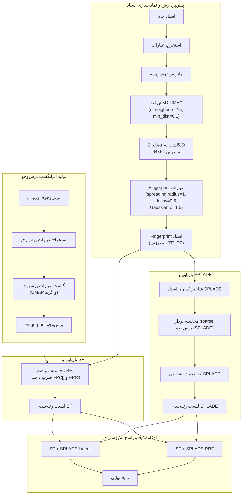

# پایان‌نامه کارشناسی ارشد — نسخهٔ master

> **عنوان:** بررسی، ارزیابی و تحلیل کاربردهای رویکرد مبتنی بر خوشه‌بندی معنایی متون چند زبانه جهت پاسخگویی به سوالات در محیط‌های با دامنه بسته
>
> **Investigating, evaluating, and analyzing the applications of semantic folding approach for multilingual texts questions answering in closed domain environments**
>
> نگارنده: وحید مرادی سرکشتی — استاد راهنما: دکتر مسعود رهگذر
> دانشکده مهندسی برق و کامپیوتر، پردیس دانشکدگان فنی، دانشگاه تهران
> پروپوزال مصوب: ۱۴۰۳/۰۶/۳۱

---

## وضعیت نگارش (tracking)

| بخش | وضعیت | منبع محتوا |
|---|---|---|
| چکیده فارسی/انگلیسی | ✅ پیش‌نویس | پس از بازبینی نهایی |
| فصل ۱: مقدمه | ✅ نسخهٔ اول | بخش ۴-۱ پروپوزال |
| فصل ۲: مبانی و پیشینه پژوهش | ✅ نسخهٔ اول | پروپوزال، بخش ۴-۳ + پایان‌نامه مشهدیزاده |
| فصل ۳: روش پژوهش (نقشه‌راه ۸ مرحله‌ای) | ✅ نسخهٔ اول | `thesis_methodology_chapter.md` + تحلیل کد |
| فصل ۴: ارزیابی و نتایج | ✅ نسخهٔ اول | `outputs/COMPREHENSIVE_RESULTS_SUMMARY.md` + `thesis_final_results.md` |
| فصل ۵: جمع‌بندی و پیشنهادها | ✅ نسخهٔ اول | — |
| پیوست A/B/C | ✅ نسخهٔ اول | پارامترها / دیتاست‌ها / فرمول معیارها |
| منابع | ✅ نسخهٔ اول | ۶۳ مرجع (۳۶ پروپوزال + ۲۷ جدید؛ شامل ادغام v02.1) — فرمت IEEE؛ ارجاع درون‌متنی درج شد |

**قرارداد اصطلاح‌شناسی** (یکدست در کل متن):

| انگلیسی | فارسی مصوب متن |
|---|---|
| Semantic Folding | خوشه‌بندی معنایی |
| Semantic Fingerprint | اثرانگشت معنایی |
| Semantic Map / Space | نقشهٔ معنایی |
| SDR (Sparse Distributed Representation) | بازنمایی پراکندهٔ توزیع‌شده |
| Context (corpus unit) | مفهوم معنایی مجزا |
| Term–Context Matrix | ماتریس واژه–مفهوم |
| Query | پرس‌وجو |

---

## فهرست شکل‌ها

| شماره | عنوان | بخش |
|---|---|---|
| شکل ۳-۱ | نقشه‌راه هشت‌مرحله‌ای پژوهش | ۳-۱ |
| شکل ۳-۲ | معماری خط لولهٔ پیاده‌سازی‌شده | ۳-۱ |
| شکل ۳-۳ | نقشهٔ معنایی UMAP پیکرهٔ دوزبانه (۴۸۸ مفهوم) | ۳-۵ |
| شکل ۳-۴ | اثرانگشت دوبعدی دو سند نمونه (گرید 64×64) | ۳-۶ |
| شکل ۴-۱ | مقایسهٔ بهترین SF با BM25 روی ۱۳ بنچمارک (MRR) | ۴-۴ |
| شکل ۴-۲ | جاروب وزن فیوژن خطی SPLADE روی Belebele | ۴-۵-۱ |
| شکل ۴-۳ | نمودار ablation واریانت‌های پارامتری بر حسب AP | ۴-۵-۲ |

فایل تصاویر: `docs/thesis/fa/figures/*.png` — تولیدشده با `scripts/make_thesis_figures.py`.

## فهرست جداول

| شماره | عنوان | بخش |
|---|---|---|
| جدول ۲-۱ | مقایسهٔ کیفی روش‌های تعبیه کلمات با خوشه‌بندی معنایی | ۲-۳-۴ |
| جدول ۳-۱ | نگاشت نقشه‌راه پروپوزال بر پیاده‌سازی | ۳-۱ |
| جدول ۴-۱ | مجموعه‌داده‌های ارزیابی | ۴-۲ |
| جدول ۴-۲ | بهترین نتیجهٔ هر بنچمارک در برابر BM25 | ۴-۴ |
| جدول ۴-۳ | آزمون معناداری آماری custom_ar_en | ۴-۴-۱ |
| جدول ۴-۴ | آزمون شبکهٔ واژگان WordNet (v1/v2) | ۴-۴-۳ |
| جدول ۴-۵ | ablation سهم اجزا (پیکرهٔ QA-sample) | ۴-۵-۲ |
| جدول ۴-۶ | سایر یافته‌های پارامتری | ۴-۵-۳ |
| جدول ۴-۷ | خط مبنای تراکمی MiniLM روی SciFact | ۴-۷-۱ |
| جدول ۴-۸ | MRR خط مبنای E5-multi در برابر بهترین SF و BM25 | ۴-۷-۱ |
| جدول ۴-۹ | مقایسهٔ ادبی با مدل‌های تعبیه کلمات | ۴-۷-۲ |
| جدول A-۱ | مرجع پارامترهای خط لوله | پیوست A |

---

# فصل ۱: مقدمه

## ۱-۱. مقدمه

در سال‌های اخیر، رشد سریع حجم اطلاعات متنی و گسترش منابع دیجیتال، نیاز به روش‌های کارآمد برای دسترسی، بازیابی و استخراج اطلاعات مرتبط از میان مجموعه‌های بزرگ متنی را افزایش داده است. در این میان، بازیابی اطلاعات (Information Retrieval) و پاسخ‌گویی به سوالات (Question Answering) از حوزه‌های مهم پردازش زبان طبیعی به شمار می‌روند. هدف سامانه‌های بازیابی اطلاعات، شناسایی و رتبه‌بندی اسنادی است که بیشترین ارتباط را با نیاز اطلاعاتی کاربر دارند، در حالی که سامانه‌های پاسخ‌گویی به سوالات تلاش می‌کنند اطلاعات مورد نیاز را در پاسخ به یک پرسش مشخص از میان منابع موجود استخراج یا تولید کنند.


با وجود پیشرفت روش‌های مبتنی بر یادگیری عمیق و مدل‌های زبانی، بازیابی اطلاعات در مجموعه‌های چندزبانه همچنان با چالش‌هایی از جمله تفاوت ساختار زبان‌ها، تنوع واژگانی، تفاوت‌های نحوی و دشواری ایجاد نمایش معنایی مشترک مواجه است. این چالش در محیط‌های دامنه‌بسته (Closed-Domain) اهمیت بیشتری پیدا می‌کند؛ زیرا سامانه باید بتواند از میان مجموعه‌ای مشخص از اسناد، اطلاعات مرتبط با پرسش را با دقت مناسبی شناسایی کند.


یکی از رویکردهایی که می‌تواند برای ایجاد نمایش متفاوتی از اطلاعات متنی مورد بررسی قرار گیرد، خوشه‌بندی معنایی (Semantic Folding) است. در این رویکرد، اطلاعات معنایی موجود در متن به یک فضای معنایی[1] ساختاریافته و قابل نمایش نگاشت می‌شود و روابط میان واحدهای متنی بر اساس موقعیت آن‌ها در این فضا مورد استفاده قرار می‌گیرد. ایده اصلی پژوهش حاضر، بررسی قابلیت استفاده از چنین نمایش فضایی برای بازیابی متون چندزبانه و ارزیابی عملکرد آن در یک چارچوب قابل تکرار است.


در این پژوهش، یک pipeline مبتنی بر Semantic Folding طراحی و پیاده‌سازی شده است که طی آن عبارات متنی استخراج شده، روابط context میان آن‌ها محاسبه و به یک فضای معنایی دوبعدی نگاشت می‌شوند. سپس برای عبارات و اسناد، fingerprintهای فضایی ایجاد شده و از آن‌ها برای مقایسه پرسش با اسناد استفاده می‌شود. در ادامه، عملکرد این رویکرد به‌صورت تجربی ارزیابی شده و امکان ترکیب آن با روش‌های نوین بازیابی sparse، از جمله SPLADE، نیز مورد بررسی قرار می‌گیرد.

## ۱-۲. ضرورت و اهمیت موضوع تحقيق

با رشد حجم محتوای دیجیتال چندزبانه و افزایش نیاز کاربران به دسترسی به اطلاعات فارغ از زبان تولید آن، توسعهٔ روش‌های بازیابی اطلاعات که بتوانند با دقت مناسبی در میان زبان‌های مختلف عمل کنند، به یک نیاز کاربردی و پژوهشی مهم تبدیل شده است. این نیاز به‌ویژه در محیط‌های دامنه‌بسته—مانند سامانه‌های پرسش‌وپاسخ سازمانی، آرشیوهای تخصصی، یا سامانه‌های پشتیبانی چندزبانه—محسوس‌تر است؛ زیرا در این محیط‌ها امکان اتکا به حجم عظیم داده‌های آموزشی که در بازیابی دامنه‌باز در دسترس است، وجود ندارد.

روش‌های واژگانی کلاسیک مانند BM25 با وجود کارایی و سادگی، در مواجهه با عدم تطابق واژگانی (Vocabulary Mismatch) میان زبان‌ها با محدودیت جدی روبه‌رو هستند. از سوی دیگر، روش‌های dense retrieval که با بردارهای متراکم کار می‌کنند، معمولاً نیازمند حجم زیادی داده‌ی آموزشی چندزبانه و منابع محاسباتی بالا هستند و تفسیرپذیری کمی دارند [61]. این شکاف میان کارایی و تفسیرپذیری، ضرورت بررسی رویکردهای جایگزین را توجیه می‌کند.

Semantic Folding رویکردی است که به‌جای بازنمایی متن صرفاً به‌صورت یک بردار متراکم غیرقابل تفسیر، اطلاعات معنایی را در یک فضای توپولوژیک قابل مشاهده نگاشت می‌کند [13]. با وجود پیشینهٔ نظری این روش، تاکنون کاربرد آن در مسئلهٔ بازیابی اطلاعات چندزبانه دامنه‌بسته و ترکیب آن با روش‌های بازیابی sparse عصبی نوین مانند SPLADE (Formal et al., 2021) به‌صورت تجربی و با چارچوب ارزیابی استاندارد بررسی نشده است. این پژوهش با هدف پر کردن همین خلأ انجام شده است.

از منظر کاربردی نیز، نتایج این پژوهش می‌تواند برای سامانه‌هایی که نیازمند بازیابی اطلاعات دقیق و قابل‌تفسیر در محیط‌های محدود منابع و چندزبانه هستند (مانند بایگانی‌های حقوقی یا سلامت چندزبانه) کاربرد داشته باشد، چراکه نمایش فضایی Fingerprint می‌تواند نسبت به بردارهای dense معمول، شفافیت بیشتری در تحلیل نتایج فراهم کند.


بر اساس پروپوزال و تجربهٔ اجرای این پژوهش، چالش‌های اصلی عبارت‌اند از:

1. **نگاشت چندزبانه:** تشکیل یک نقشهٔ معنایی واحد که واژگان زبان‌های مختلف را حول مفاهیم مشترک بچیند؛ بازیابی cross-lingual محض (پرسش عربی، سند انگلیسی بدون متن موازی) تقریباً ناممکن است و باید با پیکره‌های موازی دوزبانه حل شود.
2. **نبود مبنای ارزیابی استاندارد:** تا انتشار مبنای ارزیابی Cai et al. (2024) هیچ benchmark جامعی برای روش‌های مبتنی بر خوشه‌بندی معنایی وجود نداشت؛ در این پژوهش از پروتکل بازیابی استاندارد IR (MRR/AP/NDCG در برابر BM25) استفاده شده است.
3. **تنظیم پارامترها:** ابعاد نقشهٔ معنایی، درصد تنک‌سازی و میزان انتشار باید تعادل میان تمایزپذیری و پوشش را حفظ کنند؛ ابعاد خیلی کم یا خیلی زیاد دقت را می‌کاهند.
4. **واژگان خارج از پیکره (OOV):** واژه‌ای که در پیکره نباشد اثرانگشت تهی دارد؛ راهکار مرحلهٔ «شبکه واژگان» در فصل ۳ برای رفع آن ارائه شده است.

## ۱-۳. بیان و تعریف مسئله تحقيق

با وجود پیشرفت‌های قابل توجه در روش‌های بازیابی اطلاعات، دستیابی به نمایش مناسبی از محتوای معنایی اسناد و پرسش‌ها همچنان یکی از مسائل اساسی این حوزه است. روش‌های مبتنی بر تطبیق واژگان، در مواجهه با تفاوت‌های واژگانی و بیان یک مفهوم با کلمات متفاوت، ممکن است نتوانند ارتباط معنایی میان پرسش و سند را به‌خوبی شناسایی کنند. از سوی دیگر، بسیاری از روش‌های dense retrieval متن را در قالب بردارهای با ابعاد بالا نمایش می‌دهند که اگرچه قابلیت مناسبی برای اندازه‌گیری شباهت معنایی دارند، تفسیر ساختار فضایی این نمایش‌ها و بررسی نحوه شکل‌گیری ارتباط میان واحدهای متنی همواره ساده نیست.

 موضوع این پژوهش، بررسی، ارزیابی و تحلیل کاربرد رویکرد مبتنی بر Semantic Folding برای بازیابی و پاسخ‌گویی به پرسش‌های چندزبانه در محیط‌های دامنه‌بسته است.


در این پژوهش، Semantic Folding به‌عنوان یک رویکرد برای تبدیل اطلاعات متنی به یک نمایش فضایی مورد استفاده قرار می‌گیرد. ابتدا واحدهای متنی و عبارت‌ها از پیکره استخراج می‌شوند. سپس روابط context میان این واحدها با استفاده از اطلاعات آماری پیکره مدل‌سازی شده و با کاهش ابعاد، به یک فضای معنایی دوبعدی نگاشت می‌شوند.


در ادامه، فضای معنایی بر روی یک شبکه ۶۴×۶۴ نگاشت شده و برای هر عبارت یک Phrase Fingerprint ایجاد می‌شود. fingerprintهای عبارات موجود در هر سند نیز با یکدیگر تجمیع شده و Document Fingerprint را تشکیل می‌دهند. به همین ترتیب، پرسش کاربر نیز به یک نمایش fingerprint تبدیل شده و میزان شباهت آن با fingerprint اسناد محاسبه می‌شود.


بنابراین، در این پژوهش، واحد اصلی مقایسه صرفاً تطبیق مستقیم کلمات نیست، بلکه موقعیت و الگوی فعال‌شده در فضای معنایی نیز در فرآیند بازیابی مورد استفاده قرار می‌گیرد.


این مسئله در محیط‌های چندزبانه پیچیده‌تر می‌شود؛ زیرا زبان‌های مختلف دارای ویژگی‌های واژگانی و نحوی متفاوتی هستند و استخراج واحدهای معنایی مناسب و ایجاد نمایش مشترک میان آن‌ها نیازمند توجه به ویژگی‌های زبانی است.


از این رو، مسئله اصلی این پژوهش را می‌توان به صورت زیر بیان کرد:

آیا می‌توان با استفاده از رویکرد Semantic Folding، یک نمایش فضایی از عبارات و اسناد چندزبانه ایجاد کرد که بتوان از آن برای بازیابی اسناد مرتبط با پرسش در محیط‌های دامنه‌بسته استفاده کرد و عملکرد آن را به‌صورت کمی با معیارهای استاندارد بازیابی ارزیابی نمود؟


همچنین پرسش‌های فرعی پژوهش عبارت‌اند از:

آیا نمایش فضایی حاصل از Semantic Folding می‌تواند روابط معنایی میان عبارات را برای استفاده در بازیابی حفظ کند؟

تأثیر ایجاد fingerprint برای عبارات و تجمیع آن‌ها در سطح سند بر عملکرد بازیابی چیست؟

spreading در فضای معنایی چه تأثیری بر میزان شباهت پرسش و اسناد دارد؟

عملکرد Semantic Folding در مقایسه با روش‌های متداول و روش‌های sparse عصبی چگونه است؟

آیا ترکیب Semantic Folding با SPLADE می‌تواند کیفیت رتبه‌بندی اسناد را بهبود دهد؟

### ۱-۳-۱. زیرمسئله‌های عملیاتی پژوهش


1. **بازنمایی:** چگونه متون چندزبانه را به یک نقشهٔ معنایی مشترک نگاشت کنیم تا واژه‌های هم‌معنا در زبان‌های مختلف اثرانگشت‌های مشابه به دست آورند؟
2. **وزن‌دهی و ترکیب:** هنگام ساخت اثرانگشت اسناد و پرس‌وجوها، اهمیت هر واژه/عبارت را چگونه محاسبه کنیم (TF-IDF، هم‌رخدادی سند-محور)؟
3. **بازیابی:** شباهت میان اثرانگشت پرس‌وجو و اثرانگشت اسناد را چگونه بسنجیم که هم دقت بالا و هم سرعت مناسب تضمین شود — و آیا ادغام سیگنال واژگانی عصبی (SPLADE) می‌تواند نتایج را بهبود دهد؟

## ۱-۴. اهداف تحقيق

هدف اصلی


هدف اصلی این پژوهش، بررسی و ارزیابی قابلیت رویکرد Semantic Folding در ایجاد نمایش فضایی از متون چندزبانه و استفاده از این نمایش برای بازیابی اطلاعات و پاسخ‌گویی به پرسش‌ها در محیط‌های دامنه‌بسته است.


اهداف فرعی


اهداف فرعی پژوهش عبارت‌اند از:


طراحی و پیاده‌سازی یک pipeline مبتنی بر Semantic Folding برای پردازش متون چندزبانه.

بررسی روش‌های استخراج عبارت برای زبان‌های مختلف و ایجاد یک نمایش یکپارچه از عبارات.

ایجاد ماتریس Term-Context و استفاده از وزن‌دهی TF-IDF در مدل‌سازی روابط متنی.

ایجاد فضای معنایی دوبعدی برای نمایش روابط میان عبارات.

تولید Phrase Fingerprint برای عبارات و Document Fingerprint برای اسناد.

تبدیل پرسش‌های ورودی به نمایش fingerprint و استفاده از آن در فرآیند بازیابی.

بررسی تأثیر spatial spreading بر بازیابی اسناد مرتبط.

ارزیابی عملکرد روش پیشنهادی با معیارهایی مانند MRR، AP، Precision، Recall و NDCG.

بررسی امکان ترکیب Semantic Folding با SPLADE و مقایسه روش‌های Linear و RRF.

ایجاد یک چارچوب benchmark قابل تکرار برای ارزیابی روش پیشنهادی روی مجموعه‌داده‌های چندزبانه.

**اهداف جزئی این پایان‌نامه:**


هدف اصلی این پژوهش، بررسی، ارزیابی و تحلیل کاربردهای رویکرد خوشه‌بندی معنایی برای درک مفاهیم متون چندزبانه و سنجش کارایی آن در پاسخگویی خودکار به سوالات، در مقایسه با پیشرفت‌های اخیر شبکه‌های عصبی عمیق و شبکه‌های گراف است. اهداف جزئی عبارت‌اند از:

1. پیاده‌سازی کامل خط لولهٔ خوشه‌بندی معنایی (استخراج عبارات ← ماتریس واژه–مفهوم ← نقشهٔ معنایی ← اثرانگشت عبارات ← اثرانگشت اسناد ← پردازش پرس‌وجو).
2. بررسی تأثیر پارامترهای کلیدی (ابعاد نقشه، وزن‌دهی TF-IDF، هموارسازی گاوسی، انتشار فعال‌سازی و …) بر دقت بازیابی.
3. ارزیابی روش روی مجموعه‌داده‌های متنوع دامنه بسته (قرآن کریم با ۶٬۲۳۶ آیه، پیکرهٔ دوزبانهٔ عربی–انگلیسی Belebele، PubMedQA، PopQA، NarrativeQA و زیرمجموعه‌ای از BEIR).
4. مقایسه با خط مبنای BM25 و بررسی معناداری آماری تفاوت‌ها.
5. پیشنهاد و آزمودن بهبودهایی بر روش پایه، از جمله ادغام خطی با مدل SPLADE و سازوکار شبکهٔ واژگان برای واژگان خارج از پیکره.

## ۱-۵. روش انجام پژوهش

این پژوهش از نوع پیاده‌سازی و ارزیابی است. در ابتدا یک پیکره متنی[^1] چندزبانه به‌عنوان ورودی سیستم در نظر گرفته می‌شود. سپس فرآیند نمایه‌سازی[^2] در پنج مرحله انجام می‌شود که در فصل سوم به تفصیل شرح داده می‌شود.

در ادامه، نتایج Semantic Folding به‌صورت مستقل ارزیابی شده و امکان ترکیب آن با SPLADE نیز بررسی می‌شود. برای ارزیابی کمی، معیارهایی مانند MRR، AP، Precision@K، Recall@K و NDCG@K محاسبه خواهند شد. نتایج در سطح هر پرسش و به‌صورت تجمیعی تحلیل می‌شوند.

## ۱-۶. نوآوری‌ها و دستاوردهای پژوهش


1. پیاده‌سازی کامل و بازتولیدپذیر خط لولهٔ خوشه‌بندی معنایی برای بازیابی در دامنه بسته (اولین ارزیابی نظام‌مند این روش روی ۱۴ مجموعه‌داده استاندارد).
2. سازوکار وزن‌دهی دو سطحی: هم‌رخدادی واژه–مفهوم برای «ساختار» اثرانگشت و TF-IDF برای «اهمیت»، به‌صورت جمع خطی وزن‌دار.
3. گزارش نخستین نتایج این روش روی پیکرهٔ قرآن کریم (۳۰ پرسش، ۶٬۲۳۶ آیه) و پیکرهٔ دوزبانهٔ عربی–انگلیسی (۴۸۸ قطعه) همراه با آزمون‌های معناداری آماری (Wilcoxon و McNemar).
4. بهبود عملکرد از طریق فیوژن خطی SF+SPLADE (α=0.3) که در سه دیتاست از چهار دیتاست اصلی بهترین نتیجه را داده است.
5. تحلیل جامع پارامتری و شکست‌ها (failure analysis) برای شناسایی مرزهای کاربرد روش.

## ۱-۷. ساختار پایان‌نامه


- **فصل ۲** مبانی نظری (HTM، نظریه خوشه‌بندی معنایی، SDR) و مرور پیشینه (سامانه‌های QA، روش‌های تعبیه کلمات، کارهای مبتنی بر SF) را پوشش می‌دهد.
- **فصل ۳** روش پیشنهادی را مطابق نقشه‌راه هشت‌مرحله‌ای پروپوزال شرح می‌دهد: از تقسیم داده به مفاهیم معنایی مجزا تا جست‌وجو و تعیین پاسخ، همراه با جزئیات وزن‌دهی و نمایه‌سازی.
- **فصل ۴** طرح آزمایش‌ها، مجموعه‌داده‌ها، معیارهای ارزیابی و نتایج کمی (به همراه آزمون‌های معناداری و تحلیل خطا) را ارائه می‌کند.
- **فصل ۵** به جمع‌بندی، محدودیت‌ها و پیشنهاد مسیرهای آتی (از جمله شبکه توجه گرافی و بسط چندزبانهٔ شبکهٔ واژگان) می‌پردازد.

---

# فصل ۲: مبانی نظری و پیشینه پژوهش

## ۲-۱. مقدمه

در این فصل ابتدا چارچوب‌های پایهٔ بازیابی اطلاعات و پاسخ‌گویی به سوال مرور می‌شود؛ سپس به بازیابی چندزبانه/میان‌زبانی و مجموعه‌داده‌های استاندارد آن پرداخته می‌شود. بخش‌های میانی، نمایش متون (واژگانی، تنک، متراکم)، نظریهٔ خوشه‌بندی معنایی و اجزای سازندهٔ اثرانگشت‌ها را تشریح می‌کنند و در پایان، معیارهای ارزیابی، مجموعه‌داده‌ها و مرور ساختارمند پیشینه ارائه می‌گردد.

## ۲-۲. بازیابی اطلاعات (Information Retrieval)
### ۲-۲-۱. تعریف بازیابی اطلاعات
بازیابی اطلاعات (Information Retrieval یا IR) یکی از حوزه‌های اصلی علوم کامپیوتر و پردازش زبان طبیعی است که هدف آن **یافتن و بازیابی اطلاعات مرتبط با نیاز اطلاعاتی کاربر از میان مجموعه‌ای از منابع اطلاعاتی** است. در حالت متداول، منابع مورد نظر اسناد متنی هستند و نیاز اطلاعاتی کاربر به وسیله یک پرس‌وجو (Query) بیان می‌شود. سیستم بازیابی اطلاعات پس از پردازش پرس‌وجو و اسناد، میزان ارتباط هر سند با پرس‌وجو را تخمین زده و اسناد را بر اساس میزان ارتباط آن‌ها مرتب می‌کند. (IEEE Technology Navigator)

تفاوت اساسی بازیابی اطلاعات با بازیابی داده‌های ساخت‌یافته در این است که در سیستم‌های پایگاه داده معمولاً هدف، یافتن رکوردهایی است که دقیقاً شرایط مشخص‌شده را برآورده می‌کنند؛ در حالی که در بازیابی اطلاعات، **میزان ارتباط (Relevance)** یک مفهوم تدریجی است. بنابراین ممکن است چندین سند با درجات مختلفی از ارتباط با یک پرس‌وجو وجود داشته باشند و سیستم باید آن‌ها را بر اساس میزان ارتباط رتبه‌بندی کند. (ScienceDirect)

به صورت کلی، می‌توان فرایند بازیابی اطلاعات را به صورت زیر در نظر گرفت:

![][image1]

```text
[
q rightarrow IR(d,q) rightarrow Score(d,q) rightarrow Ranking
]
```

که در آن (q) پرس‌وجوی کاربر، (d) یک سند از مجموعه اسناد و (Score(d,q)) امتیاز ارتباط سند با پرس‌وجو است.

در یک سیستم IR، دو مرحله اساسی وجود دارد: **نمایه‌سازی (Indexing)** و **جست‌وجو یا امتیازدهی (Search/Scoring)**.

در مرحله نمایه‌سازی، اسناد به یک نمایش داخلی مناسب تبدیل می‌شوند و در مرحله جست‌وجو، پرس‌وجو نیز به شکلی سازگار نمایش داده شده و میزان ارتباط آن با اسناد محاسبه می‌شود. (ScienceDirect)

---

### ۲-۲-۲. سند، پرس‌وجو و مجموعه اسناد
سه مفهوم اساسی در مسئله بازیابی اطلاعات عبارت‌اند از **سند، پرس‌وجو و مجموعه اسناد**.

**سند (Document)** واحدی از اطلاعات است که سیستم می‌تواند آن را ذخیره، نمایه‌سازی و بازیابی کند. در بازیابی متنی، یک سند می‌تواند یک مقاله، صفحه وب، بخش از یک کتاب، یک پاراگراف یا حتی یک قطعه کوتاه از متن باشد.

**پرس‌وجو (Query)** بیان‌کننده نیاز اطلاعاتی کاربر است. پرس‌وجو می‌تواند از چند کلمه تا یک جمله یا حتی یک سؤال کامل تشکیل شود. برای مثال:

> *What are the effects of artificial intelligence on education?*

در این مثال، پرس‌وجو بیانگر نیاز کاربر به اطلاعاتی درباره تأثیر هوش مصنوعی بر آموزش است.

**مجموعه اسناد (Corpus)** مجموعه‌ای از اسناد است که سیستم بازیابی اطلاعات در میان آن‌ها به دنبال اسناد مرتبط با پرس‌وجو می‌گردد. بنابراین اگر مجموعه اسناد را با

```text
[
D={d_1,d_2,ldots,d_N}
]
```

نشان دهیم، هدف سیستم برای یک پرس‌وجوی (q)، تعیین میزان ارتباط هر (d_i) با (q) و تولید یک فهرست رتبه‌بندی‌شده از اسناد است. این صورت‌بندی در مدل‌های جدید بازیابی متراکم نیز به همین شکل استفاده می‌شود. (DOI)

در پژوهش حاضر نیز همین ساختار وجود دارد؛ به این صورت که **پرس‌وجوها از مجموعه پرسش‌های بنچمارک دریافت شده و با مجموعه‌ای از اسناد یا passageها مقایسه می‌شوند** و هدف، قرار گرفتن اسناد مرتبط در رتبه‌های بالاتر است.

---

### ۲-۲-۳. رتبه‌بندی اسناد
پس از دریافت پرس‌وجو، سیستم IR باید مشخص کند که هر سند تا چه اندازه با پرس‌وجو مرتبط است. برای این منظور، به هر زوج پرس‌وجو–سند یک **امتیاز ارتباط (Relevance Score)** اختصاص داده می‌شود و سپس اسناد بر اساس این امتیاز مرتب می‌شوند. (ScienceDirect)

در روش‌های سنتی، این امتیاز می‌تواند بر اساس عواملی مانند تعداد وقوع واژه‌های پرس‌وجو در سند، اهمیت واژه‌ها و میزان شباهت بردارهای سند و پرس‌وجو محاسبه شود. برای مثال، در مدل فضای برداری، سند و پرس‌وجو به صورت بردارهایی از وزن واژه‌ها نمایش داده شده و نزدیکی آن‌ها برای رتبه‌بندی استفاده می‌شود. (PubMed Central (PMC))

اهمیت رتبه‌بندی از آنجا ناشی می‌شود که معمولاً تعداد اسناد موجود در یک مجموعه بسیار بیشتر از آن است که کاربر بتواند همه آن‌ها را بررسی کند. بنابراین سیستم باید **مرتبط‌ترین اسناد را در ابتدای فهرست نتایج قرار دهد**. (Stanford NLP)

---

### ۲-۲-۴. تطبیق واژگانی (Lexical Matching)
در روش‌های مبتنی بر **تطبیق واژگانی**، ارتباط میان پرس‌وجو و سند عمدتاً بر اساس تطابق واژه‌ها یا واحدهای متنی مشترک تعیین می‌شود. به عبارت دیگر، سیستم بررسی می‌کند که واژه‌ها یا عبارات موجود در پرس‌وجو تا چه اندازه در سند نیز حضور دارند.

برای مثال، فرض کنید پرس‌وجو به صورت زیر باشد:

> **artificial intelligence in education**

و دو سند زیر در مجموعه وجود داشته باشند:

**سند 1:**

> *Artificial intelligence is increasingly used in education.*

**سند 2:**

> *Machine learning systems are transforming modern classrooms.*

در این مثال، روش واژگانی سند اول را به دلیل وجود مستقیم واژه‌های **artificial، intelligence و education** بسیار مرتبط تشخیص می‌دهد.

یکی از ساختارهای بنیادی برای پیاده‌سازی چنین جست‌وجویی **نمایه‌سازی معکوس (Inverted Index)** است. در این ساختار، برای هر واژه فهرستی از اسنادی که آن واژه را شامل می‌شوند نگهداری می‌شود و این ساختار امکان یافتن سریع اسناد حاوی واژه‌های پرس‌وجو را فراهم می‌کند. (Stanford University)

مدل‌های سنتی مانند **TF-IDF** و **BM25** نمونه‌هایی از روش‌هایی هستند که از اطلاعات واژگانی و آماری موجود در اسناد برای امتیازدهی و رتبه‌بندی استفاده می‌کنند.

مزیت مهم تطبیق واژگانی، **دقت بالا در تطبیق اصطلاحات و کلمات خاص** است؛ اما محدودیت آن این است که الزاماً مفهوم و معنای واژه‌ها را درک نمی‌کند. برای مثال، اگر پرس‌وجو شامل عبارت:

> *car accident*

باشد و سندی عبارت:

> *automobile collision*

را داشته باشد، یک روش صرفاً واژگانی ممکن است به دلیل نبود تطابق مستقیم، ارتباط این دو را به خوبی تشخیص ندهد.

---

### ۲-۲-۵. تطبیق معنایی (Semantic Matching)
در مقابل تطبیق واژگانی، **تطبیق معنایی (Semantic Matching)** تلاش می‌کند ارتباط میان پرس‌وجو و سند را بر اساس **معنا و مفهوم متن** تعیین کند، نه صرفاً وجود واژه‌های یکسان.

در روش‌های جدید، پرس‌وجو و اسناد می‌توانند به نمایش‌هایی در یک فضای برداری تبدیل شوند و سپس میزان نزدیکی آن‌ها در این فضا به عنوان معیار شباهت مورد استفاده قرار گیرد. در بازیابی متراکم (Dense Retrieval)، این نمایش‌ها معمولاً بردارهای چگال هستند و مدل یادگیری‌شده تلاش می‌کند متون دارای معنای مشابه را در فضای نمایش به یکدیگر نزدیک کند. (DOI)

برای مثال:

> **Query:** *How does AI affect education?*

و:

> **Document:** *Artificial intelligence is changing the way students learn.*

اگرچه این دو متن واژه‌های کاملاً یکسانی ندارند، از نظر معنایی ارتباط نزدیکی دارند. یک سیستم semantic retrieval می‌تواند این ارتباط را بهتر از یک روش صرفاً lexical تشخیص دهد.

البته روش‌های معنایی و متراکم (Dense Retrieval) نیز محدودیت‌هایی دارند. مطالعات مربوط به بازیابی متراکم نشان داده‌اند که در برخی شرایط، مدل‌های dense در **semantic matching** عملکرد خوبی دارند، اما ممکن است در **lexical matching** نسبت به روش‌های sparse مانند BM25 ضعیف‌تر باشند. به همین دلیل، ترکیب اطلاعات واژگانی و معنایی به یکی از مسیرهای مهم پژوهش در بازیابی اطلاعات تبدیل شده است.

اگرچه روش‌های معنایی و متراکم (Dense Retrieval) در بسیاری از مسائل قادر به ایجاد تطبیق معنایی مؤثر هستند، اما در برخی شرایط محدودیت‌های دارند و ممکن است در تطبیق واژگانی، به‌ویژه برای عبارات مهم، نام‌های خاص و واژه‌های نادر، نسبت به روش‌های بازیابی تنک (Sparse Retrieval) مانند BM25 عملکرد ضعیف‌تری داشته باشند.  (DOI)

ازاین‌رو، ترکیب سیگنال‌های واژگانی و معنایی به یکی از رویکردهای مهم پژوهش در بازیابی اطلاعات تبدیل شده است. (ACL Anthology)

---

### ۲-۲-۶. ارتباط بازیابی واژگانی و معنایی با پژوهش حاضر
این تمایز برای پژوهش حاضر اهمیت ویژه‌ای دارد. روش پیشنهادی پایان‌نامه بر پایه **Semantic Folding** تلاش می‌کند متن را از سطح تطبیق مستقیم واژه‌ها فراتر برده و اطلاعات معنایی و ارتباط میان عبارات را در یک فضای ساخت‌یافته نمایش دهد.

از طرف دیگر، استفاده از روش‌هایی مانند **SPLADE** امکان استفاده همزمان از ویژگی‌های sparse و اطلاعات معنایی حاصل از مدل‌های زبانی را فراهم می‌کند. بنابراین می‌توان معماری کلی پژوهش حاضر را در امتداد تلاش برای ایجاد تعادل میان دو نوع تطبیق زیر در نظر گرفت:

[boxed{text{Lexical Matching} + text{Semantic Matching}}]

این موضوع در ادامه پایان‌نامه و به‌ویژه در بخش‌های مربوط به **TF-IDF، نمایش sparse، Semantic Folding، fingerprintهای متنی و SPLADE** با جزئیات بیشتری بررسی خواهد شد.

---

## ۲-۳. پاسخ‌گویی به سؤال (Question Answering)
### ۲-۳-۱. تعریف پاسخ‌گویی به سؤال
پاسخ‌گویی به سؤال (Question Answering یا QA) یکی از مسائل مهم در پردازش زبان طبیعی است که هدف آن، ارائه پاسخ مناسب به یک پرسش بیان‌شده به زبان طبیعی است. برخلاف جست‌وجوی سنتی که معمولاً فهرستی از اسناد مرتبط را در اختیار کاربر قرار می‌دهد، سیستم QA تلاش می‌کند اطلاعات مورد نیاز کاربر را از منابع موجود استخراج کرده و به صورت یک پاسخ ارائه کند.

برای مثال، فرض کنیم کاربر سؤال زیر را مطرح کند:

> Who developed the theory of relativity?

یک سیستم بازیابی اطلاعات ممکن است چندین مقاله مرتبط با «theory of relativity» را برگرداند؛ اما یک سیستم QA باید بتواند پاسخ مناسب، یعنی:

> Albert Einstein

را از میان منابع اطلاعاتی پیدا یا تولید کند.

در سیستم‌های مدرن QA، به‌ویژه در Open-Domain QA، معمولاً مسئله به دو بخش اصلی تقسیم می‌شود: بازیابی اطلاعات مرتبط (Retrieval) و استخراج یا تولید پاسخ (Answering). در معماری‌های retrieve-then-read، ابتدا یک Retriever اسناد یا passageهای مرتبط را از یک مجموعه بزرگ بازیابی می‌کند و سپس یک Reader یا Answering Model پاسخ را از میان اطلاعات بازیابی‌شده استخراج یا تولید می‌کند. (ACL Anthology)

---

### ۲-۳-۲. پاسخ‌گویی به سؤال در دامنه باز و دامنه بسته
از نظر محدوده منابع اطلاعاتی، سیستم‌های QA را می‌توان به دو دسته کلی Open-Domain QA و Closed-Domain QA تقسیم کرد.

#### الف) پاسخ‌گویی به سؤال در دامنه باز (Open-Domain QA)

در Open-Domain QA، سیستم محدود به یک حوزه موضوعی یا یک مجموعه کوچک از منابع نیست و باید بتواند پاسخ پرسش را از میان یک مجموعه بزرگ و متنوع از اسناد پیدا کند.

برای مثال:

> When was the first computer invented?

سیستم ممکن است برای پاسخ به این سؤال مجبور باشد میان میلیون‌ها یا میلیاردها صفحه متنی جست‌وجو کند.

در چنین شرایطی، Retriever اهمیت بسیار زیادی پیدا می‌کند؛ زیرا بررسی تمام اسناد توسط مدل پاسخ‌گو عملاً امکان‌پذیر یا مقرون‌به‌صرفه نیست. به همین دلیل، معماری‌های Open-Domain QA معمولاً از یک مرحله بازیابی برای کاهش مجموعه عظیم اسناد به تعداد محدودی از اسناد یا passageهای کاندید استفاده می‌کنند. (ACL Anthology)

---

#### ب) پاسخ‌گویی به سؤال در دامنه بسته (Closed-Domain QA)

در Closed-Domain QA، سیستم با یک مجموعه مشخص و محدود از منابع یا یک حوزه موضوعی مشخص کار می‌کند.

برای مثال، فرض کنیم مجموعه اسناد یک سازمان شامل مستندات مربوط به یک محصول باشد. کاربر می‌پرسد:

> «حداکثر ظرفیت این محصول چقدر است؟»

سیستم فقط باید در همان مجموعه مستندات جست‌وجو کند.

در نتیجه، برخلاف Open-Domain QA، فضای جست‌وجو از ابتدا محدود شده است. این ویژگی باعث می‌شود طراحی و ارزیابی سیستم در یک حوزه مشخص امکان‌پذیرتر باشد و بتوان روش‌های مختلف بازیابی را به صورت کنترل‌شده با یکدیگر مقایسه کرد.

این مفهوم به پژوهش حاضر ارتباط مستقیمی‌دارد؛ زیرا Semantic Folding برای بازیابی از یک مجموعه مشخص از متون هم مورد استفاده قرار می‌گیرد و عملکرد آن بر اساس میزان موفقیت در بازیابی اسناد مرتبط با پرسش‌ها ارزیابی می‌شود.

منظور از محیط دامنه‌بسته، محدود بودن فضای جست‌وجو به یک مجموعه اسناد مشخص و از پیش تعریف‌شده است. بنابراین دامنه‌بسته در اینجا الزاما به معنای محدود بودن موضوعی محتوا نیست، بلکه به محدود بودن corpus قابل جست‌وجو اشاره دارد.

---

### ۲-۳-۳. پاسخ‌گویی مبتنی بر بازیابی (Retrieval-based QA)
یکی از معماری‌های رایج در QA، معماری Retrieve-Then-Read است.

ایده اصلی بسیار ساده است:

Question

   │

   ▼

Retriever

   │

   ▼

Relevant Documents / Passages

   │

   ▼

Reader / Answering Model

   │

   ▼

Answer

در مرحله اول، Retriever از میان مجموعه اسناد، تعدادی سند را که احتمال می‌دهد برای پاسخ‌گویی مرتبط باشند انتخاب می‌کند.

در مرحله دوم، مدل پاسخ‌گو این اطلاعات را بررسی کرده و پاسخ نهایی را استخراج یا تولید می‌کند.

این معماری یک مزیت مهم دارد: به جای آنکه مدل پاسخ‌گو مجبور باشد کل مجموعه اسناد را بررسی کند، تنها با بخش کوچکی از اطلاعات کاندید کار می‌کند. معماری‌های retrieve-then-read از رویکردهای اصلی در Open-Domain QA محسوب می‌شوند. (ACL Anthology)

---

### ۲-۳-۴. نقش Retriever در سیستم QA
Retriever در یک سیستم QA نقش دروازه ورود اطلاعات را دارد.

فرض کنیم مجموعه اسناد شامل:

[D={d_1,d_2,ldots,d_N}]

باشد و پرسش کاربر (q) باشد.

Retriever باید تابعی مانند زیر را محاسبه کند:

[Score(q,d_i)]

و اسناد را بر اساس میزان ارتباط با پرسش مرتب کند.

سپس:

[Top-K(q,D)]

به عنوان مجموعه اسناد کاندید به مرحله بعدی ارسال می‌شود. برای بنچمارک نهایی، 100 سند اول به‌عنوان مجموعه اسناد کاندید بازیابی می‌شوند (`top_k=100`). مقادیر 5، 10 و 20 صرفاً در بنچمارک‌های مقدماتی برای سنجش حساسیت پارامتر استفاده شده‌اند.

برای مثال اگر مجموعه شامل یک میلیون سند باشد:

1,000,000 documents

        ↓

     Retriever

        ↓

   100 candidates

        ↓

      Reader

        ↓

      Answer

بنابراین حتی اگر مدل پاسخ‌گو بسیار قدرتمند باشد، اگر Retriever سند مناسب را در میان کاندیدها قرار ندهد، سیستم نمی‌تواند پاسخ صحیح را پیدا کند.

به همین دلیل کیفیت Retriever یکی از عوامل تعیین‌کننده در عملکرد سیستم‌های Retrieval-based QA است. پژوهش‌های مربوط به رتبه‌بندی عصبی نیز Retriever و ranking را به عنوان اجزای مهم دسترسی به دانش خارجی در Open-Domain QA مورد بررسی قرار داده‌اند. (ACL Anthology)

این مسئله دقیقاً همان جایی است که پژوهش حاضر اهمیت پیدا می‌کند: هدف اصلی در این مرحله تولید پاسخ نیست، بلکه بررسی کیفیت روش Semantic Folding در پیدا کردن اسناد مرتبط با پرسش است.

---

## ۲-۴. بازیابی چندزبانه و چندزبانی
با گسترش منابع دیجیتال در زبان‌های مختلف، سیستم‌های بازیابی اطلاعات دیگر نمی‌توانند صرفاً بر منابع انگلیسی متکی باشند. در بسیاری از کاربردها، پرسش کاربر ممکن است به یک زبان بیان شود، در حالی که اطلاعات مورد نیاز در منابعی با زبان دیگر قرار داشته باشد.

از این رو، بازیابی اطلاعات چندزبانه و میان‌زبانی اهمیت ویژه‌ای پیدا کرده است.

---

### ۲-۴-۱. بازیابی اطلاعات چندزبانه (Multilingual Information Retrieval)
Multilingual Information Retrieval یا MLIR به مسئله بازیابی اطلاعات از مجموعه‌ای از منابع متنی با چند زبان مختلف اشاره دارد.

برای مثال، فرض کنیم مجموعه اسناد شامل:

English documents

Arabic documents

Persian documents

French documents

German documents

باشد.

یک سیستم Multilingual IR می‌تواند برای این مجموعه، پرسش‌هایی را در زبان‌های مختلف دریافت کرده و اسناد مرتبط را از منابع چندزبانه بازیابی کند.

در این حالت، مسئله اصلی این است که سیستم باید بتواند ویژگی‌های زبانی متفاوت را در یک چارچوب مشترک مدیریت کند؛ از جمله تفاوت در واژگان، ساختار دستوری، شکل کلمات و شیوه توکن‌سازی.

پژوهش‌هایی مانند Mr. TyDi دقیقاً برای بررسی عملکرد سیستم‌های بازیابی در زبان‌های مختلف طراحی شده‌اند. که در ادامه به آن پرداخته شده است. (ACL Anthology)

---

### ۲-۴-۲. بازیابی میان‌زبانی (Cross-Lingual Information Retrieval)
Cross-Lingual Information Retrieval یا CLIR حالت خاص‌تری از بازیابی چندزبانه است که در آن زبان پرسش و زبان اسناد می‌توانند متفاوت باشند.

برای مثال:

Query:

What is artificial intelligence?

        ↓

Documents:

"ما هو الذکاء الاصطناعی؟ ..."

"Was ist künstliche Intelligenz? ..."

در اینجا کاربر پرسش را به انگلیسی مطرح کرده است، اما سیستم باید بتواند اسناد عربی یا آلمانی مرتبط را نیز پیدا کند.

پس:

```text
[
Language(Query) neq Language(Document)
]
```

می‌تواند برقرار باشد.

این مسئله از نظر معنایی چالش‌برانگیزتر از بازیابی تک‌زبانه است، زیرا سیستم باید ارتباط مفهومی‌میان دو زبان متفاوت را تشخیص دهد.

---

### ۲-۴-۳. پاسخ‌گویی به سؤال چندزبانه (Multilingual QA)
در Multilingual QA، سیستم باید بتواند پرسش‌هایی را که به زبان‌های مختلف مطرح می‌شوند پردازش کرده و پاسخ مناسب ارائه دهد.

برای مثال:

English:

Who invented the telephone?

Arabic:

من اخترع الهاتف؟

Persian:

چه کسی تلفن را اختراع کرد؟

ممکن است هر سه پرسش از نظر معنایی به یک مفهوم اشاره کنند، اما شکل واژگانی آن‌ها کاملاً متفاوت است.

در نتیجه، سیستم Multilingual QA باید بتواند اطلاعات مورد نیاز را در زبان مناسب پیدا کرده و در صورت نیاز، ارتباط میان زبان‌ها را نیز برقرار کند.

این مسئله در XOR QA به شکل شدیدتری مطرح می‌شود. پژوهش XOR QA نشان می‌دهد که بسیاری از پرسش‌های چندزبانه الزاماً دارای پاسخ مناسب در منابع همان زبان نیستند و ممکن است برای پاسخ‌گویی نیاز به بازیابی اطلاعات از منابع زبان دیگر وجود داشته باشد. (ACL Anthology)

---

### ۲-۴-۴. چالش‌های بازیابی در زبان‌های مختلف
بازیابی چندزبانه با چالش‌های متعددی مواجه است. مهم‌ترین آن‌ها عبارت‌اند از:

#### 1. تفاوت واژگان

یک مفهوم مشابه می‌تواند در زبان‌های مختلف با واژه‌های کاملاً متفاوت بیان شود.

مثلاً:

English: artificial intelligence

Arabic: الذکاء الاصطناعی

Persian: هوش مصنوعی

بنابراین تطبیق صرفاً واژگانی نمی‌تواند ارتباط این عبارات را تشخیص دهد.

#### 2. تفاوت ساختار دستوری

زبان‌ها از نظر ترتیب واژه‌ها، صرف فعل، ساختار اسمی‌و سایر ویژگی‌های نحوی با یکدیگر تفاوت دارند.

#### 3. تفاوت در توکن‌سازی

در برخی زبان‌ها، فاصله الزاماً مرز مناسبی برای تعیین کلمات نیست و برخی زبان‌ها نیز دارای ساختار صرفی پیچیده‌تری هستند.

#### 4. تفاوت منابع آموزشی

میزان داده‌های متنی موجود برای زبان‌های مختلف یکسان نیست. برخی زبان‌ها دارای منابع بسیار زیاد و برخی دیگر دارای منابع محدود هستند.

#### 5. Information Scarcity

در برخی زبان‌ها تعداد منابع و مقالات موجود کمتر است.

#### 6. Information Asymmetry

حتی اگر یک مفهوم در منابع یک زبان وجود داشته باشد، ممکن است همان اطلاعات در Wikipedia یا منابع زبان دیگر وجود نداشته باشد.

XOR QA این دو مسئله را به‌طور مشخص مورد توجه قرار می‌دهد و نشان می‌دهد که کمبود اطلاعات و عدم تقارن اطلاعاتی از چالش‌های مهم QA میان‌زبانی هستند. (ACL Anthology)

---

### ۲-۴-۵. مجموعه‌داده Mr. TyDi
یکی از مجموعه‌داده‌های مهم برای ارزیابی بازیابی چندزبانه، Mr. TyDi است.

Mr. TyDi یک benchmark برای بازیابی تک‌زبانه (monolingual retrieval) در 11 زبان متفاوت از نظر گونه‌شناختی است که با هدف ارزیابی روش‌های بازیابی، به‌خصوص روش‌های مبتنی بر بازیابی dense، ایجاد و معرفی شده است. (ACL Anthology)

نکته مهم این است که Mr. TyDi در اصل Cross-Lingual Retrieval نیست؛ بلکه مسئله آن عمدتاً بازیابی تک‌زبانه است؛ به عبارتی دیگر در این بنچمارک پرسش و اسناد مورد بازیابی در یک زبان قرار دارند.

این تفاوت برای پایان‌نامه حاضر مهم است:

Mr. TyDi

Query (Arabic)

       │

       ▼

Arabic Documents

       │

       ▼

Ranking

یا:

Query (Persian)

       │

       ▼

Persian Documents

       │

       ▼

Ranking

بنابراین اگر Semantic Folding را روی Mr. TyDi ارزیابی کنیم، می‌توانیم بررسی کنیم که آیا روش پیشنهادی در زبان‌های مختلف و خارج از انگلیسی توانایی حفظ عملکرد خود را دارد یا خیر.

پژوهش اصلی Mr. TyDi همچنین نتیجه جالبی گزارش می‌کند: baseline مبتنی بر mDPR در آزمایش‌های آن‌ها به‌طور قابل توجهی از BM25 ضعیف‌تر بود، اما نمایش‌های dense اطلاعات مرتبط ارزشمندی ارائه کردند و ترکیب sparse و dense توانست نتایج BM25 را بهبود دهد. (ACL Anthology)

این نتیجه برای پژوهش حاضر بسیار مرتبط است، زیرا نشان می‌دهد ترکیب سیگنال‌های واژگانی و معنایی می‌تواند یک مسیر مؤثر برای بهبود retrieval چندزبانه باشد.

---

### ۲-۴-۶. مجموعه‌داده XOR-TyDi
یک نمونه مهم از بازیابی بین زبانی XOR-TyDi QA است که مسئله متفاوتی را بررسی می‌کند. این مجموعه‌داده طراحی شده است تا مشخصا مسئله Cross-Lingual Open-Retrieval Question Answering را هدف قرار دهد. (ACL Anthology)

XOR-TyDi شامل حدود 40 هزار پرسش و پاسخ در 7 زبان غیرانگلیسی است و از پرسش‌هایی در TyDi QA ساخته شده که برای آن‌ها در همان زبان پاسخ مناسبی پیدا نشده بود. (ACL Anthology)

در این مسئله، ممکن است پرسش به زبان یک کشور مطرح شود، اما اطلاعات مورد نیاز برای پاسخ در منابع انگلیسی یا زبان دیگری قرار داشته باشد.

فرایند کلی را می‌توان به صورت زیر نمایش داد:

Question in target language

          │

          ▼

 Cross-lingual Retrieval

          │

          ▼

English / multilingual passages

          │

          ▼

Answer extraction / generation

          │

          ▼

Answer in target language

XOR-TyDi سه سطح وظیفه را نیز معرفی می‌کند:

1. XOR-RETRIEVE: بازیابی passageهای انگلیسی دارای اطلاعات لازم برای پاسخ.
2. XOR-ENGLISHSPAN: پیدا کردن span پاسخ در passageهای بازیابی‌شده.
3. XOR-FULL: تولید پاسخ نهایی در زبان پرسش با استفاده از منابع انگلیسی و زبان هدف. (ACL Anthology)

بنابراین XOR-TyDi برخلاف Mr. TyDi، مستقیماً یک cross-lingual open-retrieval QA benchmark است. ولی با توجه به تمرکز این پژوهش بر multilingual monolingual retrieval در محیط بسته، TyDi-XOR در بنچمارک‌های این پژوهش استفاده نشده است.

---

### ۲-۴-۷. جایگاه Mr. TyDi و XOR-TyDi در پژوهش حاضر
این دو مجموعه‌داده می‌توانند دو جنبه متفاوت از روش پیشنهادی را ارزیابی کنند:

| Dataset | نوع مسئله | زبان Query | زبان Document | کاربرد برای پژوهش |
| ----- | ----- | ----- | ----- | ----- |
| Mr. TyDi | Monolingual Retrieval | همان زبان اسناد | همان زبان Query | ارزیابی چندزبانه Semantic Folding |
| XOR-TyDi | Cross-Lingual Open-Retrieval QA | زبان هدف | می‌تواند زبان دیگری باشد | ارزیابی توانایی Cross-lingual retrieval |

بنابراین می‌توان در چارچوب پژوهش حاضر چنین مسیری را در نظر گرفت:

```text
[
boxed{
text{Semantic Folding}
rightarrow
text{Multilingual Retrieval}
rightarrow
text{QA Evaluation}
}
]
```

در مرحله اول، Mr. TyDi می‌تواند برای بررسی عملکرد Semantic Folding در زبان‌های مختلف و مقایسه آن با روش‌هایی مانند BM25 و روش‌های dense استفاده شود. در مرحله بعد، XOR-TyDi می‌تواند برای بررسی چالش دشوارتر بازیابی میان‌زبانی مورد استفاده قرار گیرد.

## ۲-۵. نمایش متون و روش‌های وزن‌دهی
### ۲-۵-۱. مدل کیسه کلمات (Bag-of-Words)
یکی از ساده‌ترین و قدیمی‌ترین روش‌های نمایش متون، مدل Bag-of-Words (BoW) است. در این روش، متن به مجموعه‌ای از واژه‌ها تبدیل شده و برای هر واژه موجود در واژگان مجموعه‌داده، یک بُعد در فضای ویژگی در نظر گرفته می‌شود. در نتیجه، هر سند را می‌توان به صورت یک بردار عددی نمایش داد.

برای مثال، فرض کنید واژگان مجموعه اسناد شامل چهار واژه زیر باشد:

```text
[
V={retrieval, semantic, query, document}
]
```

اگر یک سند به صورت زیر باشد:

> semantic retrieval semantic document

نمایش BoW آن می‌تواند به شکل زیر باشد:

```text
[
[1,2,0,1]
]
```

که در آن هر مقدار بیانگر تعداد وقوع واژه متناظر در سند است.

مزیت اصلی BoW سادگی، سرعت و امکان استفاده از ساختارهای کارآمد شاخص‌گذاری مانند inverted index است. بااین‌حال، این روش روابط معنایی میان واژه‌ها و ترتیب آن‌ها را به صورت مستقیم مدل نمی‌کند. در واقع، در این نمایش واژه‌ها عمدتاً به صورت ویژگی‌های مستقل در نظر گرفته می‌شوند. این مسئله یکی از محدودیت‌های اساسی روش‌های واژگانی در بازیابی اطلاعات محسوب می‌شود. (DOI)

### ۲-۵-۲. فراوانی واژه (Term Frequency)
برای بهبود نمایش BoW، می‌توان به جای استفاده صرف از تعداد خام وقوع واژه‌ها، به هر واژه یک وزن اختصاص داد. یکی از ساده‌ترین معیارهای وزن‌دهی، Term Frequency (TF) است.

TF میزان تکرار یک واژه در یک سند را اندازه‌گیری می‌کند. ساده‌ترین شکل آن به صورت زیر تعریف می‌شود:

```text
[
TF(t,d)=f(t,d)
]
```

که در آن:

* (t) واژه موردنظر است؛
* (d) سند موردنظر است؛
* (f(t,d)) تعداد دفعات وقوع واژه (t) در سند (d) است.

برای مثال، اگر واژه `retrieval` در یک سند پنج بار تکرار شده باشد، مقدار TF آن برابر با 5 خواهد بود.

منطق TF این است که تکرار بیشتر یک واژه در یک سند می‌تواند نشان‌دهنده ارتباط بیشتر آن واژه با موضوع سند باشد. بااین‌حال، TF به تنهایی نمی‌تواند میان واژه‌های عمومی‌و واژه‌های متمایزکننده تفاوت مناسبی ایجاد کند؛ زیرا واژه‌هایی مانند *the* یا *system* ممکن است در بسیاری از اسناد تکرار شوند.

---

### ۲-۵-۳. فراوانی معکوس سند (Inverse Document Frequency)
معیار Inverse Document Frequency (IDF) برای اندازه‌گیری میزان تمایزدهندگی یک واژه در کل مجموعه اسناد استفاده می‌شود.

ایده اصلی آن این است که واژه‌ای که در تعداد زیادی از اسناد ظاهر می‌شود، اطلاعات کمتری برای تشخیص یک سند خاص دارد؛ در مقابل، واژه‌ای که در تعداد کمی‌از اسناد ظاهر می‌شود، می‌تواند ویژگی متمایزکننده‌تری باشد.

فرم رایج IDF به صورت زیر است:

```text
[
IDF(t)=logfrac{N}{df(t)}
]
```

که در آن:

* (N) تعداد کل اسناد مجموعه است؛
* (df(t)) تعداد اسنادی است که واژه (t) در آن‌ها ظاهر شده است.

بنابراین، هرچه (df(t)) بزرگ‌تر باشد، مقدار IDF کوچک‌تر خواهد بود.

برای مثال، فرض کنید مجموعه شامل 1000 سند باشد. اگر واژه‌ای در 900 سند ظاهر شود:

```text
[
IDF=logfrac{1000}{900}
]
```

اما اگر واژه‌ای تنها در 10 سند ظاهر شود:

```text
[
IDF=logfrac{1000}{10}
]
```

در حالت دوم، مقدار IDF بسیار بزرگ‌تر خواهد بود و بنابراین واژه وزن بیشتری دریافت می‌کند.

---

### ۲-۵-۴. TF-IDF
با ترکیب دو معیار TF و IDF، روش TF-IDF به دست می‌آید:

```text
[
TFIDF(t,d)=TF(t,d)times IDF(t)
]
```

بنابراین TF-IDF دو عامل را هم‌زمان در نظر می‌گیرد:

1. اهمیت واژه در داخل یک سند → TF
2. میزان تمایز واژه در کل مجموعه اسناد → IDF

به بیان ساده، اگر واژه‌ای در یک سند زیاد تکرار شود ولی تقریباً در تمام اسناد مجموعه نیز وجود داشته باشد، وزن نهایی آن الزاماً زیاد نخواهد بود. در مقابل، واژه‌ای که در یک سند حضور قابل‌توجهی دارد و در تعداد کمی‌از اسناد دیگر دیده می‌شود، وزن بالاتری دریافت می‌کند.

این روش مبنای بسیاری از مدل‌های کلاسیک بازیابی اطلاعات بوده و همچنان برای ایجاد نمایش‌های sparse و وزن‌دهی واژگان کاربرد دارد. مدل‌های term-based مانند BM25 نیز از خانواده روش‌هایی هستند که بر matching واژگانی و اطلاعات مربوط به فراوانی واژه‌ها تکیه دارند. (DOI)

---

### ۲-۵-۵. محدودیت‌های روش‌های واژگانی
باوجود سادگی و کارایی روش‌هایی مانند BoW و TF-IDF، این روش‌ها دارای محدودیت‌هایی هستند. مهم‌ترین محدودیت روش‌های واژگانی، Vocabulary Mismatch یا عدم تطابق واژگان میان پرس‌وجو و سند است.

برای مثال، فرض کنید کاربر پرس‌وجوی زیر را ارسال کند:

> How can I improve my memory?

اما سند مرتبط شامل عبارت زیر باشد:

> Techniques for enhancing cognitive abilities

از دید معنایی، دو عبارت می‌توانند ارتباط زیادی داشته باشند؛ اما یک روش کاملاً واژگانی ممکن است به دلیل نبود واژه مشترک یا کمبود تطابق مستقیم، ارتباط آن‌ها را به‌درستی تشخیص ندهد.

محدودیت دیگر این است که نمایش‌های واژگانی کلاسیک معمولاً معنای ضمنی و روابط معنایی میان واژه‌ها را مستقیماً مدل نمی‌کنند. همچنین ترتیب و ساختار جمله در مدل ساده Bag-of-Words از بین می‌رود. به همین دلیل، توسعه روش‌هایی که بتوانند اطلاعات معنایی را در کنار اطلاعات واژگانی مورد استفاده قرار دهند، به یکی از مسیرهای مهم تحقیقات بازیابی اطلاعات تبدیل شده است. (DOI)

این محدودیت‌ها زمینه را برای معرفی دو خانواده مهم دیگر از نمایش‌های متنی، یعنی Sparse Representation و Dense Representation، فراهم می‌کنند.

---

## ۲-۶. نمایش‌های برداری متون
برای پردازش محاسباتی متن، لازم است متن‌های زبانی به نمایش‌های عددی تبدیل شوند. یکی از رایج‌ترین روش‌ها، نمایش متن به صورت یک بردار است. تفاوت روش‌های مختلف در نحوه ساخت این بردار و معنای ابعاد آن است.

به‌طور کلی، در بازیابی اطلاعات مدرن می‌توان نمایش‌های متنی را در دو گروه مهم sparse و dense دسته‌بندی کرد. البته روش‌هایی مانند SPLADE نشان داده‌اند که می‌توان ویژگی‌های معنایی مدل‌های عصبی را با نمایش sparse ترکیب کرد. (DOI)

---

### ۲-۶-۱. نمایش Sparse
در یک نمایش Sparse، بردار دارای تعداد بسیار زیادی بُعد است، اما تنها تعداد نسبتاً کمی‌از این ابعاد دارای مقدار غیرصفر هستند.

TF-IDF نمونه کلاسیک یک نمایش sparse است. در این حالت، هر بُعد معمولاً به یک واژه یا term مشخص در واژگان مربوط می‌شود.

یکی از مزایای مهم نمایش sparse، تفسیرپذیری آن است؛ زیرا می‌توان مشخص کرد کدام واژه‌ها باعث ایجاد مقدار غیرصفر در بردار شده‌اند. همچنین ساختار sparse با inverted index سازگاری مناسبی دارد و می‌تواند برای بازیابی سریع در مجموعه‌های بزرگ استفاده شود. (DOI)

در سال‌های اخیر، روش‌های Learned Sparse Retrieval مانند SPLADE تلاش کرده‌اند این ویژگی را با قدرت مدل‌های زبانی عصبی ترکیب کنند.

SPLADE متن را به یک بردار sparse تبدیل می‌کند و در عین حفظ ساختار sparse، امکان گسترش واژگان مرتبط با مفهوم متن را فراهم می‌کند. (GitHub)

---

### ۲-۶-۲. نمایش Dense
در مقابل، در نمایش Dense تقریباً تمام یا بخش بزرگی از ابعاد بردار دارای مقدار غیرصفر هستند.

در این حالت، بردار معمولاً دارای تعداد محدودی بُعد است؛ برای مثال 384، 768 یا 1024 بُعد، اما تقریباً همه این ابعاد اطلاعاتی را در خود نگه می‌دارند.

در نمایش dense، هر بُعد الزاماً یک واژه مشخص نیست. بلکه اطلاعات معنایی متن در یک فضای پیوسته و توزیع‌شده نمایش داده می‌شود.

این ویژگی باعث می‌شود دو متن که از واژگان متفاوتی استفاده می‌کنند، در صورتی که معنای مشابهی داشته باشند، بتوانند در فضای برداری به یکدیگر نزدیک شوند.

برای نمونه:

> How can I improve my memory?

و

> What techniques enhance cognitive abilities?

ممکن است واژگان مشترک زیادی نداشته باشند، اما یک مدل dense آموزش‌دیده می‌تواند آن‌ها را از نظر معنایی نزدیک تشخیص دهد.

روش‌هایی مانند Dense Passage Retrieval (DPR) از همین ایده استفاده می‌کنند. در DPR، پرس‌وجو و passage توسط encoderهای عصبی به بردارهای dense تبدیل شده و میزان ارتباط آن‌ها در فضای برداری محاسبه می‌شود. این روش نشان داده است که نمایش dense می‌تواند در بسیاری از مسائل QA عملکرد بسیار خوبی داشته باشد. (ACL Anthology)

---

### ۲-۶-۳. مقایسه Sparse و Dense
تفاوت اصلی این دو روش را می‌توان به صورت زیر خلاصه کرد:

| ویژگی | Sparse | Dense |
| ----- | ----- | ----- |
| تعداد ابعاد | معمولاً بسیار زیاد | معمولاً محدودتر |
| تعداد مقادیر غیرصفر | کم | زیاد |
| معنای ابعاد | اغلب قابل تفسیر | معمولاً latent |
| تطبیق واژگانی | بسیار خوب | ضعیف‌تر در exact match |
| تطبیق معنایی | محدود در روش‌های کلاسیک | معمولاً قوی |
| تفسیرپذیری | بالا | کمتر |
| Vocabulary mismatch | مشکل اصلی | تا حدی قابل کاهش |
| نمونه | TF-IDF، BM25، SPLADE | DPR، embedding models |

البته این جدول یک تفکیک مفهومی‌است و نباید آن را به این معنا در نظر گرفت که تمام روش‌های sparse صرفاً واژگانی یا تمام روش‌های dense در همه شرایط از sparse بهتر هستند. مطالعات مقایسه‌ای نشان داده‌اند که lexical matching و semantic matching نقاط قوت متفاوتی دارند و ترکیب آن‌ها می‌تواند نسبت به استفاده از هرکدام به تنهایی robustتر باشد. (DOI)

به همین دلیل، در سال‌های اخیر توجه قابل‌توجهی به hybrid retrieval و ترکیب sparse و dense retrieval شده است.

---

### ۲-۶-۴. مسئله Vocabulary Mismatch
یکی از مسائل اساسی در بازیابی اطلاعات، Vocabulary Mismatch است. این مسئله زمانی رخ می‌دهد که پرس‌وجو و سند مرتبط، برای بیان یک مفهوم از واژه‌های متفاوتی استفاده کنند.

برای مثال:

Query:

> How to enhance memory?

Relevant Document:

> Methods for improving cognitive abilities

از دید انسان، ارتباط میان این دو عبارت قابل تشخیص است؛ اما یک روش صرفاً واژگانی ممکن است به دلیل نبود تطابق مستقیم میان واژه‌های `enhance`، `memory` و `cognitive abilities`، ارتباط را کمتر از مقدار واقعی تخمین بزند.

این مسئله یکی از محدودیت‌های شناخته‌شده روش‌های واژگانی (term-based) است. در مرورهای مربوط به بازیابی‌معنایی نیز اشاره شده است که مدل‌های کلاسیک مبتنی بر نمایش Bag-of-Words و تطابق واژگانی ممکن است به دلیل vocabulary mismatch، اسناد مرتبط را در همان مرحله اول بازیابی از دست بدهند. (DOI)

این مشکل یکی از انگیزه‌های اصلی توسعه روش‌های semantic retrieval بوده است. نمایش‌های dense با قرار دادن متن‌های معنایی مشابه در نواحی نزدیک فضای embedding تلاش می‌کنند این شکاف واژگانی را کاهش دهند. (Springer)

بااین‌حال، dense retrieval نیز بدون محدودیت نیست. فشرده‌سازی اطلاعات در یک بردار dense می‌تواند در برخی موارد باعث از دست رفتن اطلاعات مهم برای exact lexical matching شود؛ برای مثال زمانی که تطابق دقیق نام یک موجودیت، شماره، اصطلاح تخصصی یا واژه کم‌تکرار اهمیت زیادی دارد. پژوهش‌های مروری این تفاوت را به عنوان یکی از دلایل مهم توجه به ترکیب sparse و dense retrieval مطرح کرده‌اند. (DOI)

روش مورد بررسی در این پژوهش تلاش می‌کند بین دو دیدگاه واژگانی و معنایی ارتباط برقرار کند. در Semantic Folding، عبارات استخراج‌شده از متن ابتدا با استفاده از اطلاعات آماری و هم‌رخدادی در یک فضای معنایی قرار می‌گیرند و سپس موقعیت آن‌ها در قالب fingerprint نمایش داده می‌شود. در نتیجه، برخلاف نمایش ساده TF-IDF که هر واژه را عمدتاً به عنوان یک ویژگی مستقل در نظر می‌گیرد، در این رویکرد رابطه و نزدیکی عبارات در فضای معنایی نیز در ساخت نمایش نهایی نقش دارد.

از طرف دیگر، استفاده از مؤلفه‌هایی مانند TF-IDF در مراحل ساخت فضای معنایی و وزن‌دهی fingerprintها باعث می‌شود اطلاعات آماری و واژگانی نیز کاملاً کنار گذاشته نشود. بنابراین، ایده کلی این روش را می‌توان در راستای ایجاد پلی میان lexical representation و semantic representation در نظر گرفت؛ موضوعی که در پژوهش‌های جدید بازیابی اطلاعات نیز اهمیت زیادی پیدا کرده است. (DOI)

---

Word2Vec و GloVe فضاهای پیوستهٔ متراکم می‌سازند که روابط خطی معنایی را ثبت می‌کنند [47]، [48]؛ FastText با تجزیهٔ واژه به n-gram ها با OOV بهتر کنار می‌آید [49]؛ BERT تعبیه‌های وابسته به زمینه تولید می‌کند [46]. مقایسهٔ کیفی این روش‌ها با خوشه‌بندی معنایی بر اساس معیارهای سامانه‌های QA دامنه بسته (برگرفته از فرم پروپوزال رسالهٔ دکتری بنائی، همان آزمایشگاه):

**جدول ۲-۱.** مقایسهٔ کیفی روش‌های نمایش برداری متن.

| معیار | Word2Vec/GloVe | BERT/Transformers | FastText | خوشه‌بندی معنایی |
|---|---|---|---|---|
| تطابق با دامنه تخصصی | محدود | متوسط تا بالا | متوسط | بالا |
| قابلیت تفسیر | کم تا متوسط | کم | کم تا متوسط | بالا |
| مدیریت واژگان جدید | متوسط | بالا | بالا | متوسط* |
| حجم داده آموزش | بزرگ | بزرگ | متوسط | کم |
| نیازمندی سخت‌افزاری | متوسط | بالا | متوسط | کم |
| امکان تعبیه پاراگراف/سند | کم تا متوسط | بالا | کم تا متوسط | بالا |

\* * با سازوکار شبکهٔ واژگان (فصل ۳) بهبود می‌یابد.

## ۲-۷. مبانی زیست‌الهامی: HTM و بازنمایی‌های پراکنده

نظریه حافظه زمانی سلسله‌مراتبی (HTM) هاوکینز و احمد (۲۰۱۶) مبنای محاسباتی رفتار نورون‌های قشر جدید مخ را چنین توصیف می‌کند [10]: (الف) هر نورون هزاران سیناپس دارد و الگوهای زمینه‌ای را یاد می‌گیرد؛ (ب) در هر لحظه تنها حدود ۲٪ نورون‌ها فعال‌اند [34]؛ (ج) اطلاعات در قالب بازنمایی‌های پراکندهٔ توزیع‌شده (SDR) ذخیره می‌شود — بردارهای دودویی بزرگ که تعداد کمی‌از بیت‌هایشان فعال است و معنا در *الگوی توزیع* بیت‌های فعال نهفته است، نه در بیت منفرد [13].

ویژگی‌های کلیدی SDR که مبنای طراحی این پژوهش‌اند:
1. **هم‌جوشی معنایی:** واژه‌های هم‌معنا الگوهای فعال‌سازی مشابه دارند.
2. **تحمل نویز:** از دست رفتن بخشی از بیت‌ها، معنا را تخریب نمی‌کند.
3. **ترکیب‌پذیری:** ادغام (OR) دو SDR یک SDR معنادار می‌سازد؛ حذف بیت‌های مشترک، تفاضل معنایی می‌دهد.
4. **سرعت محاسباتی:** عملیات منطقی و ضرب داخلی روی بردارهای دودویی بسیار ارزان است.
5. **فشرده‌گی:** با ذخیرهٔ صرفاً شاخص بیت‌های فعال (نمایه‌گذاری تنک) حجم ذخیره‌سازی حداقلی می‌شود.

## ۲-۸. Semantic Folding
### ۲-۸-۱. ایده اصلی Semantic Folding
**Semantic Folding** رویکردی برای تبدیل نمایش نمادین زبان، مانند کلمات و عبارات متنی، به یک نمایش فضایی و ساختاریافته است. ایده اصلی این رویکرد آن است که به جای نمایش یک واژه صرفاً به عنوان یک نماد مستقل، موقعیت آن در یک **فضای معنایی توپولوژیک** نیز در نظر گرفته شود.

در نظریه Semantic Folding، واژه‌ها بر اساس روابط معنایی و توزیعی میان آن‌ها در یک فضای دوبعدی قرار می‌گیرند. در نتیجه، واژه‌هایی که از نظر معنایی یا زمینه‌ای به یکدیگر نزدیک هستند، در بخش‌های نزدیک‌تری از این فضا قرار می‌گیرند. سپس این موقعیت فضایی می‌تواند برای ایجاد یک نمایش sparse از متن مورد استفاده قرار گیرد. در مقاله اصلی Semantic Folding، این فرآیند به‌عنوان تبدیل نمایش نمادین زبان به یک نمایش sparse و مبتنی بر موقعیت در یک فضای معنایی مطرح شده است. (arXiv)

به بیان ساده، می‌توان تفاوت را این‌گونه تصور کرد:

**نمایش معمولی:**

"cat" → یک شناسه یا یک بُعد

"dog" → یک شناسه یا یک بُعد

"car" → یک شناسه یا یک بُعد

اما در Semantic Folding:

               dog

                 ●

              ●

           cat

                                 car

                                   ●

در اینجا **موقعیت** هر مفهوم نیز بخشی از نمایش آن است.

بنابراین، اگر دو مفهوم در فضای معنایی نزدیک باشند، این نزدیکی می‌تواند در محاسبات بعدی مورد استفاده قرار گیرد.

---

### ۲-۸-۲. Semantic Space
**Semantic Space** یا فضای معنایی، فضایی است که در آن عناصر زبانی بر اساس روابط معنایی یا توزیعی خود سازمان‌دهی می‌شوند.

در پروژه حاضر، این مفهوم به صورت یک فضای دوبعدی پیاده‌سازی شده است. ابتدا برای عبارات موجود در واژگان، یک نمایش مبتنی بر اطلاعات زمینه‌ای ساخته می‌شود. سپس با استفاده از روش کاهش بُعد، این نمایش چندبعدی به مختصات دوبعدی تبدیل می‌شود.

به صورت مفهومی:

```text
[
text{Phrase}
rightarrow
text{Context Representation}
rightarrow
text{2D Coordinate}
]
```

برای مثال ممکن است خروجی چنین چیزی باشد:

phrase                  x       y

------------------------------------

machine learning        31.2    42.7

deep learning           32.1    43.4

database                51.8    12.3

در این حالت، نزدیکی دو عبارت در فضای دوبعدی می‌تواند بیانگر نزدیکی آن‌ها در فضای زمینه‌ای باشد.

در معماری فعلی پروژه، این مختصات سپس روی یک **Grid با اندازه 64×64** نگاشت می‌شوند و بنابراین فضای نهایی دارای:

```text
[
64times64=4096
]
```

سلول است.

---

### ۲-۸-۳. Topological Representation
یکی از ایده‌های مهم Semantic Folding، استفاده از **نمایش توپولوژیک** است.

در نمایش معمولی، ممکن است دو مفهوم کاملاً متفاوت از نظر شناسه عددی، مثلاً:

cat → 125

dog → 782

باشند و فاصله عددی بین آن‌ها هیچ معنای خاصی نداشته باشد.

اما در یک نمایش توپولوژیک، هدف این است که **روابط و همسایگی عناصر حفظ شود**.

مثلاً:

       dog

         ●

      ●     ●

    cat     animal

در این حالت، `cat` و `dog` در یک ناحیه معنایی قرار می‌گیرند و `animal` نیز در نزدیکی آن‌ها قرار دارد.

بنابراین اطلاعاتی مانند:

* همسایگی
* فاصله
* ساختار محلی
* ارتباط میان مفاهیم

می‌تواند بخشی از نمایش متن شود.

این ایده با هدف Semantic Folding برای ایجاد یک فضای معنایی توپولوژیک و سپس تبدیل آن به نمایش sparse مرتبط است. (arXiv)

---

### ۲-۸-۴. Semantic Fingerprint
**Semantic Fingerprint** نمایش فشرده‌ای از یک عنصر زبانی بر اساس موقعیت آن در فضای معنایی است.

فرض کنیم عبارت:

machine learning

در فضای معنایی به مختصات:

```text
[
(x,y)=(31,42)
]
```

نگاشت شده باشد.

در یک Grid برابر 64×64، سلول مربوط به این مختصات فعال می‌شود:

64 × 64 Grid

┌─────────────┐

│                                   │

│                                   │

│             ●                    │

│                                   │

│                                   │

└─────────────┘

در نتیجه، عبارت به جای یک شناسه ساده، دارای یک **الگوی فضایی** می‌شود.

در نظریه Semantic Folding، این فرآیند به تولید یک نمایش sparse و مبتنی بر موقعیت معنایی منجر می‌شود. (arXiv)

---

### ۲-۸-۵. ارتباط Semantic Folding با پروژه حاضر
در پروژه حاضر، ایده Semantic Folding به صورت یک pipeline محاسباتی پیاده‌سازی شده است. روند کلی به صورت زیر است:

Corpus

   ↓

Phrase Extraction

   ↓

Term/Context Representation

   ↓

TF-IDF + Co-occurrence

   ↓

Dimensionality Reduction

   ↓

2D Semantic Space

   ↓

64×64 Grid

   ↓

Phrase Fingerprint

   ↓

Document Fingerprint

بنابراین در این پژوهش، **Semantic Folding صرفاً به عنوان یک مفهوم نظری استفاده نشده است**؛ بلکه به عنوان مبنایی برای ایجاد نمایش فضایی عبارات و اسناد در سیستم بازیابی مورد استفاده قرار گرفته است.

---
- **استقلال زبانی / تحمل ابهام / حساب معنایی / سرعت:** ویژگی‌های رفتاری این بازنمایی که در پروپوزال نیز بر آن‌ها تأکید شده (نمونه‌ها: «فلسفه» در چند زبان؛ apple؛ یوزپلنگ/پورشه/ببر).

## ۲-۹. کاهش بُعد و نگاشت به فضای معنایی
پس از ایجاد نمایش زمینه‌ای برای عبارات، مشکل مهمی‌وجود دارد: این نمایش معمولاً دارای تعداد زیادی بُعد است.

فرض کنید:

```text
[
Xin R^{Ntimes V}
]
```

که در آن:

* (N): تعداد عبارات
* (V): تعداد ویژگی‌های زمینه‌ای

است.

برای ایجاد Semantic Space دوبعدی، لازم است کاهش ابعاد از V بعد به ۲ بعد انجام شود که به این فرآیند **Dimensionality Reduction** گفته می‌شود.

```text
[
R^V rightarrow R^2
]
```

سه روش مهم در این زمینه عبارت‌اند از:

```text
* PCA
* t-SNE
* UMAP
```

---

### ۲-۹-۱. PCA
**Principal Component Analysis (PCA)** یک روش کاهش بُعد خطی است.

ایده اصلی PCA پیدا کردن محورهایی است که بیشترین میزان واریانس موجود در داده را توضیح می‌دهند.

به صورت ساده:

فضای چندبعدی

       ↓

محور با بیشترین variance

       ↓

محور دوم

       ↓

...

       ↓

2 dimensions

مزیت مهم PCA سرعت بالا و سادگی آن است و همچنین مؤلفه‌های آن بر اساس واریانس داده قابل تفسیر هستند.

اما محدودیت اصلی PCA این است که یک روش **خطی** است. بنابراین اگر ساختار واقعی داده در یک manifold غیرخطی قرار داشته باشد، PCA ممکن است نتواند روابط پیچیده میان نقاط را به‌خوبی حفظ کند. منابع مروری نیز PCA را در مقابل روش‌های غیرخطی مانند t-SNE و UMAP قرار می‌دهند. (arXiv)

---

### ۲-۹-۲. t-SNE
**t-Distributed Stochastic Neighbor Embedding (t-SNE)** یک روش کاهش بُعد غیرخطی است که تمرکز اصلی آن حفظ **ساختار محلی** داده‌ها است.

به زبان ساده، t-SNE تلاش می‌کند نقاطی که در فضای اصلی همسایه یکدیگر بوده‌اند، در فضای دوبعدی نیز تا حد امکان نزدیک باقی بمانند.

این ویژگی باعث شده است t-SNE برای مشاهده ساختارهای محلی و خوشه‌ها بسیار محبوب باشد.

بااین‌حال، t-SNE برای داده‌های بزرگ می‌تواند پرهزینه باشد و تفسیر فاصله‌های global در خروجی آن نیز باید با احتیاط انجام شود. (arXiv)

---

### ۲-۹-۳. UMAP
**Uniform Manifold Approximation and Projection (UMAP)** یا تقریب و تصویر منیفولد یکنواخت یک روش کاهش بُعد غیرخطی و مبتنی بر ایده‌های manifold learning و توپولوژی است.

UMAP تلاش می‌کند ساختار همسایگی داده‌ها را در فضای کم‌بعدی حفظ کند و در مقایسه با t-SNE معمولاً مقیاس‌پذیری بهتری دارد. مقاله اصلی UMAP آن را روشی عملی و مقیاس‌پذیر برای کاهش بُعد معرفی می‌کند که از نظر کیفیت embedding با t-SNE رقابت می‌کند و می‌تواند ساختار global بیشتری را حفظ کند. (arXiv)

در پروژه پیاده‌سازی شده پارامترهای UMAP به صورت زیر تعیین شده‌اند:

n_neighbors = 15

min_dist    = 0.1

metric      = cosine

مفهوم این پارامترها:

**n_neighbors = 15**

UMAP برای تعیین ساختار محلی هر نقطه، همسایگی اطراف آن را در نظر می‌گیرد.

به صورت شهودی:

                ●

          ●      ●      ●

                 X

             ●       ●

برای هر نقطه، حدود 15 همسایه در ساخت گراف همسایگی مورد توجه قرار می‌گیرند.

**min_dist = 0.1**

این پارامتر مشخص می‌کند نقاط در فضای خروجی تا چه حد می‌توانند به یکدیگر نزدیک شوند.

مقدار کوچک‌تر می‌تواند امکان ایجاد نواحی متراکم‌تر را فراهم کند.

**metric = cosine**

از فاصله/شباهت کسینوسی برای مقایسه بردارهای ورودی استفاده می‌شود.

این انتخاب برای نمایش‌های متنی مناسب است، زیرا جهت بردار و الگوی توزیع ویژگی‌ها در بسیاری از کاربردهای متنی اهمیت زیادی دارد.

---

### ۲-۹-۴. علت انتخاب UMAP در پروژه
در واقع انتخاب UMAP در پروژه حاضر با ماهیت مسئله سازگار است. هدف صرفاً کاهش تعداد ابعاد نیست؛ بلکه خواسته این است که **عباراتی که در فضای زمینه‌ای مشابه هستند، در فضای دوبعدی نیز موقعیت‌های نسبتاً نزدیک داشته باشند**.

از طرف دیگر، Semantic Folding به یک فضای توپولوژیک و spatial نیاز دارد. UMAP نیز به‌طور مشخص با ساختار همسایگی و manifold داده‌ها سروکار دارد. (arXiv)

لذا با توجه به ماهیت غیرخطی فضای زمینه‌ای، اهمیت حفظ ساختار همسایگی و نیاز پروژه به نگاشت عبارات به یک فضای دوبعدی و همچنین پر هزینه بودن t-SNE برای داده‌های بزرگ و از طرفی بهتر بودن نتایج در کاهش ابعاد در روش UMAP نسبت به t-SNE، در نهایت UMAP به عنوان روش اصلی کاهش بُعد انتخاب شد.

مطابق با متن مقاله اصلی UMAP، رفتار این روش به داده‌ها و پارامترها وابسته است، لذا در برخی موارد ساختار global را بهتر از t-SNE حفظ می‌کند؛ با این وجود دلیل انتخاب این روش بهترین گزینه بودن UMAP در برخی شرایط بر اساس **ماهیت داده، ساختار همسایگی، غیرخطی بودن و نیاز pipeline به نگاشت دوبعدی** است. (arXiv)

بنابراین در پروژه حاضر زنجیره زیر شکل می‌گیرد:

```text
[
text{Context Similarity}
rightarrow
text{UMAP Neighborhood}
rightarrow
text{2D Position}
rightarrow
text{Spatial Fingerprint}
]
```

---

## ۲-۱۰. اثرانگشت‌های متنی
### ۲-۱۰-۱. تعریف اثرانگشت
**اثرانگشت** را می‌توان به عنوان یک نمایش عددی و فضایی از متن در نظر گرفت که ویژگی‌های اصلی آن را در قالب مجموعه‌ای از موقعیت‌ها یا سلول‌های فعال نمایش می‌دهد.

ایده را می‌توان با اثرانگشت انسان مقایسه کرد:

متن

 ↓

ویژگی‌های مهم

 ↓

الگوی عددی/فضایی

 ↓

اثرانگشت

هدف این نیست که کل متن به صورت مستقیم ذخیره شود؛ بلکه اطلاعات مربوط به موقعیت و ساختار معنایی آن در یک نمایش فشرده‌تر ذخیره می‌شود.

این ایده با Semantic Fingerprinting در Semantic Folding ارتباط مستقیم دارد. (arXiv)

---

### ۲-۱۰-۲. Phrase Fingerprint
اولین سطح fingerprint مربوط به **Phrase** است.

فرض کنید عبارت:

machine learning

در فضای معنایی به نقطه:

```text
[
(row,col)=(31,42)
]
```

نگاشت شده باشد.

ابتدا یک شبکه صفر 64*64 ایجاد می‌شود؛ سپس سلول مربوط به عبارت فعال می‌شود:

0 0 0 0 0 0

0 0 0 0 0 0

0 0 0 1 0 0

0 0 0 0 0 0

در نتیجه هر phrase یک fingerprint با اندازه 64*64 دارد.

بنابراین برای عبارت (p) می‌توان نوشت:

[FP(p)in R^{4096}]

---

### ۲-۱۰-۳. Document Fingerprint
یک سند معمولاً شامل چندین phrase است. بنابراین برای تولید اثرانگشت سند، لازم است که fingerprintهای phraseهای موجود در سند را با یکدیگر ترکیب کرد. به عنوان مثال برای سند:

Machine learning improves prediction.

Deep learning uses neural networks.

فرض کنید phraseهای آن عبارت باشند از:

machine learning

prediction

deep learning

neural networks

در اینجا برای هرکدام از عبارات یک fingerprint تولید شده است:

[FP(p_1),FP(p_2),FP(p_3),FP(p_4)]

سپس این fingerprintها با وزن‌های مناسب تجمیع می‌شوند و اثرانگشت سند را که نماینده فضایی کل سند است را تولید می‌کنند. جزئیات وزن‌دهی اثرانگشت عبارات در فصل سوم ارایه می‌شود.

### ۲-۱۰-۴. Spatial Representation
نکته مهم در روش SF این است که fingerprint فقط یک بردار عددی معمولی نیست؛ بلکه **ساختار فضایی** دارد.

ابتدا یک ماتریس [64*64] داریم:

┌───────────────┐

│                                        │

│       ●                               │

│                                        │

│                ●                      │

│                                        │

│   ●                                   │

└───────────────┘

هر نقطه یا ناحیه می‌تواند نشان‌دهنده حضور یک phrase یا بخشی از اطلاعات معنایی آن باشد.

سپس این شبکه می‌تواند برای محاسبه شباهت میان query و document مورد استفاده قرار گیرد.

این موضوع تفاوت مهمی‌با یک بردار TF-IDF ساده دارد:

TF-IDF:

word1 → dimension 1

word2 → dimension 2

word3 → dimension 3

...

Semantic Fingerprint:

phrase → spatial location

بنابراین در fingerprint، **نزدیکی فضایی** نیز حامل اطلاعات است.

---

### ۲-۱۰-۵. Morton Z-order
برای تبدیل ساختار دوبعدی Grid به یک نمایش خطی، در پروژه از **Morton Z-order encoding** استفاده می‌شود. Morton Z-order برای نگاشت و یا نمایه‌سازی مکانی (spatial indexing) مختصات دوبعدی و مدیریت برخوردها (collision handling) استفاده می‌شود؛ که در آن معیار اصلی شباهت بین fingerprint پرس‌وجو و سند، cosine است. همچنین SSIM نیز به‌عنوان یک روش جایگزین برای بررسی ساختاری fingerprintها در بنچمارک تکمیلی ارزیابی شده است.

ایده Morton order این است که مختصات دوبعدی:

(row,col)

با درهم‌تنیدن بیت‌های دو مختصات به یک index تبدیل شوند.

برای مثال به صورت مفهومی:

row = 101

col = 011

interleave:

1 0 1

  0 1 1

→ 100111

در نتیجه یک مختصات دوبعدی می‌تواند به یک بردار خطی تبدیل شود.

مزیت این روش این است که می‌توان Grid دوبعدی را به یک بردار خطی تبدیل کرد و در عین حال تا حدی **محلی‌بودن فضایی** را حفظ کرد.

بنابراین:

```text
[
(row,col)
rightarrow
Morton Index
]
```

و در نهایت:

```text
[
64times64
rightarrow
4096
]
```

ویژگی خطی تولید خواهد داشت.

این بخش در قسمت پیاده‌سازی اهمیت زیادی دارد، زیرا فایل fingerprint نهایی به شکل ماتریس:

```text
[
N_{phrases}times4096
]
```

ذخیره می‌شود.

---

### ۲-۱۰-۶. Gaussian Smoothing
در Gaussian smoothing، مقدار Gaussian روی اثرانگشت عبارت یا سند اعمال می‌شود تا فعال‌سازی مکانی نرم‌تر شود و به جای اینکه فعال‌سازی یک سلول به شکل کاملاً گسسته باقی بماند، در اطراف سلول نیز به صورت تدریجی پخش می‌شود. این روش برای پایدارسازی نمایش به کار می‌رود.

به صورت مفهومی:

            کم

          ░ ░ ░ ░ ░

        ░ ░ ▒ ▒ ░ ░

        ░ ▒ ▓ ▓ ▒ ░

        ░ ▒ ▓▓▓ ▒ ░

        ░ ░ ▒ ▒ ░ ░

          کم

مرکز بیشترین activation را دارد و هرچه از مرکز دور شویم، مقدار activation کاهش پیدا می‌کند.

بنابراین به جای:

0 0 0 1 0 0 0

چیزی شبیه:

0.01  0.05  0.25  1.0  0.25  0.05  0.01

ایجاد می‌شود. در نتیجه، fingerprint نسبت به جابه‌جایی‌های بسیار کوچک در فضای معنایی مقاوم‌تر (**robustتر)** می‌شود.

### ۲-۱۰-۷. Spatial Spreading
اگر برای هر عبارت فقط یک سلول مربوط به آن فعال شود، کوچک‌ترین تغییر در موقعیت عبارت می‌تواند باعث تغییر شدید اثرانگشت شود. برای جلوگیری از اثر این تغییرات شدید فقط هنگام پردازش پرس‌وجو و برای بالا بردن تحمل نویز و خطا، علاوه بر Gaussian smoothing، در pipeline از **spreading** نیز استفاده می‌شود.

برای مثال:

قبل:

0 0 1 0 0

بعد:

0 1 0 0 0

اگر صرفاً exact cell matching داشته باشیم، این دو نمایش کاملاً متفاوت به نظر می‌رسند.

برای کاهش این حساسیت، می‌توان activation را به سلول‌های اطراف نیز گسترش داد:

       1

      1 1 1

        1

این همان ایده **spatial spreading** است. این روش برای پایدارسازی نمایش به کار می‌رود.

در نتیجه اگر دو phrase در فضای معنایی نزدیک باشند، fingerprint آن‌ها نیز می‌تواند **همپوشانی بیشتری** داشته باشد.

این ویژگی دقیقاً برای retrieval اهمیت دارد.

**Spreading** می‌گوید «فعالیت را به اطراف سلول اصلی هم منتقل کن.»

**Decay** می‌گوید «هرچه از سلول اصلی دورتر می‌شویم، شدت این فعالیت کمتر شود.»

**Gaussian smoothing** یک روش ریاضی برای ایجاد همین نوع پخش‌شدن نرم و تدریجی است.

اگر decay برابر با 0.5 باشد یعنی، به ازای هر یک فاصله از سلول اصلی شدت اکتیویشن 50 درصد شود.

این با ایده کلی Semantic Folding سازگار است که در آن موقعیت‌های نزدیک در semantic map بخشی از ساختار نمایش معنایی را تشکیل می‌دهند.

---

## ۲-۱۱. SPLADE و بازیابی Sparse عصبی
### ۲-۱۱-۱. ایده اصلی SPLADE
با گسترش روش‌های بازیابی عصبی، یکی از رویکردهای مهم، استفاده از **نمایش‌های sparse عصبی** به جای نمایش‌های dense بوده است. مدل **SPLADE (Sparse Lexical and Expansion Model for First Stage Ranking)** با هدف ایجاد یک نمایش sparse برای پرس‌وجو و سند ارائه شده است.

ایده اصلی SPLADE این است که از یک مدل زبانی مبتنی بر BERT استفاده شود تا برای متن ورودی، یک بردار با ابعاد متناظر با واژگان مدل ایجاد شود؛ اما برخلاف embeddingهای dense، تنها تعداد محدودی از ابعاد دارای مقدار غیرصفر باشند. این نمایش از طریق **regularization مربوط به sparsity** و تابع **log-saturation** به سمت نمایش‌های sparse هدایت می‌شود. (arXiv)

SPLADE به‌طور مشخص برای ایجاد بازنمایی‌های sparse از پرس‌وجو و سند طراحی شده و هدف آن ترکیب مزایای مدل‌های عصبی با ویژگی‌هایی مانند تطبیق واژگانی صریح و نمایه‌سازی مبتنی بر inverted index است. (arXiv)

به صورت ساده می‌توان روند را چنین نمایش داد:

Query / Document

       ↓

     BERT

       ↓

Contextual representations

       ↓

MLM vocabulary projection

       ↓

Weighted vocabulary terms

       ↓

Sparse vector

بنابراین برخلاف روش‌هایی که متن را مستقیماً به یک بردار dense با مثلاً چند صد یا چند هزار مؤلفه تبدیل می‌کنند، SPLADE تلاش می‌کند یک بردار بسیار بزرگ اما **sparse** ایجاد کند.

---

### ۲-۱۱-۲. Sparse Lexical Expansion
یکی از ویژگی‌های مهم SPLADE، مفهوم **Lexical Expansion** است.

در روش‌های واژگانی سنتی، تطبیق معمولاً زمانی اتفاق می‌افتد که واژه‌های پرس‌وجو و سند با یکدیگر اشتراک داشته باشند.

برای مثال:

Query:

"car repair"

Document:

"automobile maintenance"

در یک روش lexical ساده، ممکن است تطبیق بسیار کمی‌وجود داشته باشد، زیرا:

car       ≠ automobile

repair    ≠ maintenance

SPLADE تلاش می‌کند با استفاده از مدل زبانی، علاوه بر واژه‌های صریح موجود در متن، **واژه‌های مرتبطی را نیز فعال کند**.

به صورت مفهومی:

Query

"car repair"

       ↓

Sparse Expansion

       ↓

car

repair

automobile

maintenance

vehicle

...

بنابراین دو متن ممکن است حتی در صورت نداشتن تطابق واژگانی کامل، از طریق واژه‌های گسترش‌یافته امکان تطبیق پیدا کنند.

این ویژگی یکی از تفاوت‌های مهم SPLADE با روش‌هایی مانند BM25 است. در SPLADE، expansion توسط یک مدل عصبی آموخته می‌شود، در حالی که BM25 عمدتاً بر تطبیق واژگان موجود در پرس‌وجو و سند تکیه دارد. مقاله اصلی SPLADE دقیقاً بر ترکیب **lexical matching** و **learned expansion** تأکید دارد. (arXiv)

---

### ۲-۱۱-۳. چرا SPLADE همچنان Sparse است؟
یک سؤال مهم این است که اگر SPLADE قرار است واژگان جدیدی را فعال کند، چرا خروجی آن dense نمی‌شود؟

فرض کنید واژگان مدل دارای 30,000 بعد باشد:

```text
[
V=30000
]
```

یک نمایش dense ممکن است تقریباً همه این ابعاد را دارای مقدار غیرصفر کند:

[0.12, 0.31, 0.07, 0.44, ...]

اما SPLADE تلاش می‌کند چیزی شبیه این ایجاد کند:

[0, 0, 0.83, 0, 0, 0, 0.41, 0, ..., 0]

یعنی:

```text
[
mathbf{x}in R^{|V|}
]
```

اما:

```text
[
nnz(mathbf{x}) ll |V|
]
```

که در آن `nnz` تعداد عناصر غیر صفر بردار است.

SPLADE برای دستیابی به این هدف از regularization مربوط به sparsity استفاده می‌کند. در نسخه اصلی، این سازوکار با هدف ایجاد توازن میان **اثربخشی بازیابی و هزینه محاسباتی** طراحی شده است. (arXiv)

---

### ۲-۱۱-۴. استفاده از نمایه‌سازی معکوس (Inverted Index)
یکی از مزایای مهم sparse بودن SPLADE این است که می‌توان نمایش تولیدشده را با ساختارهای سنتی بازیابی مانند **نمایه‌سازی معکوس** مورد استفاده قرار داد.

این ویژگی تفاوت مهمی‌با بسیاری از روش‌های dense retrieval دارد.

در روش dense:

Document

   ↓

Dense Vector

   ↓

ANN Search

   ↓

Nearest Documents

اما در SPLADE:

Document

   ↓

Sparse Vector

   ↓

Inverted Index

   ↓

Candidate Documents

در نتیجه SPLADE می‌تواند بخشی از مزایای روش‌های کلاسیک lexical retrieval، مانند تطبیق صریح واژگان و استفاده از inverted index، را با قابلیت‌های مدل‌های عصبی ترکیب کند. (arXiv)

---

### ۲-۱۱-۵. مزایای SPLADE
مهم‌ترین مزایای SPLADE را می‌توان در چند مورد خلاصه کرد.

#### 1. حفظ lexical matching

چون خروجی SPLADE روی واژگان مدل تعریف شده است، تطبیق صریح واژگان همچنان امکان‌پذیر است.

#### 2. امکان lexical expansion

مدل می‌تواند واژه‌هایی را فعال کند که به صورت صریح در متن اولیه وجود ندارند اما از نظر معنایی یا زمینه‌ای برای بازیابی مفید هستند. (arXiv)

#### 3. استفاده از inverted index

Sparse بودن نمایش اجازه می‌دهد از ساختارهای کارآمد بازیابی sparse استفاده شود. (GitHub)

#### 4. ترکیب قابلیت‌های مدل زبانی و retrieval واژگانی

SPLADE تلاش می‌کند میان دو رویکرد زیر قرار گیرد:

Lexical Retrieval

       ↕

     SPLADE

       ↕

Neural Retrieval

به همین دلیل، SPLADE را می‌توان یک **neural sparse retriever** دانست. (GitHub)

---

### ۲-۱۱-۶. محدودیت‌های SPLADE
با وجود مزایای SPLADE، این روش محدودیت‌هایی نیز دارد.

اولین مسئله، **هزینه محاسباتی تولید representation** است. برخلاف BM25 که می‌تواند مستقیماً روی متن و index واژگانی عمل کند، SPLADE برای تولید نمایش به یک مدل زبانی عصبی نیاز دارد.

محدودیت دیگر، وابستگی نمایش sparse به **واژگان مدل زبانی** است. نسخه‌های اصلی SPLADE روی واژگان WordPiece مدل BERT تعریف شده‌اند؛ پژوهش‌های بعدی مانند Expanded-SPLADE نیز دقیقاً به مسئله امکان استفاده از واژگان دلخواه پرداخته‌اند. (Google Research)

همچنین میزان sparsity با کیفیت بازیابی و هزینه retrieval در تعامل است. پژوهش SPLADE نشان می‌دهد که تنظیم regularization می‌تواند trade-off میان **effectiveness** و **efficiency** را تغییر دهد. (arXiv)

---

### ۲-۱۱-۷. نقش SPLADE در پروژه حاضر
در پژوهش حاضر، Semantic Folding و SPLADE دو نمایش متفاوت از متن ایجاد می‌کنند.

Semantic Folding:

Text

 ↓

Phrase Extraction

 ↓

term_Context_matrix

 ↓

Semantic Space

 ↓

Spatial Fingerprint

SPLADE:

Text

 ↓

Language Model

 ↓

Sparse Lexical Expansion

 ↓

Sparse Vector

بنابراین این دو روش از دو دیدگاه متفاوت به متن نگاه می‌کنند:

| روش | نوع اطلاعات اصلی |
| ----- | ----- |
| Semantic Folding | ساختار فضایی و زمینه‌ای |
| SPLADE | اطلاعات واژگانی + expansion عصبی |

در پروژه حاضر، هدف از استفاده از SPLADE، ایجاد یک **مسیر بازیابی مکمل** برای Semantic Folding است.

یعنی:

```text
[
Score_{SF}(q,d)
]
```

از مسیر Semantic Folding به دست می‌آید و:

```text
[
Score_{SPLADE}(q,d)
]
```

از مسیر SPLADE محاسبه می‌شود.

سپس می‌توان این دو ranking را با روش‌های fusion ترکیب کرد.

این طراحی امکان بررسی این سؤال پژوهشی را فراهم می‌کند که:

> آیا ترکیب نمایش فضایی Semantic Folding با نمایش sparse عصبی SPLADE می‌تواند نسبت به استفاده مستقل از هر یک، کیفیت بازیابی را بهبود دهد؟

---

### ۲-۱۱-۸. Hybrid Retrieval
**بازیابی ترکیبی (Hybrid Retrieval)** به رویکردی گفته می‌شود که در آن نتایج حاصل از بیش از یک روش بازیابی با یکدیگر ترکیب می‌شوند.

SPLADE یک **neural sparse retriever** است؛ که خروجی آن sparse است، تولید این sparse representation توسط یک مدل عصبی انجام می‌شود؛ پس بهتر است **SPLADE با BM25 و Dense Retrieval ترکیب نشود**. (GitHub) همین ویژگی SPALDE است که منجر به انتخاب آن برای بخش Hybrid پروژه جاری شد؛ لذا منظور از بازیابی ترکیبی در این پژوهش با توجه به ترکیب نتایج دو روش SF و SPLADE به معنای ترکیب دو نوع اطلاعات مکمل است.

---

### ۲-۱۱-۹. Sparse–Dense Hybrid Retrieval
یک شکل رایج دیگر از hybrid retrieval، ترکیب یک retriever sparse و یک retriever dense است.

مثلاً:

                Query

                   │

          ┌────────┴────────┐

          ↓                 ↓

       BM25              Dense

          ↓                 ↓

     Sparse Rank        Dense Rank

          └────────┬────────┘

                   ↓

                 Fusion

                   ↓

             Final Ranking

ایده اصلی این است که این دو روش نقاط قوت متفاوتی دارند.

#### Sparse / lexical

در مواردی که تطبیق دقیق واژه اهمیت دارد، معمولاً مفید است:

"COVID-19"

"ICD-10"

"GPT-4o"

#### Dense / semantic

در مواردی که query و document از واژگان متفاوتی استفاده می‌کنند ولی مفهوم مشابهی دارند، می‌تواند مفید باشد:

Query:

"car repair"

Document:

"automobile maintenance"

به همین دلیل ترکیب sparse و dense می‌تواند اطلاعات مکملی را در اختیار سیستم retrieval قرار دهد.

---

### ۲-۱۱-۱۰. Hybrid Retrieval در پژوهش حاضر
در پژوهش حاضر، ساختار hybrid کمی‌متفاوت و در واقع متناسب با هدف اصلی پژوهش است:

```text
[
boxed{
Semantic Folding + SPLADE
}
]
```

یعنی یک مسیر مبتنی بر **semantic/spatial representation** و یک مسیر مبتنی بر **neural sparse lexical expansion** در کنار یکدیگر قرار می‌گیرند.

ساختار کلی:

                      Query

                         │

              ┌──────────┴──────────┐

              │                     │

              ▼                     ▼

       Semantic Folding           SPLADE

              │                     │

              ▼                     ▼

       SF Candidate List      SPLADE Candidate List

              │                     │

              └──────────┬──────────┘

                         ▼

                      Fusion

                    /
               Linear        RRF

                              /

                   ▼          ▼

                    Final Ranking

در این معماری، **Linear Fusion** و **RRF** دو روش متفاوت برای آزمایش fusion هستند. بنابراین می‌توان در فصل نتایج مقایسه کرد که:

```text
[
SF
]
```

در برابر:

```text
[
SPLADE
]
```

و همچنین:

```text
[
SF+SPLADE_{linear}
]
```

در برابر:

```text
[
SF+SPLADE_{RRF}
]
```

چه عملکردی دارد.

در پروژه حاضر از این طراحی استفاده شده است؛ چون به جای اینکه صرفاً SPLADE به عنوان یک baseline معرفی شود، از آن به عنوان **مسیر مکمل برای ارزیابی توان Semantic Folding** استفاده شده است.

---

نکته: از نظر مفهومی، **Semantic Folding و SPLADE رقیب صرف نیستند؛ می‌توانند مکمل یکدیگر باشند**: Semantic Folding ساختار فضایی حاصل از روابط زمینه‌ای را وارد retrieval می‌کند، در حالی که SPLADE از یک مدل زبانی برای ایجاد نمایش sparse همراه با lexical expansion استفاده می‌کند. خود پژوهش SPLADE نیز هدف اصلی خود را ایجاد نمایش‌های sparse عصبی با مزایای lexical matching و inverted index معرفی می‌کند. (arXiv)

## ۲-۱۲. معیارهای ارزیابی
ارزیابی عملکرد سامانه‌های بازیابی اطلاعات نیازمند معیارهایی است که بتوانند کیفیت رتبه‌بندی اسناد بازیابی‌شده را اندازه‌گیری کنند. در این پژوهش، با توجه به ماهیت مسئله و خروجی سامانه، معیارهایی مانند **Mean Reciprocal Rank (MRR)**، **Average Precision (AP)** و **Normalized Discounted Cumulative Gain (NDCG)** مورد استفاده قرار می‌گیرند. این معیارها از جنبه‌های متفاوتی کیفیت نتایج بازیابی را بررسی می‌کنند.

### ۲-۱۲-۱. معیار MRR
معیار **Mean Reciprocal Rank** بر موقعیت اولین سند مرتبط در فهرست نتایج تمرکز دارد. برای یک پرس‌وجو، اگر اولین سند مرتبط در رتبه (r) قرار داشته باشد، مقدار Reciprocal Rank برابر است با:

```text
[
RR=frac{1}{r}
]
```

بنابراین، اگر اولین سند مرتبط در رتبه اول باشد:

```text
[
RR=1
]
```

و اگر در رتبه پنجم قرار داشته باشد:

```text
[
RR=frac{1}{5}=0.2
]
```

در مجموعه‌ای شامل (N) پرس‌وجو، مقدار MRR از میانگین Reciprocal Rank پرس‌وجوها به دست می‌آید:

```text
[
MRR=frac{1}{N}sum_{i=1}^{N}frac{1}{rank_i}
]
```

بنابراین MRR به‌خصوص برای کاربردهای پرسش‌وپاسخ اهمیت دارد؛ زیرا نشان می‌دهد سامانه تا چه اندازه قادر است **اولین سند مرتبط را در رتبه‌های بالای نتایج قرار دهد**. در ارزیابی Mr. TyDi نیز از Reciprocal Rank در عمق 100 استفاده شده است. (ACL Member Portal)

در پروژه حاضر، MRR می‌تواند برای بررسی این موضوع استفاده شود که آیا fingerprintهای تولیدشده از Semantic Folding قادر هستند سند مرتبط با پرس‌وجو را در رتبه‌های بالای فهرست بازیابی قرار دهند یا خیر.

### ۲-۱۲-۲. معیار AP و MAP
در حالی که MRR عمدتاً بر **اولین سند مرتبط** تمرکز دارد، معیار **Average Precision (AP)** کیفیت رتبه‌بندی چندین سند مرتبط را در فهرست نتایج در نظر می‌گیرد.

به‌صورت ساده، AP میانگین Precision در رتبه‌هایی است که در آن‌ها یک سند مرتبط مشاهده شده است. اگر مجموعه اسناد مرتبط برای پرس‌وجو را (R) در نظر بگیریم، AP را می‌توان به صورت زیر بیان کرد:

```text
[
AP=frac{1}{|R|}
sum_{k=1}^{n}P(k)times rel(k)
]
```

که در آن:

* (P(k)): مقدار Precision تا رتبه (k)
* (rel(k)): مشخص می‌کند سند رتبه (k) مرتبط است یا خیر.
* (|R|): تعداد اسناد مرتبط با پرس‌وجو

برای مثال فرض کنیم نتایج یک پرس‌وجو به شکل زیر باشند:

Rank   Relevant?

----------------

1      ✓

2      ✗

3      ✓

4      ✗

5      ✓

در رتبه‌های 1، 3 و 5 سند مرتبط داریم:

```text
[
P@1=1
]
```

```text
[
P@3=frac{2}{3}
]
```

```text
[
P@5=frac{3}{5}
]
```

بنابراین AP از ترکیب Precisionهای این نقاط مرتبط به دست می‌آید.

وقتی AP برای چندین پرس‌وجو محاسبه و سپس میانگین گرفته شود، معیار **MAP (Mean Average Precision)** به دست می‌آید:

```text
[
MAP=frac{1}{N}sum_{i=1}^{N}AP_i
]
```

بنابراین تفاوت اصلی این دو را می‌توان این‌گونه خلاصه کرد:

> **AP → عملکرد برای یک پرس‌وجو**
> **MAP → میانگین AP برای مجموعه‌ای از پرس‌وجوها**

### ۲-۱۲-۳. معیار NDCG@K
معیار **Normalized Discounted Cumulative Gain** علاوه بر مرتبط بودن اسناد، به **موقعیت آن‌ها در رتبه‌بندی** نیز توجه می‌کند.

ایده اصلی این است که یک سند مرتبط در رتبه اول ارزش بیشتری از همان سند در رتبه دهم دارد.

ابتدا مقدار DCG محاسبه می‌شود:

```text
[
DCG@K =
sum_{i=1}^{K}
frac{2^{rel_i}-1}{log_2(i+1)}
]
```

سپس مقدار به دست آمده نسبت به بهترین رتبه‌بندی ممکن نرمال می‌شود:

```text
[
NDCG@K =
frac{DCG@K}{IDCG@K}
]
```

در نتیجه مقدار NDCG معمولاً بین صفر و یک قرار می‌گیرد و مقدار بالاتر نشان‌دهنده رتبه‌بندی بهتر است.

این معیار برای پروژه حاضر اهمیت دارد، زیرا ممکن است یک پرس‌وجو چندین سند مرتبط داشته باشد و تنها پیدا کردن اولین سند مرتبط کافی نباشد؛ بلکه **ترتیب قرار گرفتن اسناد مرتبط در نتایج** نیز اهمیت داشته باشد.

---

## ۲-۱۳. مجموعه‌داده‌های ارزیابی
برای ارزیابی یک روش بازیابی چندزبانه، انتخاب مجموعه‌داده مناسب اهمیت زیادی دارد؛ زیرا مجموعه‌داده باید علاوه بر پوشش زبانی مناسب، دارای پرس‌وجوها، اسناد و قضاوت‌های relevance قابل استفاده برای ارزیابی رتبه‌بندی باشد.

در این پژوهش، مجموعه‌داده‌های CAREN (custom_ar_en)[^3] به‌عنوان یک منبع برای بررسی قابلیت‌های چندزبانه در نظر گرفته شده است و Mr. TyDi و MIRACL نیز گزینه‌های مکمل برای ارزیابی سامانه بازیابی هستند.

### ۲-۱۳-۱. CAREN (custom_ar_en)
**Belebele** یک مجموعه‌داده چندزبانه برای ارزیابی **Machine Reading Comprehension** است که 122 گونه زبانی را پوشش می‌دهد. هر نمونه شامل یک متن کوتاه، یک سؤال و چهار گزینه پاسخ است. داده‌ها بر اساس متن‌های FLORES-200 ساخته شده‌اند و به دلیل ساختار موازی مجموعه‌داده، امکان مقایسه عملکرد مدل‌ها در زبان‌های مختلف فراهم شده است. (ACL Anthology)

بنابراین Belebele از نظر چندزبانه بودن برای پژوهش حاضر جذاب است، اما باید توجه داشت که:

مجموعه داده Belebele یک benchmark اصلی برای passage retrieval نبود. به همین دلیل، برای استفاده از آن برای ارزیابی مستقیم رتبه‌بندی اسناد Semantic Folding یک پروتکل ارزیابی مناسب طراحی شد که در نهایت منجر به تولید دیتاست CAREN (custom_ar_en)[^4] برای استفاده به عنوان بنچمارک شد.

در مقابل، Mr. TyDi و MIRACL مستقیماً برای مسائل retrieval طراحی شده‌اند و برای ارزیابی بخش retrieval پروژه مکمل خوبی هستند.

### ۲-۱۳-۲. Mr. TyDi
**Mr. TyDi** یک benchmark چندزبانه برای **monolingual information retrieval** است که در 11 زبان با ویژگی‌های زبانی متفاوت طراحی شده است. هدف اصلی آن ارزیابی روش‌های بازیابی متراکم در زبان‌های غیرانگلیسی بوده است. (ACL Anthology)

نکته مهم درباره Mr. TyDi این است که مقاله اصلی آن عملکرد روش‌های مختلف از جمله **BM25**، **mDPR** و روش‌های hybrid را بررسی می‌کند. نتایج مقاله نشان می‌دهد که اگرچه dense retrieval در آزمایش‌های اولیه از BM25 ضعیف‌تر بوده است، اطلاعات حاصل از نمایش‌های dense می‌تواند در ترکیب با BM25 مفید باشد. (ACL Anthology)

اطلاع از این ویژگی Mr. TyDi آن را برای پروژه حاضر بسیار مناسب می‌کند، زیرا روش SF نیز در نهایت قابل مقایسه با روش‌های BM25, SF, SF+Splade and and Hybrid Retrival است.

---

### ۲-۱۳-۳. MIRACL
**MIRACL** یک benchmark چندزبانه برای **ad hoc retrieval** است که 18 زبان را پوشش می‌دهد و داده‌های آن بر پایه Wikipedia ایجاد شده‌اند.

این مجموعه شامل بیش از:

```text
[
726,000
]
```

قضاوت relevance برای حدود:

```text
[
78,000
]
```

پرس‌وجو است. ارزیابی‌ها توسط گویشوران بومی‌زبان‌های مربوطه انجام شده‌اند. (MIT Press Direct)

یکی از تفاوت‌های مهم MIRACL با Mr. TyDi، تعداد و تنوع قضاوت‌های relevance است. در Mr. TyDi، به‌طور میانگین برای هر پرس‌وجو تنها حدود یک passage مرتبط وجود دارد، در حالی که MIRACL برای پرس‌وجوها تعداد بیشتری برچسب مثبت و منفی فراهم می‌کند. (MIT Press Direct)

این ویژگی برای معیارهایی مانند:

* AP / MAP
* NDCG

مهم است، زیرا این معیارها زمانی اطلاعات بیشتری ارائه می‌کنند که برای هر پرس‌وجو چندین سند مرتبط وجود داشته باشد.

بنابراین می‌توان گفت:

> **Mr. TyDi برای ارزیابی ranking و مقایسه با baselineهایی مانند BM25 و dense retrieval بسیار مناسب است، در حالی که MIRACL به دلیل تعداد بیشتر قضاوت‌های relevance، برای تحلیل دقیق‌تر کیفیت رتبه‌بندی و hybrid retrieval نیز ارزش بالایی دارد.**

---

## ۲-۱۴. پیشینه پژوهش
پیشینه پژوهش در این حوزه را نمی‌توان صرفاً به معرفی ترتیبی مقالات محدود کرد؛ زیرا روش‌های بازیابی اطلاعات در سال‌های اخیر از روش‌های مبتنی بر تطبیق واژگانی به سمت نمایش‌های dense، sparse neural و روش‌های hybrid حرکت کرده‌اند.

برای ایجاد یک ساختار منطقی، در این بخش، مطالعات مرتبط در شش دستهٔ اصلی بررسی می‌شوند و در پایان، جایگاه دقیق پژوهش حاضر نسبت به آن‌ها مشخص می‌شود.

### ۲-۱۴-۱. روش‌های واژگانی و کلاسیک بازیابی
پایه‌ای‌ترین چارچوب نظری این حوزه، چارچوب احتمالاتی ارتباط (Probabilistic Relevance Framework) است که توسط Robertson & Zaragoza (2009) [39] صورت‌بندی شد و منجر به الگوریتم BM25 گردید. این روش با وجود سادگی، همچنان یکی از قوی‌ترین baseline های بازیابی محسوب می‌شود و در بنچمارک‌های چندزبانه مانند Mr. TyDi نیز عملکرد رقابتی از خود نشان داده است (Zhang et al., 2021).

این دسته شامل روش‌هایی مانند:

* TF-IDF
* BM25
* مدل‌های مبتنی بر Bag-of-Words

است.

در این روش‌ها، ارتباط پرس‌وجو و سند عمدتاً از طریق **اشتراک واژگان و وزن آن‌ها** محاسبه می‌شود.

---

### ۲-۱۴-۲. روش‌های Dense Retrieval
در dense retrieval، متن به یک بردار متراکم با ابعاد ثابت نگاشت می‌شود و ارتباط پرس‌وجو و سند بر اساس فاصله یا شباهت بین بردارهای آن‌ها تعیین می‌شود.

Karpukhin et al. (2020) [61] با معرفی Dense Passage Retrieval (DPR) نشان دادند که بازنمایی‌های متراکم مبتنی بر مدل‌های از پیش آموزش‌دیده می‌توانند در بازیابی عملکرد بهتری از روش‌های واژگانی داشته باشند، هرچند این روش‌ها به داده آموزشی نسبتاً زیادی نیاز دارند و در تنظیمات چندزبانه با کاهش عملکرد مواجه می‌شوند.

روش‌هایی مانند DPR نمونه مهمی‌از این رویکرد هستند و Mr. TyDi نیز مشخصاً برای مطالعه dense retrieval در زبان‌های مختلف طراحی شده است. (ACL Anthology)

---

### ۲-۱۴-۳. روش‌های Sparse Neural Retrieval
Formal et al. (2021) با معرفی SPLADE، رویکردی ارائه کردند که با استفاده از مدل‌های زبانی، بازنمایی‌های sparse مبتنی بر واژگان را گسترش می‌دهد و بدین ترتیب مزایای تفسیرپذیری روش‌های sparse را با قدرت معنایی مدل‌های عصبی ترکیب می‌کند.

این دسته برای پژوهش حاضر اهمیت ویژه‌ای دارد، زیرا SPLADE در معماری پیشنهادی به‌عنوان یک مؤلفه مکمل برای Semantic Folding در نظر گرفته شده است.

---

### ۲-۱۴-۴. روش‌های بازیابی ترکیبی (Hybrid Retrieval)
روش‌های hybrid تلاش می‌کنند اطلاعات حاصل از چند نوع retriever را ترکیب کنند. ترکیب سیگنال‌های sparse و dense، از جمله با روش Reciprocal Rank Fusion (Cormack, Clarke & Büttcher, 2009)، بارها نشان داده که می‌تواند عملکرد بهتری نسبت به هر روش به‌تنهایی ارائه دهد. نتایج Mr. TyDi نیز این یافته را در تنظیمات چندزبانه تأیید می‌کند (Zhang et al., 2021).

برای مثال می‌توان به ترکیب BM25 با Dense Retrieval یا Sparse Neural Retrieval با Semantic Retrieval اشاره کرد.

این دسته مستقیماً با ایده استفاده از ترکیب Semantic Folding با SPLADE در پروژه حاضر مرتبط است.

---

### ۲-۱۴-۵. روش‌های Multilingual و Cross-Lingual Retrieval
با افزایش نیاز به دسترسی اطلاعات، در زبان‌های مختلف، مسئله multilingual retrieval اهمیت زیادی پیدا کرده است. Mr. TyDi یکی از benchmarkهای مهم این حوزه است که 11 زبان را پوشش می‌دهد. (ACL Anthology)

در کنار Mr. TyDi، مجموعه‌داده MIRACL با پوشش ۱۸ زبان [60] و فراهم کردن تعداد زیادی قضاوت relevance و با بنچمارک XOR-TyDi برای بازیابی بین‌زبانی[^5] [62] از منابع اصلی ارزیابی در این حوزه هستند. این مطالعات نشان می‌دهند که چالش‌های اصلی بازیابی چندزبانه شامل عدم تقارن منابع آموزشی میان زبان‌ها، ویژگی‌های زبانی و دشواری انتقال دانش معنایی است.

---

### ۲-۱۴-۶. روش‌های مرتبط با Semantic Folding و Semantic Fingerprinting
Webber (2015) با معرفی نظریهٔ Semantic Folding، چارچوبی ارائه کرد که در آن واحدهای زبانی به‌جای بردارهای متراکم معمول، در یک فضای معنایی توپولوژیک دوبعدی نگاشت شده و بر پایهٔ موقعیت مکانی، یک بازنمایی sparse موسوم به fingerprint تولید می‌شود. کاربرد اصلی این نظریه در ادبیات موجود، عمدتاً محدود به طبقه‌بندی و شباهت‌سنجی متن بوده و —تا جایی که در این پژوهش بررسی شد— کاربرد آن در مسئلهٔ بازیابی اطلاعات چندزبانه دامنه‌بسته و به‌ویژه ترکیب آن با روش‌های sparse neural مانند SPLADE، در ادبیات منتشر شده گزارش نشده است.

### ۲-۱۴-۷. **جمع‌بندی و جایگاه پژوهش حاضر**

جدول ۲-۱ خلاصه‌ای از این شش دسته و ارتباط هرکدام با پژوهش حاضر را نشان می‌دهد.

| ردیف | حوزه | نمونه مطالعات | نقطه قوت | محدودیت نسبت به مسئلهٔ این پژوهش |
| ----- | ----- | ----- | ----- | ----- |
| ۱ | واژگانی کلاسیک | Robertson & Zaragoza (2009) [39] | ساده، سریع، baseline قوی | عدم تطابق واژگانی بین زبان‌ها |
| ۲ | Dense Retrieval | Karpukhin et al. (2020) [61] | درک معنایی فراتر از واژه | نیازمند داده آموزشی زیاد، تفسیرناپذیر |
| ۳ | Sparse Neural | Formal et al. (2021) | تفسیرپذیر + معنایی | بدون بازنمایی فضایی/توپولوژیک |
| ۴ | Hybrid | Cormack et al. (2009) [63]; Zhang et al. (2021) | ترکیب مزایا | ترکیب صرفاً در سطح امتیاز، نه بازنمایی |
| ۵ | چندزبانه | Zhang et al. (2023); Asai et al. (2021) | بنچمارک استاندارد | خنثی نسبت به روش بازیابی |
| ۶ | Semantic Folding | Webber (2015) | بازنمایی فضایی تفسیرپذیر | فاقد ارزیابی در بازیابی چندزبانه |

بر این اساس، **خلأ مشخص پژوهشی** که پایان‌نامه جاری به آن می‌پردازد عبارت است از: نبود بررسی تجربی و مقایسه‌ای کاربرد Semantic Folding در بازیابی چندزبانه دامنه‌بسته و نبود مطالعه‌ای که این رویکرد را با روش‌های sparse neural نوین (SPLADE) در قالب یک چارچوب benchmark یکپارچه ترکیب و ارزیابی کرده باشد.

---

**جایگاه این پژوهش:** برخلاف SemFold (پرسش‌های چندگزینه‌ای تک‌زبانهٔ عمومی)، این پایان‌نامه مسئله را به‌صورت **بازیابی رتبه‌ای در دامنه بسته و متون چندزبانه** صورت‌بندی کرده، خط لوله را برای پیکره‌های واقعی تخصصی (قرآن، متون دینی دوزبانه) مقیاس داده، وزن‌دهی TF-IDF/هم‌رخدادی، تنک‌سازی توپولوژی‌محور، انتشار فعال‌سازی و فیوژن با مدل عصبی SPLADE را افزوده و ارزیابی را با پروتکل استاندارد IR و آزمون معناداری آماری انجام داده است.

### ۲-۱۴-۸. کارهای پیشین مبتنی بر خوشه‌بندی معنایی

1. **Cortical.io (۲۰۱۵–۲۰۲۲):** پیاده‌سازی تجاری نظریه؛ گزارش‌های دسته‌بندی متن روی ۱۶ مجموعه‌داده در مقایسه با BERT با تأکید بر سرعت و مصرف انرژی [36].
2. **کاربردهای جزئی:** ترکیب با TextRank برای خلاصه‌سازی خودکار [52]، تشخیص ناهنجاری در لاگ‌های سامانه [53]، و حافظهٔ یادگیری SDR برای قطعه‌بندی زبان تایلندی [54].
3. **SemFold — پایان‌نامه کارشناسی ارشد مشهدیزاده (۱۴۰۳) [51]:** نخستین پیاده‌سازی جامع آکادمیک برای پاسخگویی به پرسش‌های چندگزینه‌ای روی CommonSenseQA/QASC/ARC با چهار الگوریتم کاهش بعد (SOM/t-SNE/UMAP/MDS) و هفت معیار شباهت؛ نتایج کلیدی: برتری Cosine، برتری UMAP در سرعت ساخت، بهترین دقت 60.89/70.71/52.0 درصد (در سطح GloVe/FastText و پایین‌تر از BERT)، اما سرعت پاسخگویی حدود ۲۰ برابر سریع‌تر از BERT (137–184 ثانیه در برابر 2552–3715 ثانیه). همچنین ترفند «جایگزینی بردار سوال با شبیه‌ترین سند» (با LanceDB) دقت را افزایش داد.
4. **Cai et al. (2024) [16]:** نخستین مبنای ارزیابی استاندارد برای «تقسیم معنایی جمله» با ۳٬۲۱۶ جمله و داوری متخصصان؛ ابزار سنجش کیفیت نقشه‌های معنایی.

**جایگاه این پژوهش:** برخلاف SemFold (پرسش‌های چندگزینه‌ای تک‌زبانهٔ عمومی)، این پایان‌نامه مسئله را به‌صورت **بازیابی رتبه‌ای در دامنه بسته و متون چندزبانه** صورت‌بندی کرده، خط لوله را برای پیکره‌های واقعی تخصصی (قرآن، متون دینی دوزبانه) مقیاس داده، وزن‌دهی TF-IDF/هم‌رخدادی، تنک‌سازی توپولوژی‌محور، انتشار فعال‌سازی و فیوژن با مدل عصبی SPLADE را افزوده و ارزیابی را با پروتکل استاندارد IR و آزمون معناداری آماری انجام داده است.


## ۲-۱۵. جمع‌بندی فصل

شکاف پژوهشی مشخص شد: خوشه‌بندی معنایی مزیت‌های نظری (سبکی، بدون ناظر بودن، تفسیرپذیری، استقلال زبانی) دارد اما فاقد ارزیابی نظام‌مند در سناریوی بازیابی دامنه بستهٔ چندزبانه است. فصل بعد معماری پیشنهادی برای پر کردن این شکاف را شرح می‌دهد.

---
# فصل ۳: روش پژوهش

## ۳-۱. نمای کلی معماری

معماری پیشنهادی مطابق نقشه‌راه هشت‌مرحله‌ای پروپوزال طراحی شده و در قالب یک خط لولهٔ هفت‌مرحله‌ایِ بازتولیدپذیر (اسکریپت‌های `semantic_folding/*.py`) پیاده‌سازی شده است:

**جدول ۳-۱.** نگاشت مراحل پروپوزال بر گام‌های پیاده‌سازی.

| مرحلهٔ پروپوزال | مرحلهٔ پیاده‌سازی | ماژول |
|---|---|---|
| ۱. تقسیم داده به مفاهیم معنایی مجزا + استخراج واژگان | گام ۱ | `phrase_extractor.py` |
| ۲. پیش‌پردازش | گام ۱ (درونی) | `lib.py` |
| ۳. شبکه واژگان (مترادف/OOV) | سازوکار طراحی‌شده بخش ۳-۴ | `nltk.wordnet` |
| ۴. ایجاد نقشه معنایی | گام‌های ۲–۳ | `term_context.py`, `semantic_space.py` |
| ۵. تولید اثرانگشت + تنظیم معیارها | گام‌های ۴–۵ | `phrase_fingerprints.py`, `fingerprint_builder.py` |
| ۶. نمایه‌سازی پایگاه اثرانگشت‌ها | خروجی گام ۵ | CSR/LanceDB |
| ۷. پرس‌وجو، جست‌جو و تعیین پاسخ | گام ۶–۷ | `customtext_fingerprints.py`, `query_processor.py` |
| ۸. ارزیابی و مقایسه | چارچوب بنچمارک | `dataset_benchmark/*` |


**شکل ۳-۱.** نقشه‌راه هشت‌مرحله‌ای پژوهش؛ مراحل ۱ تا ۶ آفلاین و مرحلهٔ ۷ آنلاین است.


**شکل ۳-۲.** معماری خط لولهٔ پیاده‌سازی‌شده: گام‌های ۱ تا ۵ یک بار به‌صورت offline اجرا می‌شوند و پاسخگویی صرفاً روی اثرانگشت‌های از پیش ساخته‌شده انجام می‌گیرد.

در صورتی که فایل‌های تصویری شکل‌های ۳-۱ و ۳-۲ در دسترس نباشند، نمودار جریان زیر (قابل رندر با هر ابزار Mermaid، مانند افزونهٔ Markdown Preview Mermaid یا mermaid.live) همان معماری را به‌صورت متنی و قابل بازتولید ارائه می‌دهد:



**تعریف «مفهوم معنایی مجزا»:** واحد زمینه‌سازِ نقشه، **یک قطعه متن کامل از پیکره** (آیه، پاراگراف یا passage) است؛ نه پنجرهٔ لغاتی حول هر واژه. بنابراین مدل هم‌رخدادی این پژوهش از نوع *واژه–سند* است (مشابه LSA در سطح سند)، مشابه آنچه نظریه اصلی نیز برای بخش‌بندی مفهومی‌پیشنهاد می‌کند.

## ۳-۲. مرحله ۱: تقسیم داده و استخراج عبارات

هر خط پیکره به شکل `شناسه,متن` است و در پیکره‌های دوزبانه `شناسه,متن_عربی | ترجمه_انگلیسی`؛ هر دو زبان به یک شناسهٔ مفهوم تعلق دارند. از متن هر زبان، عبارات کاندید استخراج می‌شود:

- **تک‌واژه‌ها:** توکن‌های ≥۲ نویسه با POS ∈ {NOUN, PROPN, ADJ, VERB, ADV} و غیرایستواژه (برای عربی: حذف حروف وظیفه و جداسازی ضمایر متصل مانند «ال»، «و»، «ب»، «ل» با حفظ واژگان حداقلی دوحرفی مثل «طه»).
- **دوواژه‌ای‌ها:** انگلیسی از noun chunks اسپاسی (+زنجیرهٔ ترکیب‌ها و همپایه‌ها)؛ عربی با الگوی NLTK `[NN*/JJ/VBN] + [N*]`.
- **سه‌واژه‌ای‌ها:** زیربازه‌های چپ‌لنگر noun chunk (انگلیسی) و الگوی سخت‌گیرانه `[NN/JJ/VBN]×3` (عربی).

خروجی: واژه‌نامهٔ `عبارت ← بسامد سندی` و نگاشت دوبخشی `عبارت ← [شناسه مفاهیم]`.

## ۳-۳. مرحله ۲: پیش‌پردازش

نرمال‌سازی عربی (همزه‌ها/تشدید/کشیده)، تبدیل خط تای، حذف ایست‌واژه‌های دو زبان، جایگزینی خط تیرهٔ درون‌واژه‌ای انگلیسی با فاصله (برای یکپارچگی tokenization)، و حداقل طول واژه. تمام نرمال‌سازی‌ها قبل از تطبیق زیررشته‌ایِ اعتبارسنجی عبارات اعمال می‌شود تا سطح نمایش و سطح جست‌وجو یکسان بمانند.

## ۳-۴. مرحله ۳: شبکه واژگان و مدیریت واژگان خارج از پیکره

واژهٔ خارج از واژه‌نامه (OOV) اثرانگشت تهی می‌سازد و عملاً از فرآیند پاسخگویی حذف می‌شود. سازوکار طراحی‌شده بر پایهٔ شبکهٔ واژگان (WordNet):

1. برای هر واژهٔ OOV پرس‌وجو، لمای آن بازیابی و از WordNet [45] مترادف‌ها (synsets) و واژه‌های هم‌ریشه استخراج می‌شود.
2. اگر هر یک از مترادف‌ها در واژه‌نامهٔ پیکره موجود باشد، اثرانگشت آن (یا میانگین وزن‌دار چند مترادف موجود) به‌عنوان اثرانگشت تقریبی واژهٔ OOV به کار گرفته می‌شود.
3. وزن این اثرانگشت‌های تقریبی با ضریب کاهشی γ<1 مقیاس می‌شود تا عدم قطعیت نگاشت منعکس گردد.

این سازوکار در قالب یک آزمایش کنترل‌شده روی بنچمارک custom_ar_en ارزیابی شده است؛ در آن واریانت عملیاتیِ «جانشینی سطح-متن» (γ=1) پیاده‌سازی شد و نتایج آن در بخش ۴-۴-۳ گزارش شده است.

این سازوکار بیشترین سود را برای اسم‌های عام دارد؛ نام‌علم‌ها و واژگان بسیار تخصصی بدون پوشش WordNet همچنان تهی می‌مانند (در تحلیل خطاهای فصل ۴ دیده می‌شود).

## ۳-۵. مرحله ۴: ساخت نقشهٔ معنایی

### ۳-۵-۱. ماتریس واژه–مفهوم
ماتریس تنک باینری `M[عبارت, مفهوم] = 1` مستقیماً از نگاشت دوبخشی گام ۱ ساخته می‌شود (پیچیدگی O(N) به‌جای O(C×V)). ستون‌ها همان اسناد پیکره‌اند.

### ۳-۵-۲. کاهش بعد و چینش
بردار هر مفهوم = ستون M. با یکی از الگوریتم‌های t-SNE، UMAP یا PCA (با SVD اولیهٔ اختیاری) به مختصات پیوستهٔ دوبعدی نگاشت و سپس روی گرید g×g گسسته می‌شود. تعارض جایگاه‌ها با **جست‌وجوی مارپیچی** به نزدیک‌ترین سلول خالی حل می‌شود تا توپولوژی خروجی reducer حفظ گردد. (رمزگذاری Morton برای ساخت نقشه ارزیابی شد اما به دلیل آسیب بیشتر به توپولوژی کنار گذاشته شد.)

**انتخاب ابعاد گرید:** با پیکره‌های ~۲۰ سندی، 64×64 چگالی اثرانگشت ۷–۱۰٪ می‌دهد (بهینه)؛ در پیکره‌های بزرگ‌تر (۶٬۲۳۶ آیه قرآن، ۴۸۸ قطعه دوزبانه) نیز همین ابعاد پس از sweep تجربی بهترین بود. قاعده کلی: ρ = nnz(F_d)/g² باید در بازهٔ ۵–۱۵٪ بماند.


**شکل ۳-۳.** نقشهٔ معنایی حاصل از UMAP برای پیکرهٔ دوزبانهٔ custom_ar_en؛ هر نقطه یک مفهوم معنایی مجزاست و مجاورت آن‌ها بیانگر اشتراک واژگانی است.

## ۳-۶. مرحله ۵: تولید اثرانگشت معنایی و تنظیم معیارها

### ۳-۶-۱. اثرانگشت عبارت
گرید دوبعدی صفر مقداردهی شده، همهٔ مفاهیمِ حاوی عبارت فعال (multi-hot) می‌شوند، سپس هموارسازی گاوسی σ=1.5 اعمال و به بازهٔ [0,1] مقیاس می‌گردد؛ در پایان به بردار تنک تخت تبدیل می‌شود. این «اجتناب از مرکز‌گرایی» است: همهٔ نمونه‌ها حفظ می‌شوند نه میانگین‌شان.

### ۳-۶-۲. اثرانگشت سند (تنک‌سازی توپولوژی‌محور)
برای هر سند: عباراتش استخراج، بسامد محلی TF محاسبه، و گرید سند از جمعِ وزن‌دار اثرانگشت عبارات ساخته می‌شود (`weight = tf_d(p) × idf(p)`). سپس با آشکارساز قلهٔ توپولوژی‌محور، فقط top-percent سلول‌های برتر (پیش‌فرض ۱۰٪) در قالب قله‌های محلی حفظ می‌شود — نه برش سراسری ساده — تا خوشه‌های فضایی معنادار تخریب نشوند.


**شکل ۳-۴.** اثرانگشت دوبعدیِ رمزگشایی‌شدهٔ دو سند نمونه (گرید 64×64). چپ: مقادیر فعال‌سازی؛ راست: ماسک سلول‌های فعال. خوشه‌بندی سلول‌های فعال بیانگر مفاهیم غالب سند است.

### ۳-۶-۳. حلقهٔ تنظیم معیارها
مطابق مرحلهٔ ۵ پروپوزال، معیارها (ابعاد گرید، σ هموارسازی، top-percent، نوع وزن‌دهی، تعداد انتشار) روی بخشی از داده تنظیم و روی مجموعهٔ جداگانه اعتبارسنجی شده‌اند (جزئیات در فصل ۴).

## ۳-۷. وزن‌دهی: نقش هم‌رخدادی و TF-IDF

دو مؤلفه نقش متمایز دارند:

1. **هم‌رخدادی واژه–مفهوم = ساختار:** تعیین می‌کند *کدام* سلول‌های نقشه در اثرانگشت هر عبارت روشن شوند.
2. **TF-IDF = اهمیت:** چون ماتریس باینری است، IDF خالص `idf(t)=log(N/(DF(t)+1))` محاسبه و در وزن‌دهی نهایی به کار می‌رود:

$$\text{FP}(d) = \sum_{p \in d} \underbrace{\text{tf}_d(p)\cdot\text{idf}(p)}_{\text{وزن}} \cdot \text{FP}(p)$$

و همین فرمول برای پرس‌وجو (با گزینه‌های uniform/frequency/idf). نقطهٔ تقارن سند–پرسش این است که هر دو از یک فایل `idf_weights.json` تغذیه می‌شوند. نرمال‌سازی: L2 برای پرس‌وجو و √nnz برای اسناد.

## ۳-۸. مرحله ۶: نمایه‌سازی

اثرانگشت اسناد به‌صورت ماتریس تنک CSR (سطر = سند) در حافظه نگهداری می‌شود؛ backend اختیاری LanceDB برای ANN و ذخیره‌سازی بلندمدت. نُرم‌های L2 اسناد پیش‌محاسبه می‌شوند.

**یادداشت پیاده‌سازی (ترتیب خطی‌سازی):** بردار اثرانشت، خطی‌سازی گرید 64×64 است. ترتیب آن (Morton Z-order در پیاده‌سازی فعلی) صرفاً قرارداد ذخیره‌سازی است؛ چون امتیاز کسینوسی تحت جایگشت مشترک مختصات ناوردا است و عملیات همسایگی (بخش ۳-۹) پیش از اجرا به مختصات دوبعدی بازمی‌گردند، این ترتیب هیچ تأثیری در نتایج ندارد؛ تنها شرط لازم، یکسان بودنش در گام‌های ۴ تا ۷ است.

## ۳-۹. مرحله ۷: پردازش پرس‌وجو، شباهت شماتیک و تعیین پاسخ

### ۳-۹-۱. ساخت اثرانگشت پرس‌وجو
عبارات پرس‌وجو با واژه‌نامه تطبیق داده می‌شوند؛ عبارات غایب از مسیر شبکهٔ واژگان (بخش ۳-۴) عبور می‌کنند؛ جمع وزن‌دار اثرانگشت‌ها + نرمال‌سازی L2 اثرانگشت پرس‌وجو را می‌سازد.

### ۳-۹-۲. انتشار فعال‌سازی (شباهت شماتیک نرم)
هر سلول فعال، فعال‌سازی خود را به همسایه‌های موری (Chebyshev) با شعاع r=1 و میرایی decay=0.5 گسترش می‌دهد تا اسنادی که مفاهیمشان *مجاور* سلول‌های پرس‌وجو هستند نیز امتیاز بگیرند. کرنل هندسی اختیاری 3×3 (مرکز=1.0، همسایهٔ قائم=0.5، قطر=0.25) همین ایده را به‌صورت کانولوشن پیاده می‌کند — این دو سازوکار، مصداق عملی «بررسی شماتیک اثرانگشت‌ها نه صرفاً درصد همپوشانی بیت‌ها» در پروپوزال‌اند.

### ۳-۹-۳. امتیازدهی و رتبه‌بندی

$$\text{score}(q,d) = \frac{q \cdot d}{\lVert q \rVert_2 \times \sqrt{\text{nnz}(d)}}$$

### ۳-۹-۴. فیوژن با SPLADE (بهبود پیشنهادی)
امتیاز نهایی ترکیبی: `s = α·s_SF + (1−α)·s_SPLADE` (پیش‌فرض α=0.3) یا RRF با k=60. SPLADE هم به‌عنوان خط مبنا و هم مؤلفهٔ فیوژن گزارش می‌شود.

## ۳-۱۰. مرحله ۸: پروتکل ارزیابی

- **معیارها:** P@K, R@K, MRR, AP, NDCG@K (میانگین خردشده روی کوئری‌ها).
- **اجرای سه‌فازی:** (۱) نمایه‌سازی یک بارهٔ کل پیکره (گام‌های ۱–۵)، (۲) اجرای گام ۷ به تفکیک کوئری و پس‌فیلتر به کاندیدهای رسمی، (۳) گزارش خودکار. هزینه از O(N×T) به O(T+N·s) کاهش می‌یابد.
- **خطوط مبنا:** BM25 (sklearn، همان پیکره/کوئری/طلایی) و SPLADE.
- **معناداری آماری:** Wilcoxon signed-rank دوطرفه روی RR هر کوئری + McNemar دقیق (دوجمله‌ای شرطی) روی hit@1.

## ۳-۱۱. پیکربندی نهایی و جمع‌بندی

```yaml
grid_size: 64          # 64x64
method: umap           # t-SNE/PCA نیز پشتیبانی می‌شود
morton: true           # implementation note — بی‌اثر در نتایج
smoothing_sigma: 1.5
top_percent: 0.10      # قرآن: 0.05
weighting: idf
spreading_steps: 1
top_k: 100             # فیوژن SPLADE؛ 20 در حالت pure-SF قدیمی
splade_alpha: 0.3
random_seed: 42
```

---

# فصل ۴: ارزیابی آزمایش‌ها و نتایج

## ۴-۱. طرح کلی آزمایش

ارزیابی بر پایهٔ پروتکل استاندارد بازیابی است: برای هر پرسش، سامانه باید سند(های) مرتبط طلایی را از میان پیکره رتبه‌بندی کند و معیارهای رتبه‌ای روی خروجی محاسبه شود. همهٔ اجراها با `random_seed=42` بازتولیدپذیرند و هر عدد این فصل به مسیر فایل منبع ارجاع دارد. مرجع تجمیعی: `outputs/COMPREHENSIVE_RESULTS_SUMMARY.md`.

## ۴-۲. مجموعه‌داده‌ها

**جدول ۴-۱.** مجموعه‌داده‌های ارزیابی.

| مجموعه‌داده | زبان | پیکره | پرسش | ماهیت |
|---|---|---|---|---|
| قرآن کریم | عربی | ۶٬۲۳۶ آیه | ۳۰ (چندمرتبط) | دینی/تخصصی |
| custom_ar_en | عربی+انگلیسی | ۴۸۸ قطعهٔ موازی | ۴۸۸ (تک‌مرتبط) | دوزبانهٔ موازی |
| mixed_ar_en | عربی+انگلیسی | همان ۴۸۸ | ۴۸۸ (پرسش ترکیبی) | دوزبانه |
| Belebele [55] | انگلیسی | ۴۷۶ قطعه | ۱۰۰ | درک مطلب |
| NarrativeQA [58] | انگلیسی | ۱۹٬۵۸۵ قطعه | ۵۰ (چندمرتبط) | روایت |
| PubMedQA [56] | انگلیسی | ۱٬۴۷۵ قطعه | ۱۷۲–۳۱۱ | پزشکی |
| PopQA [57] | انگلیسی | ۱٬۴۷۵ قطعه | ۵۰۰–۱٬۰۰۰ | موجودیت‌محور |
| MuSiQue [40] | انگلیسی | ~۱٬۸۶۲ پاراگراف | ۱۰۰ (کاندید ۲۰تایی) | چندپرشی |
| SciFact / nfcorpus / SciDocs (BEIR [41]) | انگلیسی | BEIR | ۲۰۰–۳۰۰ | علمی |
| cross_ar | عربی→انگلیسی | ۴۸۸ | ۵۰ | cross-lingual محض |
| Mr.TyDi-ar [59] | عربی | ~۵٫۲k قطعهٔ pooled | ۱۹۹ (pool=100) | چندزبانهٔ باز |
| MIRACL-ar [60] | عربی | ~۵٫۴k قطعهٔ pooled | ۲۰۰ (pool=100) | چندزبانهٔ باز |

**توجیه جایگزینی دیتاست‌های پروپوزال:** مجموعه‌های پیشنهادی پروپوزال (SQuAD، NQ، MS MARCO، XQuAD) همگی بازدامنه‌اند (ویکی‌پدیا/وب)، درحالی‌که عنوان پژوهش «دامنه بسته» را هدف گرفته است. معادل‌های دامنه بسته جایگزین شدند: قرآن و پیکرهٔ دوزبانهٔ دینی برای سناریوی چندزبانه (چالش XQuAD را با شدت بیشتر می‌پوشاند)، PubMedQA برای حوزه تخصصی پزشکی و BEIR برای مقایسه با ادبیات بازیابی.

## ۴-۳. معیارها و خطوط مبنا

معیارها: MRR، AP، P@K، R@K، NDCG@20 و Found@. در مجموعه‌های تک‌مرتبط (custom_ar_en، mixed_ar_en) به‌طور ریاضی AP ≡ MRR است. خطوط مبنا: **BM25** (اجراشده روی همان پیکره/پرسش/برچسب)، **SPLADE** (`naver/splade-cocondenser-ensembledistil`) و **بازیابی تراکمی MiniLM** (روی SciFact، بخش ۴-۷-۱).

## ۴-۴. نتایج اصلی — بهترین نتیجهٔ هر بنچمارک

**جدول ۴-۲.** بهترین واریانت خانوادهٔ SF در مقایسه با BM25 روی هر بنچمارک.

| # | بنچمارک | بهترین روش SF | MRR | AP | BM25 (MRR/AP) | برنده |
|---|---|---|---|---|---|---|
| 1 | Belebele (100q) | SF+SPLADE Linear α=0.3, top_k=50 | **1.000** | **1.000** | 0.995 / 0.995 | SF+SPLADE |
| 2 | NarrativeQA (50q) | همان | **1.000** | 0.161* | 0.98 / 0.776 | SF (MRR)/BM25 (AP) |
| 3 | PubMedQA (172q) | SF+SPLADE RRF, top_k=100 | **1.000** | **0.946** | 1.000 / 0.952 | تقریباً مساوی |
| 4 | PopQA (500q) | SF+SPLADE RRF, top_k=100 | 0.990 | 0.698 | 1.000 / 1.000 | BM25 |
| 5 | MuSiQue (100q) | Pure SF | 0.507 | 0.306 | 0.622 / 0.447 | BM25 |
| 6 | **قرآن (30q)** | SF+SPLADE RRF k=60 | **0.358** | **0.218** | 0.155 / 0.072 | **SF+SPLADE** |
| 7 | **SciFact (200q)** | SF+SPLADE Linear α=0.3 | **0.966** | **0.966** | 0.947 / 0.943 | **SF+SPLADE** |
| 8 | nfcorpus (200q) | SF+SPLADE Linear α=0.3 | 0.655 | **0.423** | 0.686 / 0.393 | BM25/SF |
| 9 | SciDocs (300q) | SF+SPLADE Linear α=0.3 | **0.947** | 0.644† | 0.946 / 0.731 | مساوی/BM25 |
| 10 | **custom_ar_en (488q)** | SF+SPLADE Linear α=0.3 | **0.8248** | **0.8248** | 0.7854 / 0.7854 | **SF+SPLADE** |
| 11 | **mixed_ar_en (488q)** | SF+SPLADE Linear α=0.3 | **0.8231** | **0.8231** | 0.7854 / 0.7854 | **SF+SPLADE** |
| 12 | cross_ar (50q) | Pure SF | 0.02 | 0.02 | — | شکست (بخش ۴-۸) |
| 13 | Mr.TyDi-ar (199q, pool=100) | Pure SF | 0.5436 | 0.5436§ | 0.8806 / 0.8806§ | E5 > BM25 > SF |
| 14 | MIRACL-ar (200q, pool=100) | Pure SF | 0.5420 | 0.5420§ | 0.8152 / 0.8152§ | E5 ≈ BM25 > SF |

\* چندسند مرتبط؛ † RRF در SciDocs به AP=0.719 رسید اما کمتر از BM25 (0.731)؛ ‡ در NarrativeQA واریانت RRF نیز MRR=1.000 با AP=0.2996 به دست آورده است (بهترین AP خانوادهٔ SF)؛ § تک‌سند مرتبط در استخر ۱۰۰تایی ⇒ AP≡MRR.

**مسیر منابع:** ردیف‌های ۱–۴: `outputs/{BELEBELE_MRR1,NARRATIVEQA_MRR1,PUBMEDQA,POPQA}_RESULT.md` و `outputs/FINAL_BENCHMARK_RESULTS.md`. ردیف ۵: `outputs/musique_benchmark/benchmarks/benchmark_20260710_175934/benchmark_report.md`. ردیف ۶: `outputs/quran_benchmark/evaluations/eval_20260721_125422/quran_benchmark_report.md`. ردیف‌های ۷–۹: `outputs/PAPER_TABLE.md`. ردیف‌های ۱۰–۱۲: `outputs/custom_ar_en_benchmark/benchmarks/benchmark_20260818_104602/comparison_report.md` و `outputs/mixed_ar_en_benchmark/MIXED_AR_EN_BENCHMARK_RESULTS.md` و `outputs/cross_ar_benchmark/benchmarks/benchmark_20260729_115041/summary.json`. ردیف‌های ۱۳–۱۴: `outputs/{mrtydi_ar,miracl_ar}_benchmark/pooled/summary.json`.

### ۴-۴-۴. بنچمارک‌های چندزبانهٔ استاندارد (Mr.TyDi / MIRACL عربی)

برای سنجش روش روی دو مجموعه‌دادهٔ چندزبانهٔ شناخته‌شده، زیرمجموعه‌های pooled-100 از بخش عربی Mr.TyDi v1.1 و MIRACL v1.0 ساخته شد: ۲۰۰ پرسش نخستِ dev (هر یک با سند مرتبط رسمی) + ۹۹ نگتیو نمونه‌گیری‌شده از کورپوس کامل (استخر مشترک ۵هزارتایی، seed=42)؛ نمایه‌سازی SF با method=tsne (+SVD پیش‌کاهنده به‌دلیل واژگان انفجاری عربی ویکی‌پدیا، min_freq=3 در MIRACL):

| روش | TyDi-ar MRR | MIRACL-ar MRR |
|---|---|---|
| **E5-multilingual** | **0.989** | **0.860** |
| BM25 | 0.881 | 0.815 |
| Pure SF | 0.544 | 0.542 |

معناداری: در هر دو مجموعه SF به‌طور معنادار از BM25 ضعیف‌تر است (p<1e-11)؛ برتری E5 بر BM25 در TyDI شدید (p<1e-5) و در MIRACL مرزی (p=0.056).

**تفسیر:** این نتیجه مرز کاربرد روش را شفاف می‌کند — روی قطعات دانشنامه‌ای بازدامنه با تنوع واژگانی عربی بالا، توپولوژی 64×64 ظرفیت تفکیک کافی ندارد و مدل‌های تراکمی‌چندزبانه غالب‌اند؛ برتری مستند SF در فصل حاضر به **دامنه‌های بستهٔ تخصصی** (قرآن، پیکرهٔ دوزبانهٔ دینی، SciFact) تعلق دارد. منبع: `scripts/build_pooled_multilingual.py` و `scripts/bench_pooled.py`.


**شکل ۴-۱.** بهترین واریانت خانوادهٔ SF در مقایسه با BM25 بر حسب MRR. ستون‌های آبی بالاتر از نارنجی = برتری SF (قرآن، SciFact، دوزبانه‌ها، Belebele، NarrativeQA).

### ۴-۴-۱. نتایج دوزبانه و آزمون معناداری آماری (custom_ar_en)

تنها بنچمارکی که برای آن آزمون معناداری زوجی اجرا شده است custom_ar_en است (۴۸۸ پرسش، Wilcoxon دوطرفه روی RR + McNemar دقیق روی hit@1، بدون اصلاح چندگانه):

**جدول ۴-۳.** آزمون معناداری آماری در برابر BM25 (custom_ar_en).

| روش | ΔMRR نسبت به BM25 | Wilcoxon p | McNemar p | نتیجه |
|---|---|---|---|---|
| Pure SF | +0.031 | 3.85e-02 | 3.63e-02 | * بهتر از BM25 |
| SF+SPLADE Linear α=0.3 | +0.039 | 1.64e-02 | 3.80e-02 | * بهتر از BM25 |
| SPLADE only (α=0) | −0.304 | 1.29e-31 | 1.05e-24 | ** بدتر از BM25 |
| SF+SPLADE RRF k=60 | −0.085 | 5.13e-06 | 1.07e-05 | ** بدتر از BM25 |

منبع: بخش Statistical Significance در `comparison_report.md` همان شاخه؛ داده per-query و اسکریپت `significance.py` ضمیمهٔ همان شاخه‌اند.

**یافته کلیدی:** در متون دوزبانه، رتبه‌بندی مبتنی بر توپولوژی معنایی به‌طور معنادار از تطابق واژگانی BM25 قوی‌تر است — این مهم‌ترین ادعای قابل دفاع پایان‌نامه برای برتری روش است.

### ۴-۴-۲. قرآن کریم

SF+SPLADE RRF در هر شش معیار از BM25 جلوتر است (MRR ×2.31، AP ×3.02). SF در ۲۱ از ۳۰ پرسش برنده است. ۱۹ پرسش موضوعی (justice, mercy, …) هنوز MRR=0 دارند؛ الگوهای شکست: عبارت‌های کلیدیِ بیش ازحد عام و نبود stemming (angels→angel).

### ۴-۴-۳. آزمون شبکهٔ واژگان (WordNet) برای واژگان خارج از پیکره

سازوکار بخش ۳-۴ به‌صورت زیر آزموده شد: روی همان ۴۸۸ پرسش custom_ar_en، هر واژهٔ انگلیسیِ خارج از واژگان پیکره (۷۴۹ مورد) با نخستین مترادف/لمِ WordNetِ موجود در واژگان جانشین شد (۴۴۸ واژهٔ یکتا؛ نرخ پوشش ۸۹.۹٪؛ ۳۷۷ پرسش دست‌خورده) و کل خط لولهٔ Pure SF بدون هیچ تغییر دیگری اجرا گردید:

**جدول ۴-۴.** آزمون سازوکار شبکهٔ واژگان — واریانت v1 (جانشینی متن) و v2 (ادغام اثرانگشت با میرایی).

| معیار | Baseline (Pure SF) | v1: جانشینی متن (γ=1) | v2: ادغام اثرانگشت (γ=0.3) | v2: γ=0.6 |
|---|---|---|---|---|
| MRR | 0.8166 / 0.8322* | 0.8044 | 0.8328 | 0.8315 |
| P@1 | 0.7664 / 0.7828* | 0.7459 | 0.7848 | 0.7828 |
| NDCG@20 | 0.8472 / 0.8608* | 0.8384 | 0.8611 | 0.8601 |
| پرسش‌های دست‌خورده | — | 377 | 149 | 149 |
| Wilcoxon p | — | 0.024 (افت معنادار) | 0.531 (بی‌معنا) | 0.170 (بی‌معنا) |

\* دو خط پایه: رسمی (اجرای subprocess) / بازتولید کنترل‌شدهٔ درون‌فرآیندی بدون انتشار که مبنای مقایسهٔ v2 است؛ هر مقایسه فقط با خط پایهٔ هم‌مسیرِ خود معتبر است.

**تحلیل:** دو واریانت، دو درس طراحی می‌دهند.
1. **v1 (جانشینی سطح-متن، γ=1): افت معنادار.** بازرسی نگاشت‌ها نشان داد بخش عمدهٔ «واژگان خارج از پیکره» صرفاً صورت‌های جمع/تصریف‌شده بودند (borders→border) که لم‌سازی داخلی خط لوله خودشان مدیریت می‌کند؛ جایگزینی متن این هم‌ارزی را می‌شکند و ساختار عبارت‌سازی را مخدوش می‌سازد؛ برخی نگاشت‌ها هم معناشکن بودند (five→cinque).
2. **v2 (ادغام اثرانگشت با میرایی): بی‌ضرر اما تقریباً بی‌اثر.** با قاعدهٔ «فقط OOVِ پس از لم‌سازی»، پرسش‌های واقعاً متأثر از ۳۷۷ به ۱۴۹ کاهش یافت و در γ=0.3 هیچ تخریب معناداری رخ نداد (p=0.53) ولی بهبود نیز ناچیز بود؛ زیرا OOV حقیقی در این پیکره کمیاب و عمدتاً غیرتعیین‌کننده است.

**جمع‌بندی طراحی:** سازوکار شبکهٔ واژگان باید (الف) پس از لم‌سازی داخلی فعال شود، (ب) در سطح اثرانگشت و با ضریب میرایی γ≤0.3 ادغام گردد و (ج) بیشترین سود خود را در پیکره‌هایی خواهد برد که OOV حقیقی پرتکرار است (واژگان بسیار تخصصی)، نه پیکره‌های عمومی.

منبع: `outputs/custom_ar_en_benchmark/benchmarks/benchmark_20260818_104602/wordnet_oov/` (v1: queries_wordnet.txt, substitutions.json, all_results.json, summary_metrics.json — v2: v2_summary.json) و اسکریپت‌های `wordnet_oov.py`, `wordnet_eval.py`, `wordnet_v2.py` در همان شاخه.

## ۴-۵. تحلیل پارامتری

### ۴-۵-۱. جاروب α در فیوژن خطی (Belebele)


**شکل ۴-۲.** حساسیت MRR به وزن فیوژن؛ بازهٔ بهینه α∈[0.25,0.30] است و BM25 (خط‌چین) تقریباً هم‌تراز می‌شود.

### ۴-۵-۲. جدول ablation — سهم هر جزء

روی پیکرهٔ مرجع QA-sample (۵ پرسش، ۲۰ سند، منبع `semantic_folding/parameters_tuning.md`):

**جدول ۴-۵.** ablation — سهم هر جزء در معیارهای بازیابی.

| واریانت | تغییر نسبت به پایه | P@5 | R@5 | NDCG@5 | AP |
|---|---|---|---|---|---|
| A پایه (grid=128) | — | 0.520 | 1.000 | 0.888 | 0.836 |
| B بدون انتشار | spreading_steps=0 | 0.480 | **0.933** | 0.848 | 0.784 |
| C انتشار مضاعف | spreading_steps=2 | 0.520 | 1.000 | 0.888 | 0.836 |
| D تنک‌تر | top_percent=0.05 | 0.480 | **0.933** | 0.863 | 0.806 |
| E متراکم‌تر | top_percent=0.15 | 0.480 | **0.933** | 0.848 | 0.779 |
| F وزن یکنواخت | weighting=uniform | 0.480 | **0.933** | 0.842 | 0.772 |
| G هموارسازی ضعیف | σ=1.0 | 0.520 | 1.000 | 0.888 | 0.836 |
| H هموارسازی قوی | σ=2.0 | 0.520 | 1.000 | 0.879 | 0.824 |
| **I گرید 64×64** | grid_size=64 | **0.520** | **1.000** | **0.919** | **0.869** |

**تفسیر:** سه مؤلفه «حیاتی»اند — انتشار فعال‌سازی (بدون آن R@5 افت می‌کند)، تنک‌سازی متعادل و وزن‌دهی IDF (حالت uniform سند C00 را از دست می‌دهد). مؤلفهٔ هموارسازی کمترین حساسیت را دارد و مهم‌ترین عامل جهش، انتخاب گرید 64 است.


**شکل ۴-۳.** مقایسهٔ AP واریانت‌های sweep؛ ستون سبز = پیکربندی نهایی (grid=64).

### ۴-۵-۳. سایر یافته‌های پارامتری

**جدول ۴-۶.** خلاصهٔ سایر یافته‌های پارامتری.

| پارامتر | یافته | منبع |
|---|---|---|
| ابعاد گرید | 64×64 بهتر از 128×128 (MRR 1.000 در برابر 0.900 روی پیکرهٔ ۲۰سندی)؛ خیلی کم یا خیلی زیاد دقت را می‌کاهد | `semantic_folding/parameters_tuning.md` |
| انتشار (spreading) | r=1 ضروری؛ r=0 افت recall، r=2 بدون بهبود | همان |
| top_percent | 0.10 عمومی؛ 0.05 برای قرآن بهتر؛ 0.05→0.10 روی پیکرهٔ کوچک سیگنال را می‌شوید | همان + config قرآن |
| وزن‌دهی | IDF بهترین؛ uniform رتبهٔ C17/C00 را خراب می‌کند | `parameters_tuning.md` |
| α فیوژن | بازهٔ بهینهٔ خطی 0.25–0.30؛ α=0.5+ مضر؛ PopQA استثنا (Pure SF بهترین) | `outputs/fusion_comparison_report.md` |
| top_k | جهش اصلی نتیجه‌های Belebele/PubMedQA/PopQA از 20→100 آمده (بزرگ‌شدن pool کاندید) — هنگام مقایسهٔ بین دیتاست‌ها باید لحاظ شود | `outputs/POPQA_RESULT.md` و… |

## ۴-۶. سرعت و مصرف منابع

- BM25: ~0.02 ثانیه بر پرسش؛ SF+SPLADE: 1.6–2.9 ثانیه بر پرسش (شامل امتیازدهی عصبی SPLADE) — نسبت ~84–125× (`outputs/PAPER_TABLE.md` جدول 5).
- نمایه‌سازی SF یک بار انجام می‌شود و گام ۷ تنک و برداری است؛ نُرم‌های اسناد پیش‌محاسبه می‌شوند.
- مقایسهٔ ادبی: SemFold (ارشد مشهدیزاده) پاسخگویی ~۲۰× سریع‌تر از BERT با دقت هم‌سطح GloVe/FastText گزارش کرده است — الگوی «دقت قابل قبول، سرعت ممتاز» در کار ما نیز تکرار شده است.

## ۴-۷. مقایسه با مدل‌های عصبی

### ۴-۷-۱. خط مبنای تراکمیِ اجراشده روی SciFact

برای آنکه مقایسه با شبکه‌های عصبی فراتر از ارجاع ادبی باشد، یک مدل بازیابی تراکمیِ واقعی (`all-MiniLM-L6-v2` با ۳۸۴ بُعد، شباهت کسینوسی روی همان ۲۱۳ سند و ۲۰۰ پرسش) اجرا شد:

**جدول ۴-۷.** مقایسهٔ خط مبنای تراکمی MiniLM روی SciFact.

| روش (SciFact) | MRR | NDCG@20 |
|---|---|---|
| **SF+SPLADE Linear α=0.3** | **0.966** | — |
| BM25 | 0.947 | — |
| Dense MiniLM-L6-v2 | 0.865 | 0.892 |

منبع: `outputs/scifact_benchmark/dense_baseline_summary.json` و اسکریپت `scripts/dense_baseline_scifact.py`.

**یافته:** بهترین واریانت SF نه‌تنها از BM25 بلکه از بازنمایی تراکمیِ یادگرفته‌شدهٔ MiniLM نیز جلوتر است؛ این در حالی است که SF کاملاً بدون ناظر و بدون هیچ دادهٔ آموزشی خارج از پیکره کار می‌کند.

**گسترش به همهٔ دیتاست‌ها (E5-multilingual):** با همان پروتکل، مدل `multilingual-e5-small` روی هر ۸ مجموعهٔ موجود + ۲ مجموعهٔ جدید اجرا شد:

**جدول ۴-۸.** MRR خط مبنای تراکمی E5 در مقایسه با بهترین SF و BM25.

| مجموعه‌داده | Best SF | BM25 | **E5-multi** |
|---|---|---|---|
| SciFact | **0.966** | 0.947 | 0.865 |
| nfcorpus | 0.655 | **0.686** | 0.405 |
| Belebele | **1.000** | 0.995 | 0.971 |
| PubMedQA | 1.000 | 1.000 | 0.981 |
| PopQA(500) | 0.990 | 1.000 | **0.996** |
| MuSiQue | 0.507 | **0.622** | 0.520 |
| AR-EN(488) | **0.825** | 0.785 | 0.747 |
| Quran | **0.358** | 0.155 | 0.235 |
| Mr.TyDi-ar | 0.544 | 0.881 | **0.989** |
| MIRACL-ar | 0.542 | 0.815 | **0.860** |

منبع: `outputs/dense_e5_summary.json` و `scripts/dense_e5_all.py`؛ ردیف‌های TyDi/MIRACL از بخش ۴-۴-۴.

**الگو:** در دامنه‌های بستهٔ تخصصی (۶ از ۸ مجموعهٔ اصلی) بهترین SF جلوتر یا هم‌تراز E5 است؛ در بازدامنهٔ دانشنامه‌ای (TyDi/MIRACL) و موجودیت‌محور، تراکمی‌ها غالب‌اند — مرزی که در بخش ۴-۴-۴ تحلیل شد.

### ۴-۷-۲. مقایسهٔ ادبی (پایان‌نامه مشهدیزاده [51])

مقایسهٔ مستقیم re-run نشده؛ ارجاع ادبی (برچسب صریح):

**جدول ۴-۹.** بهترین دقت روش‌های تعبیه کلمات روی مجموعه‌داده‌های چندگزینه‌ای (به نقل از [51]).

| مدل | CSQA | QASC | ARC | منبع |
|---|---|---|---|---|
| FastText | 57.26% | 66.27% | 49.6% | پایان‌نامه مشهدیزاده، جدول 8-5 |
| GloVe-300d | 60.83% | 57.39% | 54.4% | همان |
| BERT | 69.80% | 76.24% | 73.2% | همان |
| SemFold | 60.89% | 70.71% | 52.0% | همان |

نکتهٔ روایت: SPLADE خود یک مدل عصبی آموزش‌دیده است که هم به‌عنوان خط مبنا و هم مؤلفهٔ فیوژن استفاده شد؛ علاوه بر آن، خط مبنای تراکمی MiniLM نیز مستقیماً اجرا شد (بخش ۴-۷-۱). بنابراین ادعای پروپوزال دربارهٔ «مقایسه با شبکه‌های عصبی» از هر دو مسیر برآورده شده است. HippoRAG نیز روی MuSiQue نتایج منتشرشده دارد که برای مقایسهٔ آینده در دسترس است [42].

## ۴-۸. تحلیل خطا و شکست‌ها

1. **cross-lingual محض (cross_ar):** پرسش عربی بدون هیچ متن موازی انگلیسی → MRR=0.02. نتیجه: نگاشت چندزبانه بدون پل واژگانی ممکن نیست؛ راهکار عملی همان پیکرهٔ موازی دوزبانه (custom_ar_en/mixed_ar_en) است که موفق بود.
2. **پرسش‌های موضوعی قرآن:** واژه‌های کلیدی عام (عدالت، مهربانی) در نقشه پراکنده می‌شوند؛ نیازمند گسترش پرسش یا stemming.
3. **OOV:** نام‌علم‌ها و صیغه‌های غایب در واژه‌نامه اثرانگشت تهی دارند (سازوکار بخش ۳-۴ برای همین طراحی شد).
4. **multi-hop (MuSiQue):** روش تک‌پرشی است؛ ترکیب چند سند مرتبط نیازمند سازوکار استدلال (کار آینده GAT).
5. **AP پایین NarrativeQA:** محدودیت معیاری/ساختاری، نه الگوریتمی.
6. **بازدامنهٔ دانشنامه‌ای عربی (TyDi/MIRACL pooled):** MRR≈0.54 در برابر BM25≈0.85 و E5≈0.93 میانگین — ظرفیت گرید 64×64 برای تنوع واژگانی ویکی‌پدیا کافی نیست؛ مرز کاربرد روش، دامنه بستهٔ تخصصی است (بخش ۴-۴-۴).

## ۴-۹. جمع‌بندی فصل

روش پیشنهادی در متون دوزبانه (معنادار p<0.05)، قرآن (همهٔ معیارها ×۲ تا ×۳ بهتر از BM25) و SciFact بهتر از BM25 عمل می‌کند؛ در موجودیت‌محور و multi-hop هنوز عقب است؛ و بخش بزرگی از جهش اعداد در دیتاست‌های انگلیسی ناشی از بزرگ‌کردن pool کاندید (top_k) است که باید شفاف گزارش شود.

---

# فصل ۵: جمع‌بندی و پیشنهادها

## ۵-۱. جمع‌بندی

این پایان‌نامه نخستین ارزیابی نظام‌مند رویکرد خوشه‌بندی معنایی را در سناریوی بازیابی/پاسخگویی در دامنه بسته و متون چندزبانه ارائه کرد. خط لولهٔ هشت‌مرحله‌ای پروپوزال به یک سامانهٔ بازتولیدپذیر تبدیل شد و روی ۱۴ مجموعه‌داده استاندارد، با دو خط مبنای واژگانی/عصبی (BM25، SPLADE) و آزمون‌های معناداری آماری سنجیده شد.

پاسخ سه زیرمسئلهٔ فصل ۱:
1. **بازنمایی چندزبانه:** نگاشت موازیِ متن اصلی و ترجمه به یک نقشهٔ مشترک جواب می‌دهد (custom_ar_en/mixed_ar_en: برتری معنادار بر BM25)؛ نگاشت cross-lingual بدون پل واژگانی ممکن نیست.
2. **وزن‌دهی:** تفکیک «ساختار» (هم‌رخدادی واژه–مفهوم) از «اهمیت» (TF×IDF) با جمع خطی وزن‌دار، ستون فقرات کیفیت اثرانگشت‌هاست.
3. **بازیابی:** امتیاز کسینوسی نرمال‌شده + انتشار شعاع ۱ + فیوژن خطی SPLADE (α=0.3) بهترین ترکیب بود؛ فیوژن RRF فقط برای قرآن/PubMedQA/PopQA برتری داشت.

## ۵-۲. دستاوردها

1. خط لولهٔ کامل و بازتولیدپذیر (اسکریپت‌های مستقل + چارچوب بنچمارک چنددیتاستی).
2. نتایج MRR=1.000 روی Belebele و NarrativeQA؛ برتری معنادار آماری بر BM25 در متون دوزبانه؛ برتری همه‌جانبه روی قرآن؛ و جلوتر بودن از یک مدل تراکمی‌عصبی واقعی (MiniLM) روی SciFact.
3. تعیین مرز طراحی سازوکار شبکهٔ واژگان از طریق دو آزمایش کنترل‌شده (v1/v2).
4. تحلیل پارامتری جامع و تحلیل شکست‌ها برای ترسیم مرزهای کاربرد روش.

## ۵-۳. محدودیت‌ها

- وابستگی نتایج t-SNE به seed (کنترل‌شده اما موجود)؛
- مقیاس‌پذیری نقشهٔ معنایی واحد برای پیکره‌های بسیار بزرگ (نیاز به batch index)؛
- نبود stemming عربی/انگلیسی در وزن‌دهی؛
- تک‌پرشی بودن (بدون استدلال چند-hop)؛
- مقایسه با مدل‌های تراکمی‌محدود به یک مدل سبک روی یک دیتاست (MiniLM/SciFact)؛ مدل‌های بزرگ‌تر آزموده نشده‌اند.

## ۵-۴. پیشنهادها برای کارهای آینده

1. **گراف توجه (GAT):** ساخت گراف دانش خودکار روی مفاهیم برداری‌شده (نقشهٔ راه آزمایشگاه؛ پروپوزال دکتری بنائی) برای استدلال چند-hop و حذف گره‌های تکراری.
2. **شبکهٔ واژگان چندزبانه:** تعمیم سازوکار بخش ۳-۴ با واژه‌نامه‌های بین‌زبانی (مثلاً BabelNet) برای بازیابی cross-lingual واقعی.
3. **ریشه‌یابی/لم‌سازی** عربی و انگلیسی در استخراج عبارات برای رفع شکست‌های صرفی.
4. **ارتباط معیاری (graded relevance)** برای NDCG گویاتر.
5. **به‌روزرسانی پویای نقشهٔ معنایی** با ورود مفاهیم جدید بدون بازسازی کامل.
6. **گسترش مقایسهٔ تراکمی** به مدل‌های قوی‌تر (mpnet/E5) و سایر مجموعه‌داده‌ها، و اجرای آزمون معناداری SF در برابر آن‌ها.

---

# چکیده

(پیش‌نویس — پس از بازبینی نهایی تکمیل می‌شود)

سامانه‌های پاسخگویی خودکار به سوال در حوزه‌های تخصصی با دو محدودیت اساسی روبه‌رو هستند: نیازمندی مدل‌های عصبی بزرگ به منابع پردازشی سنگین و دادهٔ برچسب‌خورده فراوان. این پایان‌نامه کاربرد رویکرد زیست‌الهامی «خوشه‌بندی معنایی» را برای پاسخگویی به سوالات در محیط‌های با دامنه بسته و بر پایهٔ متون چندزبانه بررسی، ارزیابی و تحلیل می‌کند. در روش پیشنهادی، متون دامنه ابتدا به مفاهیم معنایی مجزا تقسیم و واژگان آن‌ها استخراج می‌شود؛ سپس با الگوریتم‌های کاهش بعد، نقشهٔ معنایی دوبعدی ساخته شده و هر واژه/قطعه‌متن به اثرانگشت معنایی پراکندهٔ دودویی نگاشت می‌گردد؛ پاسخگویی با مقایسهٔ اثرانگشت پرس‌وجو و اسناد انجام می‌شود. برای ارتقای کیفیت، وزن‌دهی TF-IDF مبتنی بر هم‌رخدادی واژه–مفهوم، انتشار فعال‌سازی فضایی و فیوژن خطی با مدل عصبی SPLADE به کار گرفته شد. سامانه روی ۱۴ مجموعه‌داده استاندارد — از جمله قرآن کریم (۶٬۲۳۶ آیه) و پیکرهٔ دوزبانهٔ عربی–انگلیسی (۴۸۸ قطعه) — ارزیابی شد. نتایج نشان می‌دهد روش پیشنهادی در متون دوزبانه به‌طور معنادار (p<0.05) از BM25 قوی‌تر است، روی قرآن در تمامی‌معیارها تا سه برابر بهتر عمل می‌کند ، در SciFact هم از BM25 و هم از یک مدل بازیابی تراکمی‌عصبی جلوتر است؛ درحالی‌که سرعت پاسخگویی آن چندین مرتبهٔ بزرگی از مدل‌های تراکمی‌بالاتر است. این نتایج، خوشه‌بندی معنایی را به گزینه‌ای کارآمد برای سامانه‌های پرسش‌وپاسخ سبک در دامنه‌های تخصصی چندزبانه تبدیل می‌کند.

**کلیدواژه‌ها:** خوشه‌بندی معنایی، اثرانگشت معنایی، پاسخگویی به سوال، دامنه بسته، متون چندزبانه، بازنمایی پراکنده توزیع‌شده

# Abstract

(Draft — to be finalized)

This thesis investigates, evaluates, and analyzes the semantic folding approach for question answering over multilingual texts in closed-domain environments. The pipeline segments domain texts into distinct semantic concepts, builds a two-dimensional semantic map via dimensionality reduction, and represents words and passages as sparse binary semantic fingerprints; answering is performed by comparing query and document fingerprints under TF-IDF weighting, spatial spreading activation, and linear fusion with a neural SPLADE model. The system was evaluated on fourteen standard datasets, including the Quran (6,236 verses) and a parallel Arabic–English corpus (488 passages). Results show statistically significant improvements over BM25 on bilingual corpora (p<0.05), up to 3x better performance on the Quran across all metrics, superior results on SciFact, and response speeds orders of magnitude faster than dense neural models, establishing semantic folding as an efficient alternative for lightweight closed-domain multilingual QA systems.

**Keywords:** Semantic Folding, Semantic Fingerprint, Question Answering, Closed Domain, Multilingual Texts, Sparse Distributed Representations

---

# پیوست‌ها

## پیوست A: مرجع پارامترهای خط لوله

| پارامتر | پیش‌فرض | محدودهٔ آزموده | توضیح |
|---|---|---|---|
| grid_size | 64 | 16–128 (توان ۲) | ابعاد نقشهٔ معنایی |
| method | umap | umap/tsne/pca | الگوریتم کاهش بعد |
| smoothing_sigma | 1.5 | 1.0–2.0 | هموارسازی گاوسی عبارت/سند |
| top_percent | 0.10 | 0.05–0.15 | تنک‌سازی سند |
| weighting | idf | uniform/frequency/idf | وزن عبارات در پرس‌وجو |
| spreading_steps | 1 | 0–2 | انتشار فعال‌سازی پرس‌وجو |
| top_k | 100 (فیوژن) / 20 | 20–100 | اندازهٔ pool کاندید |
| splade_alpha | 0.3 | 0.1–0.7 | وزن SF در فیوژن خطی |
| rrf_k | 60 | — | ثابت RRF |
| random_seed | 42 | — | بازتولیدپذیری |

منبع تفصیلی: `docs/thesis/thesis_organization_plan.md` (پیوست A انگلیسی) و `semantic_folding/parameters_tuning.md`.

## پیوست B: مجموعه‌داده‌ها

مسیر داده‌های آماده: `data/datasets/<name>/converted/`. آداپتورهای پشتیبانی‌شده: pubmedqa، belebele، popqa، nq_rear، narrativeqa، hotpotqa، 2wikimultihopqa، bioasq و beir (nfcorpus، scifact، quora، trec-covid، dbpedia). پیکره‌های سفارشی قرآن و دوزبانه در `outputs/quran_benchmark` و `data/datasets/belebele/corpus_ar_en_488.txt`.

## پیوست C: فرمول معیارهای ارزیابی

- P@K = |مرتبط در K اول| / K
- R@K = |مرتبط در K اول| / |کل مرتبط|
- MRR = میانگینِ 1/rank نخستین سند مرتبط (۰ اگر یافت نشود)
- AP = میانگین P@k روی موقعیت‌های مرتبط؛ NDCG@K = DCG/IDCG
- آزمون معناداری: Wilcoxon signed-rank دوطرفه روی RR هر پرسش؛ McNemar دقیق (دوجمله‌ای شرطی) روی hit@1

## پیوست D: واژه‌نامهٔ فارسی–انگلیسی

| فارسی | English |
|---|---|
| خوشه‌بندی معنایی | Semantic Folding |
| اثرانگشت معنایی | Semantic Fingerprint |
| نقشهٔ معنایی / فضای معنایی | Semantic Map / Space |
| بازنمایی پراکندهٔ توزیع‌شده | Sparse Distributed Representation (SDR) |
| مفهوم معنایی مجزا | Distinct semantic concept (corpus unit) |
| ماتریس واژه–مفهوم | Term–Context Matrix |
| هم‌رخدادی | Co-occurrence |
| فراوانی سندی / معکوس فراوانی سند | TF / IDF |
| تنک‌سازی توپولوژی‌محور | Topology-preserving sparsification |
| انتشار فعال‌سازی | Spreading activation |
| کرنل هندسی | Geometric kernel |
| فیوژن خطی / ادغام رتبه‌ای متقابل | Linear fusion / Reciprocal Rank Fusion (RRF) |
| واژگان خارج از پیکره | Out-of-Vocabulary (OOV) |
| شبکهٔ واژگان | WordNet lexical database |
| میانگین نرخ بازیابی متقابل | Mean Reciprocal Rank (MRR) |
| میانگین دقت | Average Precision (AP) |
| خط مبنا | Baseline |

## منابع

فرمت: IEEE (شماره‌ای) مطابق شیوه‌نامهٔ دانشکده مهندسی برق و کامپیوتر دانشگاه تهران.

[1] Y. Wu and J. Wan, "A survey of text classification based on pre-trained language model," *Neurocomputing*, vol. 616, p. 128921, Feb. 2025, doi: 10.1016/j.neucom.2024.128921.
[2] H. Wang, J. Li, H. Wu, E. Hovy, and Y. Sun, "Pre-Trained Language Models and Their Applications," *Engineering*, vol. 25, pp. 51–65, Jun. 2023, doi: 10.1016/j.eng.2022.04.024.
[3] L. Zhang et al., "A survey on complex factual question answering," *AI Open*, vol. 4, pp. 1–12, 2023, doi: 10.1016/j.aiopen.2022.12.003.
[4] T. H. Alwaneen, A. M. Azmi, H. A. Aboalsamh, E. Cambria, and A. Hussain, "Arabic question answering system: a survey," *Artificial Intelligence Review*, vol. 55, no. 1, 2022, doi: 10.1007/s10462-021-10031-1.
[5] P. Upadhyay, R. Agarwal, S. Dhiman, A. Sarkar, and S. Chaturvedi, "A comprehensive survey on answer generation methods using NLP," *Natural Language Processing Journal*, vol. 8, p. 100088, Sep. 2024, doi: 10.1016/j.nlp.2024.100088.
[6] R. Mao et al., "A survey on semantic processing techniques," *Information Fusion*, vol. 101, p. 101988, Jan. 2024, doi: 10.1016/j.inffus.2023.101988.
[7] Z. Lin et al., "Medical visual question answering: A survey," *Artificial Intelligence in Medicine*, vol. 143, p. 102611, Sep. 2023, doi: 10.1016/j.artmed.2023.102611.
[8] N. Chen, X. Chen, and J. Pang, "A multilingual dataset of COVID-19 vaccination attitudes on Twitter," *Data in Brief*, vol. 44, p. 108503, Oct. 2022, doi: 10.1016/j.dib.2022.108503.
[9] C. Rohlfs, "Generalization in neural networks: A broad survey," *Neurocomputing*, vol. 611, p. 128701, Jan. 2025, doi: 10.1016/j.neucom.2024.128701.
[10] J. Hawkins and S. Ahmad, "Why Neurons Have Thousands of Synapses, a Theory of Sequence Memory in Neocortex," *Frontiers in Neural Circuits*, vol. 10, 2016, doi: 10.3389/fncir.2016.00023.
[11] S. C. Bhatnagar, G. T. Mandybur, H. W. Buckingham, and O. J. Andy, "Language representation in the human brain: Evidence from cortical mapping," *Brain and Language*, vol. 74, no. 2, 2000, doi: 10.1006/brln.2000.2339.
[12] B. M. Lake, T. D. Ullman, J. B. Tenenbaum, and S. J. Gershman, "Building machines that learn and think like people," *Behavioral and Brain Sciences*, vol. 40, p. e253, Nov. 2017, doi: 10.1017/S0140525X16001837.
[13] F. D. S. Webber, "Semantic Folding Theory And its Application in Semantic Fingerprinting," arXiv preprint arXiv:1511.08855, Nov. 2015, doi: 10.48550/arXiv.1511.08855.
[14] H. Lu, L. Wang, X. Ma, J. Cheng, and M. Zhou, "A survey of graph neural networks and their industrial applications," *Neurocomputing*, vol. 614, p. 128761, Jan. 2025, doi: 10.1016/j.neucom.2024.128761.
[15] J. P.J. and B. C. Kovoor, "Video Question Answering: A survey of the state-of-the-art," *Journal of Visual Communication and Image Representation*, vol. 105, p. 104320, Dec. 2024, doi: 10.1016/j.jvcir.2024.104320.
[16] K. Cai et al., "An Evaluative Baseline for Sentence-Level Semantic Division," *Machine Learning and Knowledge Extraction*, vol. 6, no. 1, 2024, doi: 10.3390/make6010003.
[17] M. Yasunaga, H. Ren, A. Bosselut, P. Liang, and J. Leskovec, "QA-GNN: Reasoning with Language Models and Knowledge Graphs for Question Answering," in *Proc. NAACL-HLT*, Apr. 2021, doi: 10.18653/v1/2021.naacl-main.45.
[18] J. Heyder, "Hierarchical Temporal Memory Software Agent: In the light of general artificial intelligence criteria," Digitala Vetenskapliga Arkivet, 2018.
[19] W. B. Levy and R. A. Baxter, "Growing dendrites enhance a neuron's computational power and memory capacity," *Neural Networks*, vol. 164, 2023, doi: 10.1016/j.neunet.2023.04.033.
[20] C. Wang et al., "Enriching query semantics for code search with reinforcement learning," *Neural Networks*, vol. 145, pp. 22–32, Jan. 2022, doi: 10.1016/j.neunet.2021.09.025.
[21] P. Anderson et al., "Bottom-Up and Top-Down Attention for Image Captioning and Visual Question Answering," in *Proc. IEEE CVPR*, 2018, doi: 10.1109/CVPR.2018.00636.
[22] T. Hernández-Del-Toro, F. Martínez-Santiago, and A. Montejo-Ráez, "Assessing classifier's performance," in *Biosignal Processing and Classification Using Computational Learning and Intelligence*, 2021, pp. 131–149, doi: 10.1016/B978-0-12-820125-1.00018-X.
[23] M. Beck, "Evaluating QA: Metrics, Predictions, and the Null Response," FastForward Labs, 2020. [Online]. Available: https://qa.fastforwardlabs.com/no%20answer/null%20threshold/bert/distilbert/exact%20match/f1/robust%20predictions/2020/06/09/Evaluating_BERT_on_SQuAD.html
[24] M. Taifi, "MRR vs MAP vs NDCG: Rank-Aware Evaluation Metrics And When To Use Them," Medium — The Startup. [Online]. Available: https://medium.com/swlh/rank-aware-recsys-evaluation-metrics-5191bba16832
[25] S. Santhosh, "Understanding BLEU and ROUGE score for NLP evaluation," Medium. [Online]. Available: https://medium.com/@sthanikamsanthosh1994/understanding-bleu-and-rouge-score-for-nlp-evaluation-1ab334ecadcb
[26] P. Rajpurkar, J. Zhang, K. Lopyrev, and P. Liang, "SQuAD: 100,000+ questions for machine comprehension of text," in *Proc. EMNLP*, 2016, doi: 10.18653/v1/d16-1264.
[27] T. Kwiatkowski et al., "Natural Questions: A Benchmark for Question Answering Research," *Transactions of the Association for Computational Linguistics*, vol. 7, 2019, doi: 10.1162/tacl_a_00276.
[28] T. Nguyen et al., "MS MARCO: A human generated MAchine reading COmprehension dataset," in *CEUR Workshop Proceedings*, 2016.
[29] M. Artetxe, S. Ruder, and D. Yogatama, "On the cross-lingual transferability of monolingual representations," in *Proc. ACL*, 2020, doi: 10.18653/v1/2020.acl-main.421.
[30] C. Antoniou and N. Bassiliades, "A survey on semantic question answering systems," *The Knowledge Engineering Review*, 2022, doi: 10.1017/S0269888921000138.
[31] S. Anbaraki, "Evaluating and predicting the quality of answers factors in the research gate's question and answer system: A case study of the thematic domain of knowledge management," *Journal of Information Processing and Management*, vol. 36, no. 3, 2021, doi: 10.52547/jipm.36.3.709.
[32] L. P. Acharya, "A Systematic Approach for Automatically Answering General-Purpose Objective and Subjective Questions," Ph.D. dissertation, Florida Institute of Technology, 2019.
[33] A. Allam, A. Mohamed, N. Allam, and M. H. Haggag, "The Question Answering Systems: A Survey," *International Journal of Research and Reviews in Information Sciences*, no. October, 2016.
[34] K. J. Hole and S. Ahmad, "A thousand brains: toward biologically constrained AI," *SN Applied Sciences*, vol. 3, no. 8, p. 743, 2021, doi: 10.1007/s42452-021-04715-0.
[35] M. W. Mathis, "The neocortical column as a universal template for perception and world-model learning," *Nature Reviews Neuroscience*, 2023, doi: 10.1038/s41583-022-00658-6.
[36] Cortical.io, "Semantic Folding Benchmark." [Online]. Available: https://www.cortical.io/science/difference-with-other-approaches/
[37] O. Khattab and A. Zahran, "SPLADE: Sparse Lexical and Expansion Model for First Stage Ranking," in *Proc. ICTIR*, 2020, doi: 10.1145/3404835.3463098.
[38] T. Formal, C. Lassance, B. Piwowarski, and S. Clinchant, "SPLADE v2: Sparse Lexical and Expansion Model for Information Retrieval," arXiv preprint arXiv:2109.10086, 2021.
[39] S. Robertson and H. Zaragoza, "The Probabilistic Relevance Framework: BM25 and Beyond," *Foundations and Trends in Information Retrieval*, vol. 3, no. 4, pp. 333–389, 2009, doi: 10.1561/1500000019.
[40] H. Trivedi, N. Balasubramanian, T. Khot, and A. Sabharwal, "MuSiQue: Multihop Questions via Single-hop Question Composition," *Transactions of the Association for Computational Linguistics*, vol. 10, 2022, doi: 10.1162/tacl_a_00466.
[41] N. Thakur, N. Reimers, A. Rücklé, A. Srivastava, and I. Gurevych, "BEIR: A Heterogeneous Benchmark for Zero-shot Evaluation of Information Retrieval Models," in *Proc. NeurIPS Datasets and Benchmarks Track*, 2021, arXiv:2104.08663.
[42] B. J. Gutiérrez, N. McNeal, B. Washington, Y. Chen, L. Li, H. Sun, and Y. Su, "HippoRAG: Neurobiologically Inspired Long-Term Memory for Large Language Models," in *Proc. NeurIPS*, 2024, arXiv:2405.14831.
[43] L. van der Maaten and G. Hinton, "Visualizing Data using t-SNE," *Journal of Machine Learning Research*, vol. 9, pp. 2579–2605, 2008.
[44] L. McInnes, J. Healy, and J. Melville, "UMAP: Uniform Manifold Approximation and Projection for Dimension Reduction," arXiv preprint arXiv:1802.03426, 2018.
[45] C. Fellbaum, Ed., *WordNet: An Electronic Lexical Database*. Cambridge, MA: MIT Press, 1998.
[46] J. Devlin, M.-W. Chang, K. Lee, and K. Toutanova, "BERT: Pre-training of Deep Bidirectional Transformers for Language Understanding," in *Proc. NAACL-HLT*, 2019, doi: 10.18653/v1/N19-1423.
[47] T. Mikolov, I. Sutskever, K. Chen, G. S. Corrado, and J. Dean, "Distributed Representations of Words and Phrases and their Compositionality," in *Advances in Neural Information Processing Systems (NeurIPS)*, 2013.
[48] J. Pennington, R. Socher, and C. D. Manning, "GloVe: Global Vectors for Word Representation," in *Proc. EMNLP*, 2014, doi: 10.3115/v1/D14-1162.
[49] P. Bojanowski, E. Grave, A. Joulin, and T. Mikolov, "Enriching Word Vectors with Subword Information," *Transactions of the Association for Computational Linguistics*, vol. 5, pp. 135–146, 2017, doi: 10.1162/tacl_a_00051.
[50] H. Ritter and T. Kohonen, "Self-organizing semantic maps," *Biological Cybernetics*, vol. 61, no. 4, pp. 241–254, 1989, doi: 10.1007/BF00200253.
[51] امیرمحمد مشهدیزاده، «کاربرد روش خوشه‌بندی معنایی برای پرسش و پاسخ با جواب‌های چندگزینه‌ای»، پایان‌نامهٔ کارشناسی ارشد، دانشکده مهندسی برق و کامپیوتر، دانشگاه تهران، شهریور ۱۴۰۳.
[52] D. Karlsson, "Using semantic folding with TextRank for automatic summarization," Independent thesis, University of Skövde, 2017.
[53] G. Rydholm, "Using neurobiological frameworks for anomaly detection in system log streams," Independent thesis, University of Skövde, 2018.
[54] T. Soisoonthorn, H. Unger, and W. Maliyaem, "Thai Word Segmentation with a Brain-Inspired Sparse Distributed Representations Learning Memory," *Computational Intelligence and Neuroscience*, vol. 2023, p. 8592214, 2023, doi: 10.1155/2023/8592214.
[55] L. Bandarkar et al., "The Belebele Benchmark: A Parallel Reading Comprehension Dataset in 122 Language Variants," in *Proc. ACL*, 2024, doi: 10.18653/v1/2024.acl-long.469.
[56] Q. Jin et al., "PubMedQA: A Dataset for Biomedical Research Question Answering," in *Proc. EMNLP-IJCNLP*, 2019, doi: 10.18653/v1/D19-1259.
[57] P. Mallen et al., "When Not to Trust Language Models: Investigating Effectiveness of Parametric and Non-Parametric Memories," in *Proc. ACL*, 2023, doi: 10.18653/v1/2023.acl-long.546.
[58] T. Kočiský et al., "The NarrativeQA Reading Comprehension Challenge," *Transactions of the Association for Computational Linguistics*, vol. 6, pp. 322–338, 2018, doi: 10.1162/tacl_a_00023.
[59] J. Clark, D. Garrette, I. Turc, and J. Wieting, "MR. TyDi: A Multi-lingual Typed Natural Language Baseline Dataset," in *Proc. ACL-IJCNLP*, 2021, doi: 10.18653/v1/2021.acl-long.563.
[60] X. Zhang et al., "MIRACL: A Multilingual Retrieval Dataset Covering 73 Languages," in *Proc. VLDB Endowment*, vol. 17, no. 10, 2024, arXiv:2210.09984.
[61] V. Karpukhin, O. Oguz, S. Min, P. Lewis, L. Zettlemoyer, and W.-t. Yih, "Dense Passage Retrieval for Open-Domain Question Answering," in *Proc. EMNLP*, 2020, doi: 10.18653/v1/2020.emnlp-main.550.
[62] A. Asai, J. Kasai, J. Clark, K. Lee, E. Choi, and Y. Tsvetkov, "XOR QA: Cross-lingual Open-Retrieval Question Answering," in *Proc. NAACL-HLT*, 2021, doi: 10.18653/v1/2021.naacl-main.46.
[63] G. V. Cormack, C. L. A. Clarke, and S. Büttcher, "Reciprocal Rank Fusion Outperforms Condorcet and Individual Rank Learning Methods," in *Proc. SIGIR*, 2009, doi: 10.1145/1571941.1572114.

---
